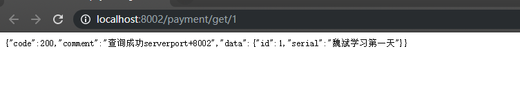

[TOC]


# SpringCloud第一天

## 01

### 前言说明

#### 课程内容

SpringCloud+SpringCloud alibaba

#### 技术要求

java8+maven+git、github+Nginx+RabbitMq+SpringBoot2.0

## 02

### 微服务架构理论入门

#### 融合协调一切

##### 步骤

1. 服务注册与发现
2. 服务调用
3. 服务熔断
4. 负载均衡
5. 服务降级
6. 服务消息队列
7. 配置中心管理
8. 服务网关
9. 服务监控
10. 全链路追踪
11. 自动化构建部署
12. 服务定时任务调度操作

##### SpringCloude是什么

分布式微服务架构的一站式解决方案,是多种微服务架构落地技术的几何体，俗称微服务全家桶

##### SpringCloud这个大集合里有多少种技术？


#### SpringCloud技术栈

##### 技术栈


##### 主要讲


## 03

#### SpringCloud-SpringBoot

##### 版本依赖选择和SpringCloude版本选型


## 04

### Cloud组件的停更/替换

#### Cloude升级


## 05

### 父工程Project空间新建

#### 订单-支付模块微服务

##### 约定>配置>编码

##### 构建项目过程

1. 总父工程(MavenPom)

2. 创建一个project,创建model

3. 编写pom.xml文件

   ```xml
   <properties>
       <project.build.sourceEncoding>UTF-8</project.build.sourceEncoding>
       <maven.compiler.source>1.8</maven.compiler.source>
       <maven.compiler.target>1.8</maven.compiler.target>
       <junit.version>4.12</junit.version>
       <log4j.version>1.2.17</log4j.version>
       <lombok.version>1.16.18</lombok.version>
       <mysql.version>5.1.47</mysql.version>
       <druid.version>1.1.16</druid.version>
       <mybatis.spring.boot.version>1.3.0</mybatis.spring.boot.version>
     </properties>
   
     <dependencyManagement>
       <dependencies>
         <!--springBoot 2.2.2-->
         <dependency>
           <groupId>org.springframework.boot</groupId>
           <artifactId>spring-boot-dependencies</artifactId>
           <version>2.2.2.RELEASE</version>
           <type>pom</type>
           <scope>import</scope>
         </dependency>
       <!--spring cloud-->
         <dependency>
           <groupId>org.springframework.cloud</groupId>
           <artifactId>spring-cloud-dependencies</artifactId>
           <version>Hoxton.SR1</version>
           <type>pom</type>
           <scope>import</scope>
         </dependency>
         <!--spring cloud alibaba 2.1.0-->
         <dependency>
           <groupId>com.alibaba.cloud</groupId>
           <artifactId>spring-cloud-alibaba-dependencies</artifactId>
           <version>2.1.0.RELEASE</version>
           <type>pom</type>
           <scope>import</scope>
         </dependency>
       <!--mysql-->
         <dependency>
           <groupId>mysql</groupId>
           <artifactId>mysql-connector-java</artifactId>
           <version>${mysql.version}</version>
         </dependency>
         <!--druid-->
         <dependency>
           <groupId>com.alibaba</groupId>
           <artifactId>druid</artifactId>
           <version>${druid.version}</version>
         </dependency>
         <!--mybatis-boot-->
         <dependency>
           <groupId>org.mybatis.spring.boot</groupId>
           <artifactId>mybatis-spring-boot-starter</artifactId>
           <version>${mybatis.spring.boot.version}</version>
         </dependency>
         <!--junit-->
         <dependency>
           <groupId>junit</groupId>
           <artifactId>junit</artifactId>
           <version>${junit.version}</version>
         </dependency>
         <!--log4j-->
         <dependency>
           <groupId>log4j</groupId>
           <artifactId>log4j</artifactId>
           <version>${log4j.version}</version>
         </dependency>
         <!--lombok-->
         <dependency>
           <groupId>org.projectlombok</groupId>
           <artifactId>lombok</artifactId>
           <version>${lombok.version}</version>
         </dependency>
       </dependencies>
     </dependencyManagement>
   
   <plugin>
           <groupId>org.springframework.boot</groupId>
           <artifactId>spring-boot-maven-plugin</artifactId>
           <configuration>
             <fork>true</fork>
             <addResources>true</addResources>
           </configuration>
         </plugin>
   ```

#### 编写pom.xml

```xml
  <groupId>com.wb.springcloud</groupId>
  <artifactId>cloud2020</artifactId>
  <version>1.0-SNAPSHOT</version>
  <packaging>pom</packaging>
  <name>Maven</name>
  <!-- FIXME change it to the project's website -->
  <url>http://maven.apache.org/</url>
  <inceptionYear>2001</inceptionYear>
  <properties>
    <project.build.sourceEncoding>UTF-8</project.build.sourceEncoding>
    <maven.compiler.source>1.8</maven.compiler.source>
    <maven.compiler.target>1.8</maven.compiler.target>
    <junit.version>4.12</junit.version>
    <log4j.version>1.2.17</log4j.version>
    <lombok.version>1.16.18</lombok.version>
    <mysql.version>5.1.47</mysql.version>
    <druid.version>1.1.16</druid.version>
    <mybatis.spring.boot.version>1.3.0</mybatis.spring.boot.version>
  </properties>
  <distributionManagement>
    <site>
      <id>website</id>
      <url>scp://webhost.company.com/www/website</url>
    </site>
  </distributionManagement>
<!--子工程不用写版本了-->
  <dependencyManagement>
    <dependencies>
      <!--springBoot 2.2.2-->
      <dependency>
        <groupId>org.springframework.boot</groupId>
        <artifactId>spring-boot-dependencies</artifactId>
        <version>2.2.2.RELEASE</version>
        <type>pom</type>
        <scope>import</scope>
      </dependency>
    <!--spring cloud-->
      <dependency>
        <groupId>org.springframework.cloud</groupId>
        <artifactId>spring-cloud-dependencies</artifactId>
        <version>Hoxton.SR1</version>
        <type>pom</type>
        <scope>import</scope>
      </dependency>
      <!--spring cloud alibaba 2.1.0-->
      <dependency>
        <groupId>com.alibaba.cloud</groupId>
        <artifactId>spring-cloud-alibaba-dependencies</artifactId>
        <version>2.1.0.RELEASE</version>
        <type>pom</type>
        <scope>import</scope>
      </dependency>
    <!--mysql-->
      <dependency>
        <groupId>mysql</groupId>
        <artifactId>mysql-connector-java</artifactId>
        <version>${mysql.version}</version>
      </dependency>
      <!--druid-->
      <dependency>
        <groupId>com.alibaba</groupId>
        <artifactId>druid</artifactId>
        <version>${druid.version}</version>
      </dependency>
      <!--mybatis-boot-->
      <dependency>
        <groupId>org.mybatis.spring.boot</groupId>
        <artifactId>mybatis-spring-boot-starter</artifactId>
        <version>${mybatis.spring.boot.version}</version>
      </dependency>
      <!--junit-->
      <dependency>
        <groupId>junit</groupId>
        <artifactId>junit</artifactId>
        <version>${junit.version}</version>
      </dependency>
      <!--log4j-->
      <dependency>
        <groupId>log4j</groupId>
        <artifactId>log4j</artifactId>
        <version>${log4j.version}</version>
      </dependency>
      <!--lombok-->
      <dependency>
        <groupId>org.projectlombok</groupId>
        <artifactId>lombok</artifactId>
        <version>${lombok.version}</version>
      </dependency>
    </dependencies>
  </dependencyManagement>
  <build>
    <pluginManagement><!-- lock down plugins versions to avoid using Maven defaults (may be moved to parent pom) -->
      <plugins>
        <plugin>
          <artifactId>maven-clean-plugin</artifactId>
          <version>3.1.0</version>
        </plugin>
        <plugin>
          <artifactId>maven-site-plugin</artifactId>
          <version>3.7.1</version>
        </plugin>
        <plugin>
          <artifactId>maven-project-info-reports-plugin</artifactId>
          <version>3.0.0</version>
        </plugin>

      </plugins>
    </pluginManagement>
    <plugins>
      <plugin>
        <groupId>org.apache.maven.plugins</groupId>
        <artifactId>maven-site-plugin</artifactId>
        <configuration>
          <locales>en,fr</locales>
        </configuration>
      </plugin>
      <plugin>
        <groupId>org.springframework.boot</groupId>
        <artifactId>spring-boot-maven-plugin</artifactId>
        <configuration>
          <fork>true</fork>
          <addResources>true</addResources>
        </configuration>
      </plugin>
    </plugins>
  </build>
```

#### dependencyManagement和dependency的区别

##### dependencyManagerment 

子项目不用指定版本号,一处修改处处声明，锁定版本用的,定义用的,并不实现引入

### 构建支付模块


#### 支付模块

##### 步骤

1. 键module

2. 改pom  --支付订单模块的pom文件

   ```xml
   <dependencies>
           <!--引入自己的通用jar包-->
           <dependency>
               <groupId>com.wb.springcloud</groupId>
               <artifactId>cloud-api-commons</artifactId>
               <version>1.0-SNAPSHOT</version>
           </dependency>
           <dependency>
               <groupId>org.springframework.boot</groupId>
               <artifactId>spring-boot-starter-thymeleaf</artifactId>
           </dependency>
           <dependency>
               <groupId>org.springframework.boot</groupId>
               <artifactId>spring-boot-starter-web</artifactId>
           </dependency>
           <dependency>
               <groupId>org.springframework.cloud</groupId>
               <artifactId>spring-cloud-starter-netflix-eureka-client</artifactId>
           </dependency>
   
           <dependency>
               <groupId>org.springframework.boot</groupId>
               <artifactId>spring-boot-devtools</artifactId>
               <scope>runtime</scope>
               <optional>true</optional>
           </dependency>
           <!--mybatis整合-->
           <dependency>
               <groupId>org.mybatis.spring.boot</groupId>
               <artifactId>mybatis-spring-boot-starter</artifactId>
           </dependency>
           <!--阿里巴巴-->
           <dependency>
               <groupId>com.alibaba</groupId>
               <artifactId>druid-spring-boot-starter</artifactId>
               <version>1.1.10</version>
           </dependency>
           <!--支持jdbc-->
           <dependency>
               <groupId>org.springframework.boot</groupId>
               <artifactId>spring-boot-starter-jdbc</artifactId>
           </dependency>
           <!--druid-->
           <dependency>
               <groupId>com.alibaba</groupId>
               <artifactId>druid-spring-boot-starter</artifactId>
               <version>1.1.10</version>
           </dependency>
           <dependency>
               <groupId>mysql</groupId>
               <artifactId>mysql-connector-java</artifactId>
               <scope>runtime</scope>
           </dependency>
           <dependency>
               <groupId>org.projectlombok</groupId>
               <artifactId>lombok</artifactId>
               <optional>true</optional>
           </dependency>
           <dependency>
               <groupId>org.springframework.boot</groupId>
               <artifactId>spring-boot-starter-test</artifactId>
               <scope>test</scope>
               <exclusions>
                   <exclusion>
                       <groupId>org.junit.vintage</groupId>
                       <artifactId>junit-vintage-engine</artifactId>
                   </exclusion>
               </exclusions>
           </dependency>
           <dependency>
               <groupId>org.mybatis</groupId>
               <artifactId>mybatis</artifactId>
               <version>3.4.5</version>
               <scope>compile</scope>
           </dependency>
       </dependencies>
   
   
       <build>
           <plugins>
               <plugin>
                   <groupId>org.springframework.boot</groupId>
                   <artifactId>spring-boot-maven-plugin</artifactId>
               </plugin>
           </plugins>
       </build>
   ```

   

3. 写yml

   ```yml
   #端口号
   server:
     port: 8002
   #将项目注册到eureka服务中心
   eureka:
     client:
       register-with-eureka: true
       fetch-registry: true
       serviceUrl:
           defaultZone: http://eureka7001.com:7001/eureka/,http://eureka7002.com:7002/eureka/
     instance:
       instance-id: payment8002
       prefer-ip-address: true
       #项目名称
   spring:
     application:
       name: cloud-payment-service
   #配置druid数据库源配置
     datasource:
       type: com.alibaba.druid.pool.DruidDataSource
       username: root
       druid:
         url: jdbc:mysql://localhost:3306/springcloud2020?useUnicode=true&characterEncoding=utf-8&useSSL=false
         password: 996649855
       driver-class-name: org.gjt.mm.mysql.Driver
       #配置mybatis的mapper扫描以及别名
   mybatis:
     mapperLocations: classpath:mapper/*.xml
     type-aliases-package: com.wb.springcloud.pojo
   
   ```

   

4. 主启动

   ​	

   ```java
   package cloud.cloudproviderpayment8002;
   
   import cloud.cloudproviderpayment8002.dao.PaymentDao;
   import org.springframework.boot.SpringApplication;
   import org.springframework.boot.autoconfigure.SpringBootApplication;
   import org.springframework.cloud.client.discovery.EnableDiscoveryClient;
   
   @SpringBootApplication
   @EnableDiscoveryClient
   public class CloudProviderPayment8002Application {
   
       public static void main(String[] args) {
           SpringApplication.run(CloudProviderPayment8002Application.class, args);
       }
   
   }
   ```

   

5. 业务代码

   1. dao层代码

      ```java
      /**
       * Create By WeiBin on 2020/3/17 14:45
       */
      @Mapper
      public interface PaymentDao {
      
          //新增
              int create(Payment payment);
          //查询
              Payment getPaymentById(@Param("id") Long id);
      }
      ```

      

   2. service层

      ```java
      @Service
      public class PaymentServiceImpl implements PaymentService {
          @Resource
          private PaymentDao paymentDao;
          @Override
          public int create(Payment payment) {
              return paymentDao.create(payment);
          }
      
          @Override
          public Payment getPaymentById(Long id) {
              return paymentDao.getPaymentById(id);
          }
      }
      ```

      

   3. pojo层

      ```java
      @Data
      @NoArgsConstructor
      @AllArgsConstructor
      public class Payment implements Serializable {
          private Long id;
          private String serial;
      }
      
      ```

      

   4. controller层

      ```java
      @RestController
      @Slf4j
      public class PaymentController {
      
          @Resource
          private PaymentService paymentService;
      
          @Value("${server.port}")
          private String serverPort;
      
          @PostMapping(value = "/payment/create")
          public CommentResult create(@RequestBody Payment payment){
              int result=paymentService.create(payment);
              log.info("插入结果"+result);
              if (result>0){
                  return new CommentResult(200,"插入数据库成功,serverport"+serverPort,result);
              }else {
                  return new CommentResult(444,"插入数据库失败,serverport"+serverPort,null);
              }
          }
      
          @GetMapping(value = "/payment/get/{id}")
          public CommentResult getPaymentById(@PathVariable("id") Long id){
              Payment Payment=paymentService.getPaymentById(id);
              log.info("查询结果"+Payment);
              if (Payment!=null){
                  return new CommentResult(200,"查询成功serverport+"+serverPort,Payment);
              }else {
                  return new CommentResult(444,"没有对应记录,查询id"+id,null);
              }
          }
      }
      
      ```

      

6. 单体测试

   1. **直接localhost:8002/payment/get/1**

   2. 运行结果

      

##### 遇到的bug

1. 没有注册的项目应该要把注册的给注释掉
2. 遇到了照着pom文件写代码敲出来的项目运行不起来

##### 热部署


#### 和消费者订单模块

##### 步骤

1. 键module

2. 改pom

   ```xml
   <dependencies>
           <dependency>
               <groupId>com.wb.springcloud</groupId>
               <artifactId>cloud-api-commons</artifactId>
               <version>${project.version}</version>
           </dependency>
           <dependency>
               <groupId>org.springframework.boot</groupId>
               <artifactId>spring-boot-starter-web</artifactId>
           </dependency>
           <dependency>
               <groupId>org.springframework.cloud</groupId>
               <artifactId>spring-cloud-starter-netflix-eureka-client</artifactId>
           </dependency>
   
           <dependency>
               <groupId>org.springframework.boot</groupId>
               <artifactId>spring-boot-devtools</artifactId>
               <scope>runtime</scope>
               <optional>true</optional>
           </dependency>
           <dependency>
               <groupId>org.projectlombok</groupId>
               <artifactId>lombok</artifactId>
               <optional>true</optional>
           </dependency>
           <dependency>
               <groupId>org.springframework.boot</groupId>
               <artifactId>spring-boot-starter-test</artifactId>
               <scope>test</scope>
               <exclusions>
                   <exclusion>
                       <groupId>org.junit.vintage</groupId>
                       <artifactId>junit-vintage-engine</artifactId>
                   </exclusion>
               </exclusions>
           </dependency>
       </dependencies>
   ```

   

3. 写yml

   ```yaml
   #端口号
   server:
     port: 80
   
   eureka:
     client:
       register-with-eureka: true #是否将自己注册进注册中心
       fetch-registry: true
       serviceUrl:
           defaultZone: http://eureka7001.com:7001/eureka/,http://eureka7002.com:7002/eureka/ #注册中心地址，这里是eureka集群开发面模式
   
   spring:
     application:
       name: cloud-consumer-order #项目名称
   
   ```

   

4. 主启动

   ```java
   package cloud.cloudconsumerorder80;
   
   import org.springframework.boot.SpringApplication;
   import org.springframework.boot.autoconfigure.SpringBootApplication;
   import org.springframework.cloud.client.discovery.EnableDiscoveryClient;
   import org.springframework.cloud.client.loadbalancer.LoadBalanced;
   import org.springframework.context.annotation.Bean;
   import org.springframework.web.client.RestTemplate;
   
   @SpringBootApplication
   @EnableDiscoveryClient
   public class CloudConsumerOrder80Application {
   
       public static void main(String[] args) {
           SpringApplication.run(CloudConsumerOrder80Application.class, args);
       }
   
       @Bean
       @LoadBalanced
       public RestTemplate getRestTemplate(){
           return new RestTemplate();
       }
   }
   
   ```

   

5. 业务类

   ```java
   package cloud.cloudconsumerorder80.controller;
   
   import com.wb.springcloud.pojo.CommentResult;
   import com.wb.springcloud.pojo.Payment;
   import lombok.extern.slf4j.Slf4j;
   import org.springframework.beans.factory.annotation.Autowired;
   import org.springframework.web.bind.annotation.GetMapping;
   import org.springframework.web.bind.annotation.PathVariable;
   import org.springframework.web.bind.annotation.RestController;
   import org.springframework.web.client.RestTemplate;
   
   /**
    * Create By WeiBin on 2020/3/17 15:32
    */
   @RestController
   @Slf4j
   public class OrderController {
   //    private static String PAYMENT_URL="http://localhost:8002";
       private static String PAYMENT_URL="http://CLOUD-PAYMENT-SERVICE";
   
       @Autowired
       private RestTemplate restTemplate;
   
       //调用新增方法
   
       @GetMapping("/consumer/payment/create")
       public CommentResult<Payment> create(Payment payment){
       return    restTemplate.postForObject(PAYMENT_URL+"/payment/create",payment,CommentResult.class);
       }
       @GetMapping("/consumer/payment/get/{id}")
       public CommentResult<Payment> getPaymentById(@PathVariable("id") Long id){
           return restTemplate.getForObject(PAYMENT_URL+"/payment/get/"+id,CommentResult.class);
       }
   }
   
   ```

   

##### 代码

#### 项目重构

##### 就是将公共用的部分例如pojo的实	体类提出来,然后新建maven项目,将文件包名+类名的方式拷贝过去,即可，其他项目引用此项目的坐标即可

#### Eureka基础知识

##### yml文件


##### pom文件

```xml-dtd
 <dependencies>
        <!--服务发现-->
        <dependency>
            <groupId>org.springframework.cloud</groupId>
            <artifactId>spring-cloud-starter-netflix-eureka-server</artifactId>
        </dependency>
        <dependency>
            <groupId>org.springframework.boot</groupId>
            <artifactId>spring-boot-starter-web</artifactId>
        </dependency>
        <dependency>
            <groupId>org.springframework.boot</groupId>
            <artifactId>spring-boot-starter-actuator</artifactId>
        </dependency>
        <!--热部署-->
        <dependency>
            <groupId>org.springframework.boot</groupId>
            <artifactId>spring-boot-devtools</artifactId>
            <scope>runtime</scope>
            <optional>true</optional>
        </dependency>
        <dependency>
            <groupId>org.springframework.boot</groupId>
            <artifactId>spring-boot-starter-test</artifactId>
        </dependency>
    </dependencies>
```


##### 启动类


##### 启动效果


#### eureka注册中心集群

##### pom文件一致

##### 配置两个注册中心，互相注册相互守望

##### yml配置文件

```yml
server:
  port: 7001
eureka:
  instance:
    hostname: eureka7001.com
  client:
    registerWithEureka: false #不将自己注册
    fetchRegistry: false
    serviceUrl:
      defaultZone: http://eureka7002.com:7002/eureka/ #分别注册两个注册中心

```

##### 效果


##### 将服务层项目分别注册到两个注册中心去

1. 修改yml文件即可

   ```yaml
   server:
     port: 8003
   
   eureka:
     client:
       register-with-eureka: true
       fetch-registry: true
       serviceUrl:
           defaultZone: http://eureka7001.com:7001/eureka/,http://eureka7002.com:7002/eureka/
     instance:
       instance-id: payment8003
       prefer-ip-address: true
   spring:
     application:
       name: cloud-payment-service
   
     datasource:
       type: com.alibaba.druid.pool.DruidDataSource
       username: root
       druid:
         url: jdbc:mysql://localhost:3306/springcloud2020?useUnicode=true&characterEncoding=utf-8&useSSL=false
         password: 996649855
       driver-class-name: org.gjt.mm.mysql.Driver
   mybatis:
     mapperLocations: classpath:mapper/*.xml
     type-aliases-package: com.wb.springcloud.pojo
   
   ```

2. 在启动类上加上@SpringDiscoverCilent注解

##### 将消费者80端口注册到注册中心

1. pom文件

   ```xml
   <dependencies>
           <dependency>
               <groupId>com.wb.springcloud</groupId>
               <artifactId>cloud-api-commons</artifactId>
               <version>${project.version}</version>
           </dependency>
           <dependency>
               <groupId>org.springframework.boot</groupId>
               <artifactId>spring-boot-starter-web</artifactId>
           </dependency>
           <dependency>
               <groupId>org.springframework.cloud</groupId>
               <artifactId>spring-cloud-starter-netflix-eureka-client</artifactId>
           </dependency>
   
           <dependency>
               <groupId>org.springframework.boot</groupId>
               <artifactId>spring-boot-devtools</artifactId>
               <scope>runtime</scope>
               <optional>true</optional>
           </dependency>
           <dependency>
               <groupId>org.projectlombok</groupId>
               <artifactId>lombok</artifactId>
               <optional>true</optional>
           </dependency>
           <dependency>
               <groupId>org.springframework.boot</groupId>
               <artifactId>spring-boot-starter-test</artifactId>
               <scope>test</scope>
               <exclusions>
                   <exclusion>
                       <groupId>org.junit.vintage</groupId>
                       <artifactId>junit-vintage-engine</artifactId>
                   </exclusion>
               </exclusions>
           </dependency>
       </dependencies>
   <build>
           <plugins>
               <plugin>
                   <groupId>org.springframework.boot</groupId>
                   <artifactId>spring-boot-maven-plugin</artifactId>
               </plugin>
           </plugins>
       </build>
   ```

   

2. yml文件

   ```yaml
   server:
     port: 80
   
   eureka:
     client:
       register-with-eureka: true
       fetch-registry: true
       serviceUrl:
           defaultZone: http://eureka7001.com:7001/eureka/,http://eureka7002.com:7002/eureka/
   spring:
     application:
       name: cloud-consumer-order
   ```

##### 测试结果


## 注册中心

### zookeeper

### consul

## 负载均衡

#### 如何实现

#### 负载均衡算法


