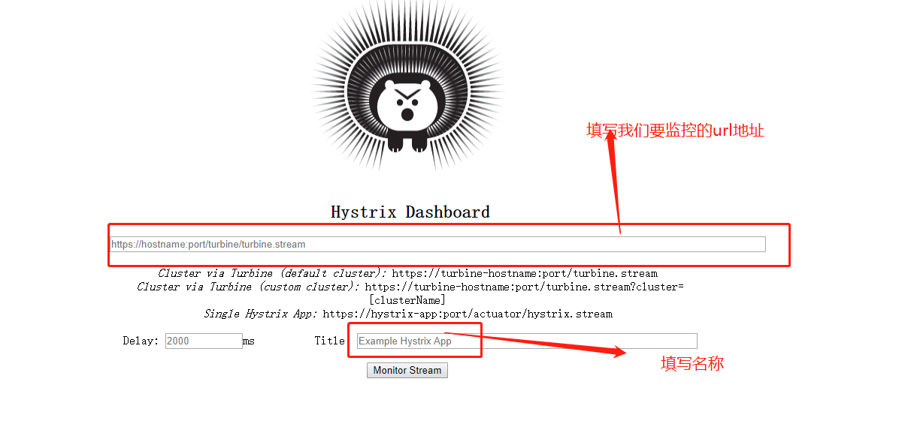
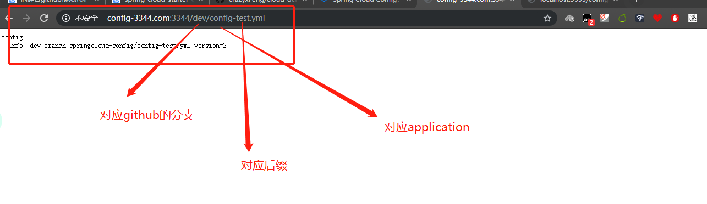

[TOC]

## SpringCloud第三天

### 服务熔断

#### 断路器

##### 一句话就是家里的保险丝

#### 熔断是什么


熔断通过Hystrix实现，还是HystrixCommend

#### 具体实操

##### 思路

1. 

##### 代码

1. 

##### 总结


### Hystrix的图形化界面

#### 仪表盘9001

##### 步骤

1. 创建Module cloud-consumer-hystrix-dashboard9001

2. 编写pom.xml文件

   ```xml
    <dependencies>
           <dependency>
               <groupId>org.springframework.cloud</groupId>
               <artifactId>spring-cloud-starter-netflix-hystrix-dashboard</artifactId>
           </dependency>
           <dependency>
               <groupId>org.springframework.boot</groupId>
               <artifactId>spring-boot-starter-web</artifactId>
           </dependency>
           <dependency>
               <groupId>org.springframework.boot</groupId>
               <artifactId>spring-boot-starter-actuator</artifactId>
           </dependency>
           <!--热部署-->
           <dependency>
               <groupId>org.springframework.boot</groupId>
               <artifactId>spring-boot-devtools</artifactId>
               <scope>runtime</scope>
               <optional>true</optional>
           </dependency>
           <dependency>
               <groupId>org.springframework.boot</groupId>
               <artifactId>spring-boot-starter-test</artifactId>
           </dependency>
           <dependency>
               <groupId>org.projectlombok</groupId>
               <artifactId>lombok</artifactId>
           </dependency>
       </dependencies>
   ```

   

3. 编写yml文件

   ```yaml
   server:
     port: 9001
   ```

   

4. 编写主启动类

   ```java
   package com.wb.springcloud;
   
   import org.springframework.boot.SpringApplication;
   import org.springframework.boot.autoconfigure.SpringBootApplication;
   import org.springframework.cloud.netflix.hystrix.dashboard.EnableHystrixDashboard;
   
   /**
    * Create By WeiBin on 2020/3/19 12:54
    */
   @SpringBootApplication
   @EnableHystrixDashboard
   public class HystrixDashboardMain9001 {
       public static void main(String[] args) {
           SpringApplication.run(HystrixDashboardMain9001.class,a	rgs);
       }
   }
   ```

5. 然后启动项目,访问localhost:9001/hystrix，出现界面代表成功

   

6. 打开我们的注册中心，和我们的payment支付类,cloud-provider-hystrix-payment8001

7. 测试地址http://localhost:8001/hystrix.stream

8. 测试结果

### 服务网关

#### Gateway

##### 案例:

1. 建module cloud-gateway-gateway9528

2. 写pom

   ```xml
   <dependencies>
           <!--<dependency>-->
               <!--<groupId>org.synchronoss.cloud</groupId>-->
               <!--<artifactId>nio-multipart-parser</artifactId>-->
               <!--<version>1.1.0</version>-->
           <!--</dependency>-->
           <!--注册进入服务中心所需要的-->
           <dependency>
               <groupId>org.springframework.cloud</groupId>
               <artifactId>spring-cloud-starter-gateway</artifactId>
               <exclusions>
                   <exclusion>
                       <artifactId>nio-multipart-parser</artifactId>
                       <groupId>org.synchronoss.cloud</groupId>
                   </exclusion>
               </exclusions>
           </dependency>
           <dependency>
               <groupId>org.springframework.cloud</groupId>
               <artifactId>spring-cloud-starter-netflix-eureka-client</artifactId>
           </dependency>
           <!--通用都要的-->
           <!--热部署-->
           <dependency>
               <groupId>org.springframework.boot</groupId>
               <artifactId>spring-boot-devtools</artifactId>
               <scope>runtime</scope>
               <optional>true</optional>
           </dependency>
           <dependency>
               <groupId>org.springframework.boot</groupId>
               <artifactId>spring-boot-starter-test</artifactId>
           </dependency>
           <dependency>
               <groupId>org.projectlombok</groupId>
               <artifactId>lombok</artifactId>
           </dependency>
           <dependency>
               <groupId>com.wb.springcloud</groupId>
               <artifactId>cloud-api-commons</artifactId>
               <version>${project.version}</version>
           </dependency>
       </dependencies>
   ```

   

3. 写yml

   ```yml
   server:
     port: 9528
   spring:
     application:
       name: cloud-gateway
     cloud:
       gateway:
         discovery:
           locator:
             enabled: true #开启从注册中心动态创建路由的功能，利用微服务名进行路由
         routes:
           - id: payment_routh  #payment_routh #路由的id 没有固定规则但要求唯一，建议配合服务名
   #          uri: http://localhost:8001  #匹配后提供服务的路由地址
             uri: lb://cloud-payment-service
             predicates:
               - Path=/payment/get/**  #断言，路径相匹配的进行路由
   
           - id: payment_routh2  #payment_routh #路由的id 没有固定规则但要求唯一，建议配合服务名
           #          uri: http://localhost:8001  #匹配后提供服务的路由地址
             uri: lb://cloud-payment-service
             predicates:
               - Path=/payment/lb/**
   eureka:
     instance:
       hostname: localhost
     client:
       fetch-registry: true
       register-with-eureka: true
       service-url:
         defaultZone: http://localhost:7003/eureka/
   ```

   

4. 写主启动

   ```java
   package com.wb.springcloud;
   
   import org.springframework.boot.SpringApplication;
   import org.springframework.boot.autoconfigure.SpringBootApplication;
   import org.springframework.cloud.netflix.eureka.EnableEurekaClient;
   
   /**
    * Create By WeiBin on 2020/3/19 17:38
    */
   @SpringBootApplication
   @EnableEurekaClient
   public class GatewayMain9528 {
       public static void main(String[] args) {
           SpringApplication.run(GatewayMain9528.class,args);
       }
   }
   ```

   

5. 业务

   ```java
   package cloud.cloudproviderpayment8001.controller;
   
   import cloud.cloudproviderpayment8001.service.PaymentService;
   import com.wb.springcloud.pojo.CommentResult;
   import com.wb.springcloud.pojo.Payment;
   import lombok.extern.slf4j.Slf4j;
   import org.springframework.beans.factory.annotation.Value;
   import org.springframework.web.bind.annotation.*;
   
   import javax.annotation.Resource;
   import java.util.concurrent.TimeUnit;
   
   /**
    * Create By WeiBin on 2020/3/17 14:54
    */
   @RestController
   @Slf4j
   public class PaymentController {
   
       @Resource
       private PaymentService paymentService;
   
       @Value("${server.port}")
       private String serverPort;
   
   
   
       @PostMapping(value = "/payment/create")
       public CommentResult create(@RequestBody Payment payment){
           int result=paymentService.create(payment);
           log.info("插入结果"+result);
           if (result>0){
               return new CommentResult(200,"插入数据库成功,serverport"+serverPort,result);
           }else {
               return new CommentResult(444,"插入数据库失败,serverport"+serverPort,null);
           }
       }
   
       @GetMapping(value = "/payment/get/{id}")
       public CommentResult getPaymentById(@PathVariable("id") Long id){
           Payment Payment=paymentService.getPaymentById(id);
           log.info("查询结果"+Payment);
           if (Payment!=null){
               return new CommentResult(200,"查询成功serverport+"+serverPort,Payment);
           }else {
               return new CommentResult(444,"没有对应记录,查询id"+id,null);
           }
       }
       @GetMapping("/payment/feign/timeout")
       public String paymentFeignTimeOut(){
           try {
               TimeUnit.SECONDS.sleep(3);
           } catch (InterruptedException e) {
               e.printStackTrace();
           }
           return serverPort;
       }
       @GetMapping("/payment/lb/{id}")
       public String paymentGetPort(@PathVariable("id") Integer id){
           return serverPort;
       }
   }
   
   ```

   

6. 看结果，可以通过访问9528来访问8001端口的内容,服务网关也可以做到负载均衡的功能，如yml文件配置

7. 通过java代码配置服务网关转发地址

   ```java
   package com.wb.springcloud.config;
   
   import org.springframework.cloud.gateway.route.RouteLocator;
   import org.springframework.cloud.gateway.route.builder.RouteLocatorBuilder;
   import org.springframework.context.annotation.Bean;
   import org.springframework.context.annotation.Configuration;
   
   /**
    * Create By WeiBin on 2020/3/19 18:15
    */
   @Configuration
   public class GatewayConfig {
   
       @Bean
       public RouteLocator customRouteLocator(RouteLocatorBuilder routeLocatorBuilder){
           RouteLocatorBuilder.Builder builder=routeLocatorBuilder.routes();
           builder.route("path_route_wb",
                       r -> r.path("/guonei")
                               .uri("http://news.baidu.com/guonei")).build();
   
           return builder.build();
       }
   
       @Bean
       public RouteLocator customRouteLocator2(RouteLocatorBuilder routeLocatorBuilder){
           RouteLocatorBuilder.Builder builder=routeLocatorBuilder.routes();
           builder.route("path_route_wb2",
                   r -> r.path("/guoji")
                           .uri("http://news.baidu.com/guoji")).build();
   
           return builder.build();
       }
   }
   
   ```

#### Gateway的常用Predicate

- after ,before,cooike这种

#### Gateway的Filter

### springConfig分布式配置中心

#### 配置总控中心搭建

##### 步骤

1. 搭建github仓库

2. 创建测试文件 config-dev.yml 这种

3. 建module cloud-config-client-3344，这是服务端

4. 写pom

   ```xml
    <dependencies>
           <dependency>
               <groupId>org.springframework.cloud</groupId>
               <artifactId>spring-cloud-config-server</artifactId>
           </dependency>
           <dependency>
               <groupId>org.springframework.cloud</groupId>
               <artifactId>spring-cloud-starter-netflix-eureka-client</artifactId>
           </dependency>
           <!--通用都要的-->
           <dependency>
               <groupId>org.springframework.boot</groupId>
               <artifactId>spring-boot-starter-web</artifactId>
           </dependency>
           <!--热部署-->
           <dependency>
               <groupId>org.springframework.boot</groupId>
               <artifactId>spring-boot-devtools</artifactId>
               <scope>runtime</scope>
               <optional>true</optional>
           </dependency>
           <dependency>
               <groupId>org.springframework.boot</groupId>
               <artifactId>spring-boot-starter-test</artifactId>
           </dependency>
           <dependency>
               <groupId>org.projectlombok</groupId>
               <artifactId>lombok</artifactId>
           </dependency>
           <dependency>
               <groupId>com.wb.springcloud</groupId>
               <artifactId>cloud-api-commons</artifactId>
               <version>${project.version}</version>
           </dependency>
       </dependencies>
   ```

   

5. 写yml

   ```yaml
   server:
     port: 3344
   
   
   
   
   eureka:
     client:
       serviceUrl:
           defaultZone: http://localhost:7003/eureka
   spring:
     application:
       name: cloud-config-center
     cloud:
       config:
         server:
           git:
             uri: https://github.com/wei9966/springcloud-config/
   #          username: wei9966
   #                    password: bin996649855
             clone-on-start: false
               #读取分支
         label: master
   
   ####分割线,下面是动态拉取要用的
   management:
     endpoints:
       web:
         exposure:
           include: "*"
   ```

   

6. 写主启动

   ```java
   package com.wb.springcloud;
   
   import org.springframework.boot.SpringApplication;
   import org.springframework.boot.autoconfigure.SpringBootApplication;
   import org.springframework.cloud.client.discovery.EnableDiscoveryClient;
   import org.springframework.cloud.config.server.EnableConfigServer;
   
   /**
    * Create By WeiBin on 2020/3/19 20:08
    */
   @SpringBootApplication
   @EnableConfigServer
   public class ConfigMain3344 {
       public static void main(String[] args) {
           SpringApplication.run(ConfigMain3344.class,args);
       }
   }
   //重点，每一个新技术都要加一个注解让他能用,enable
   ```

   

7. 启动，测试可以从仓库拿到请求

8. 结果

#### 搭建客户端

1. 建module cloud-config-client-3355，这是客户端

2. 写pom

   ```xml
    <dependencies>
           <dependency>
           <groupId>org.springframework.cloud</groupId>
           <artifactId>spring-cloud-starter-config</artifactId>
           </dependency>
           <!--<dependency>-->
           <!--<groupId>org.springframework.cloud</groupId>-->
           <!--<artifactId>spring-cloud-config-client</artifactId>-->
           <!--</dependency>-->
           <dependency>
               <groupId>org.springframework.cloud</groupId>
               <artifactId>spring-cloud-starter-netflix-eureka-client</artifactId>
           </dependency>
           <dependency>
               <groupId>org.springframework.boot</groupId>
               <artifactId>spring-boot-starter-web</artifactId>
           </dependency>
           <dependency>
               <groupId>org.springframework.boot</groupId>
               <artifactId>spring-boot-starter-actuator</artifactId>
           </dependency>
           <!--通用都要的-->
           <!--热部署-->
           <dependency>
               <groupId>org.springframework.boot</groupId>
               <artifactId>spring-boot-devtools</artifactId>
               <scope>runtime</scope>
               <optional>true</optional>
           </dependency>
           <dependency>
               <groupId>org.springframework.boot</groupId>
               <artifactId>spring-boot-starter-test</artifactId>
           </dependency>
           <dependency>
               <groupId>org.projectlombok</groupId>
               <artifactId>lombok</artifactId>
           </dependency>
           <dependency>
               <groupId>com.wb.springcloud</groupId>
               <artifactId>cloud-api-commons</artifactId>
               <version>${project.version}</version>
           </dependency>
       </dependencies>
   ```

   

3. 写yml

   ```yaml
   server:
     port: 3355
   spring:
     application:
       name: config-client
     cloud:
       config:
         label: dev
         name: config
         profile: test
         uri: http://localhost:3344
   eureka:
     client:
       service-url:
         defaultZone: http://localhost:7003/eureka
         #暴露监控断点
   management:
     endpoints:
       web:
         exposure:
           include: "*"
   
   
   
   ###在动态拉取遇到一个问题就是,两端都需要配置暴露监控断点，，或者要加上@RefreshScope在主启动类也要
   ```

   

4. 写主启动

   ```java
   package com.wb.springcloud;
   
   import org.springframework.boot.SpringApplication;
   import org.springframework.boot.autoconfigure.SpringBootApplication;
   import org.springframework.cloud.client.discovery.EnableDiscoveryClient;
   import org.springframework.cloud.context.config.annotation.RefreshScope;
   
   /**
    * Create By WeiBin on 2020/3/19 20:29
    */
   
   
   @SpringBootApplication
   @EnableDiscoveryClient
   @RefreshScope
   public class ConfigClientMain3355 {
       public static void main(String[] args) {
           SpringApplication.run(ConfigClientMain3355.class,args);
       }
   }
   
   ```

5. 修改github>3344>3355

6. 需要发送一次post请求到3355来刷新

   

   地址是http://localhost:3355/actuator/refresh

7. 测试结果

   

#### 自我理解：

##### 1.服务降级 cloud-consumer-feign-hystrix-order 80

1. 设置超时时间和错误
2. 设置反馈方法
3. 可以同时配置多个

##### 2.服务熔断 cloud-provider-hystrix-payment8001

1. 设置窗口期，请求次数，错误率
2. 设置兜底方法
3. 请求即可
4. 总结：就是如果发生错误过多，就会自动跳闸，让断路器打开，然后后面的请求会半闭半开看请求的正确性来慢慢恢复

#### 3.服务网关

1. 就是将我们之前直接暴露在外面的服务端的端口统一经过我们的服务网关来进行调用，大致就是一个路由的功能

#### 4.config配置中心

1. 用来统一版本用的,可以用github统一的进行控制和统一我们的配置文件
2. 就是用来整合我们的配置文件的