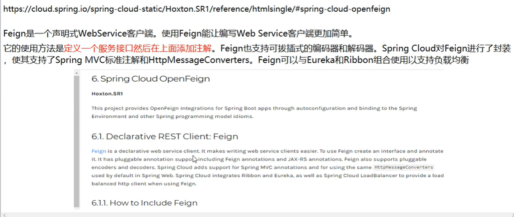
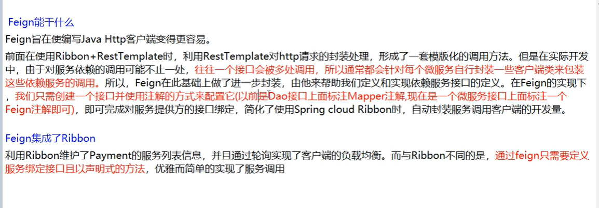
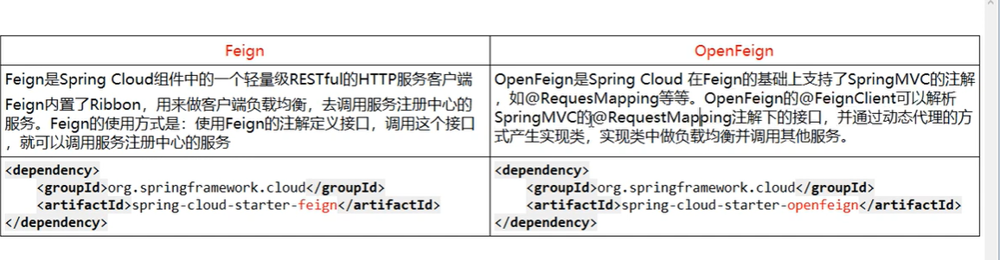
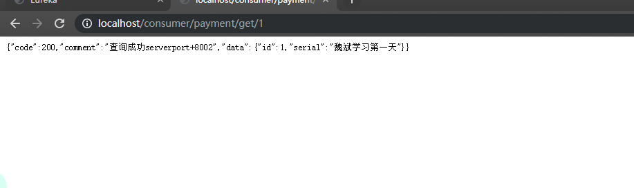
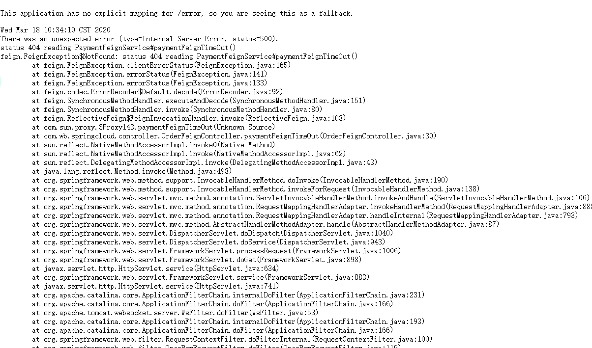

[TOC]

## SpringCloud第二天

### OpenFeign服务接口

#### OpenFeign是什么？

**是一个声明式的Web服务客户端，让编写Web服务客户端变得非常容易，只需创建一个接口并在接口上添加注解**

[OpenFeign的GitHub地址](https://github.com/spring-cloud/spring-cloud-openfeign)



#### Feign能干什么？



#### Fegin和OpenFegin的区别



#### 如何使用Feign

1. 新建项目cloud-consumer-feign-order

2. 编写pom文件 

   ```xml
   <!--基础通用接口+特殊两个特殊接口-->
   <dependencies>
           <!--openfeign依赖-->
           <dependency>
               <groupId>org.springframework.cloud</groupId>
               <artifactId>spring-cloud-starter-openfeign</artifactId>
           </dependency>
           <!--eureka-client依赖-->
           <dependency>
               <groupId>org.springframework.cloud</groupId>
               <artifactId>spring-cloud-starter-netflix-eureka-client</artifactId>
           </dependency>
           <!--springBoot启动依赖-->
           <dependency>
               <groupId>org.springframework.boot</groupId>
               <artifactId>spring-boot-starter-web</artifactId>
           </dependency>
           <dependency>
               <groupId>org.springframework.boot</groupId>
               <artifactId>spring-boot-starter-actuator</artifactId>
           </dependency>
           <!--基础通用配置-->
           <dependency>
               <groupId>org.springframework.boot</groupId>
               <artifactId>spring-boot-devtools</artifactId>
           </dependency>
           <dependency>
               <groupId>org.projectlombok</groupId>
               <artifactId>lombok</artifactId>
               <optional>true</optional>
           </dependency>
           <dependency>
               <groupId>org.springframework.boot</groupId>
               <artifactId>spring-boot-starter-test</artifactId>
           </dependency>
           <dependency>
               <groupId>com.wb.springcloud</groupId>
               <artifactId>cloud-api-commons</artifactId>
               <version>1.0-SNAPSHOT</version>
               <scope>compile</scope>
           </dependency>
       </dependencies>
   ```

   

3. 编写yml文件

   ```yaml
   server:
     port: 80
   
   eureka:
     client:
       register-with-eureka: false  #不需要将自己注册进服务中心
       serviceUrl:
           defaultZone: http://eureka7001.com:7001/eureka/,http://eureka7002.com:7002/eureka/
         
   ```

   

4. 编写主启动类

   ```java
   //主启动类需要加上启动环境的注解 @EnableFeignClients
   @SpringBootApplication
   @EnableFeignClients
   public class OrderMain80 {
       public static void main(String[] args) {
           SpringApplication.run(OrderMain80.class,args);
       }
   }
   ```

   

5. 编写业务接口

   ```java
   //跟服务调用接口的配置一样 一一对应,而且需要加上@Component注解和@FeignClient接口,值对应的是消费服务接口集群名称
   @Component
   @FeignClient(value = "CLOUD-PAYMENT-SERVICE")
   public interface PaymentFeignService {
       //新增
   //    int create(Payment payment);
       //查询
       @GetMapping(value = "/payment/get/{id}")
       public CommentResult getPaymentById(@PathVariable("id") Long id);
   }
   ```

   

6. 编写控制层

   ```java
   @RestController
   @Slf4j
   public class OrderFeignController {
       @Resource
       private PaymentFeignService paymentFeignService;
   
       @GetMapping("/consumer/payment/get/{id}")
       public CommentResult<Payment> getPaymentById(@PathVariable("id") Long id){
           return paymentFeignService.getPaymentById(id);
       }
   }
   ```

   

7. 测试

   

#### OpenFeign的超时控制

1. 8002故意写暂停程序

   ```java
    @GetMapping("/payment/feign/timeout")
       public String paymentFeignTimeOut(){
           try {
               TimeUnit.SECONDS.sleep(3);
           } catch (InterruptedException e) {
               e.printStackTrace();
           }
           return serverPort;
       }
   ```

   

2.  测试结果为显示超时报错页面

   ​	

#### 如何自己设置超时

1. 默认自带ribbon

2. 设置ribbon的实际即可

3. 编写yml文件

   ```yaml
   server:
     port: 80
   
   eureka:
     client:
       register-with-eureka: false
       serviceUrl:
           defaultZone: http://eureka7001.com:7001/eureka/,http://eureka7002.com:7002/eureka/
   
   ribbon:
     ReadTimeout: 5000
     ConnectTimeout: 5000
   ```

#### 日志增强

### Hystrix断路器，服务降级

#### Hystrix

##### 概述

##### Hystrix重要概念

#### 服务降级

##### Hystrix案例

1. 新建module

2. 编写pom.xml文件

   ```xml
   <!--新增一个，其他一致--> 
   <dependency>
               <groupId>org.springframework.cloud</groupId>
               <artifactId>spring-cloud-starter-netflix-hystrix</artifactId>
           </dependency>
   ```

   

3. 编写yml文件

   ```yaml
   #简单的注册
   #端口号
   server:
   	port: 8080
   #项目名称
   spring:
   	application:
   		name: cloud-provider-hystrix-payment
   #是否注册进注册中心
   eureka:
   	client:
   		registerWithEureka: false
           fetchRegistry: false
   #指向注册中心的地址
   		serviceUrl:
           	defaultZone: http://localhost:7003/eureka/
   ```

   

4. 编写主启动类

   ```java
   
   ```

   

5. 编写业务

   1. 业务层

      ```java
      //编写两个方法,一个是正常的,一个是非正常的
      public String paymentHystrix_OK(Integer id){
          return "线程是"+当前线程名称+"id="+id;
      }
      public String paymentHystrix_timeout(Integer id){
          return "线程是"+当前线程名称+"id="+id;
      }
      ```

      

   2. 控制层

      ```java
      
      ```

      

##### 出现服务卡顿

##### 服务降级

##### 80端如何配置服务降级

1. 主启动类加上enableHystric

2. yml加上

   ```yml
   feign:
     hystrix:
       enabled: true
   ```

3. 业务接口加上fallback = PaymentFallbackService.class

4. 新建一个类去实现此接口

5. controller加上同样配置

6. 测试即可

小结:

* 在方法头上加上注解@HystrixCommand()
* 在注解里面写上兜底的方法，K-V的形式 K对应的是fallbackMethod V对应的是兜底方法的方法名
* 然后设置超时时间,写CommandProperties={}
* 写上@HystrixProperty(name="execution.isolation.thread.timeoutInMilliseconds",value="时间")

#### Hystrix服务熔断

##### 案例

##### Hystrix工作流程

##### 服务监控HystrixDashboard