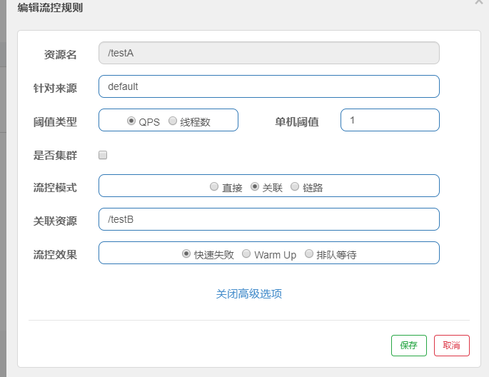

## SpringCloud第五天

### SpringCloud Alibab

#### Sentinel

##### 


##### sentinel是什么


##### 下载直接运行 java -jar

#### 初始化监控

##### 配置cloud-alibaba-sentinel-service8401

1. pom

   ```xml
       <dependencies>
               <!--sentinel jar包-->
               <dependency>
                   <groupId>com.alibaba.cloud</groupId>
                   <artifactId>spring-cloud-starter-alibaba-sentinel</artifactId>
               </dependency>
               <!--和sentinel一起搭配使用的-->
               <dependency>
                   <groupId>com.alibaba.cloud</groupId>
                   <artifactId>spring-cloud-starter-alibaba-nacos-discovery</artifactId>
               </dependency>
               <dependency>
                   <groupId>com.alibaba.csp</groupId>
                   <artifactId>sentinel-datasource-nacos</artifactId>
               </dependency>
               <!--消费端对应服务端的接口对应方法的直接实现-->
               <dependency>
                   <groupId>org.springframework.cloud</groupId>
                   <artifactId>spring-cloud-openfeign</artifactId>
               </dependency>
   
               <!--通用-->
               <dependency>
                   <groupId>com.wb.springcloud</groupId>
                   <artifactId>cloud-api-commons</artifactId>
                   <version>${project.version}</version>
               </dependency>
               <dependency>
                   <groupId>org.springframework.boot</groupId>
                   <artifactId>spring-boot-starter-web</artifactId>
               </dependency>
               <dependency>
                   <groupId>org.springframework.boot</groupId>
                   <artifactId>spring-boot-starter-actuator</artifactId>
               </dependency>
               <dependency>
                   <groupId>org.springframework.boot</groupId>
                   <artifactId>spring-boot-devtools</artifactId>
                   <scope>runtime</scope>
                   <optional>true</optional>
               </dependency>
               <dependency>
                   <groupId>org.projectlombok</groupId>
                   <artifactId>lombok</artifactId>
                   <optional>true</optional>
               </dependency>
               <dependency>
                   <groupId>org.springframework.boot</groupId>
                   <artifactId>spring-boot-starter-test</artifactId>
                   <scope>test</scope>
                   <exclusions>
                       <exclusion>
                           <groupId>org.junit.vintage</groupId>
                           <artifactId>junit-vintage-engine</artifactId>
                       </exclusion>
                   </exclusions>
               </dependency>
           </dependencies>
   ```

   

2. yml

   ```yaml
   server:
     port: 8401
   spring:
     cloud:
       nacos:
         discovery:
           server-addr: localhost:8848 #nacos服务注册中心地址
       sentinel:
         transport: #配置sentinel dashboard地址
           dashboard: localhost:8080
           #默认8719端口，假如被占用会自动从8719开始一次扫描加1直至找到未被占用端口
           port: 8719
     application:
       name: cloud-centinel-service
   
   #暴露
   management:
     endpoints:
       web:
         exposure:
           include: "*"
   ```

   

3. 主启动

   ```java
   package com.wb.springcloud;
   
   import org.springframework.boot.autoconfigure.SpringBootApplication;
   import org.springframework.cloud.client.discovery.EnableDiscoveryClient;
   
   /**
    * Create By WeiBin on 2020/3/21 20:06
    */
   @SpringBootApplication
   @EnableDiscoveryClient
   public class SentinelMain8401 {
   }
   ```

   

4. 业务类

   ```java
   package com.wb.springcloud.controller;
   
   import org.springframework.web.bind.annotation.GetMapping;
   import org.springframework.web.bind.annotation.RestController;
   
   /**
    * Create By WeiBin on 2020/3/21 20:07
    */
   @RestController
   public class FlowLimitController {
   
       @GetMapping("/testA")
       public String testA(){
       return "testA---";
       }
       @GetMapping("/testB")
       public String testB(){
           return "testB---";
       }
   
   }
   
   ```

5. 懒加载机制

   需要执行一次访问即可

#### Sentinel流控规则简介


#### 流控模式搭建

##### 流控模式QPS的直接失败（系统默认）

首先拿到的是request，资源名(testA)

QPS超过单机阈值1 就直接失败 1秒1次


##### 线程数直接失败

线程数:调用该api的线程数超过阈值


##### 流控模式:关联

当与A关联的资源B达到阈值后就限流A自己，B惹事，A挂了




大并发访问B导致A访问不了了

##### 作业：链路

#### Sentinel流控 预热

##### 预热就是为了保护系统