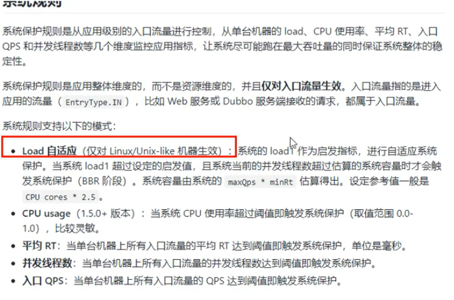

## SpringCloud第六天

### Sentinel流控

#### 排队等待


#### Sentinel降级

##### 简介


##### RT


jemeter压力测试


##### 异常比例


##### 异常数

配置


一分钟之类有5次异常就直接熔断跳闸

#### Sentinel热点 KEY

##### 编写测试代码

**假设传入p1和p2两个参数，设置如何p1的QPS超过了设定，那么就报错，可以自己设定兜底的方法**

1. controller

   ```java
   @RequestMapping("/testHotKey")//资源地址，请求地址
       @SentinelResource(value = "testHotKey",blockHandler = "default_testHotKey")//热点限制的注解，value代表的是资源名，blockHandler代表的是反馈的方法
       public String testHotKey(@RequestParam(value = "p1",required = false) String p1,@RequestParam(value = "p2",required = false) String p2){
           return "-----testHotKey";
       }
   
       /**
        *
        * @param p1
        * @param p2
        * @param E 一定要加上这个参数
        * @return
        */
       public String default_testHotKey(String p1, String p2, BlockException E){
           return "testHotKey  o(╥﹏╥)o";
       }
   
   ```

   

2. 热点设置

   

##### Sentinel热点Key的参数例外项

1. 配置

   

#### Sentinel系统规则



**总入口设置**

#### SentinelResource配置

##### 入门案例

1. pom

   ```xml
    <dependencies>
           <!--sentinel jar包-->
           <dependency>
               <groupId>com.alibaba.cloud</groupId>
               <artifactId>spring-cloud-starter-alibaba-sentinel</artifactId>
           </dependency>
           <!--和sentinel一起搭配使用的-->
           <dependency>
               <groupId>com.alibaba.cloud</groupId>
               <artifactId>spring-cloud-starter-alibaba-nacos-discovery</artifactId>
           </dependency>
           <dependency>
               <groupId>com.alibaba.csp</groupId>
               <artifactId>sentinel-datasource-nacos</artifactId>
           </dependency>
           <!--消费端对应服务端的接口对应方法的直接实现-->
           <dependency>
               <groupId>org.springframework.cloud</groupId>
               <artifactId>spring-cloud-openfeign</artifactId>
           </dependency>
   
           <!--通用-->
           <dependency>
               <groupId>com.wb.springcloud</groupId>
               <artifactId>cloud-api-commons</artifactId>
               <version>${project.version}</version>
           </dependency>
           <dependency>
               <groupId>org.springframework.boot</groupId>
               <artifactId>spring-boot-starter-web</artifactId>
           </dependency>
           <dependency>
               <groupId>org.springframework.boot</groupId>
               <artifactId>spring-boot-starter-actuator</artifactId>
           </dependency>
           <dependency>
               <groupId>org.springframework.boot</groupId>
               <artifactId>spring-boot-devtools</artifactId>
               <scope>runtime</scope>
               <optional>true</optional>
           </dependency>
           <dependency>
               <groupId>org.projectlombok</groupId>
               <artifactId>lombok</artifactId>
               <optional>true</optional>
           </dependency>
           <dependency>
               <groupId>org.springframework.boot</groupId>
               <artifactId>spring-boot-starter-test</artifactId>
               <scope>test</scope>
               <exclusions>
                   <exclusion>
                       <groupId>org.junit.vintage</groupId>
                       <artifactId>junit-vintage-engine</artifactId>
                   </exclusion>
               </exclusions>
           </dependency>
       </dependencies>
   ```

   

2. yml

   ```yaml
   server:
     port: 8401
   spring:
     cloud:
       nacos:
         discovery:
           server-addr: localhost:8848 #nacos服务注册中心地址
       sentinel:
         transport: #配置sentinel dashboard地址
           dashboard: localhost:8080
           #默认8719端口，假如被占用会自动从8719开始一次扫描加1直至找到未被占用端口
           port: 8719
     application:
       name: cloud-centinel-service
   
   #暴露
   management:
     endpoints:
       web:
         exposure:
           include: "*"
   
   ```

   

3. 主启动

   ```java
   package com.wb.springcloud;
   
   import org.springframework.boot.SpringApplication;
   import org.springframework.boot.autoconfigure.SpringBootApplication;
   import org.springframework.cloud.client.discovery.EnableDiscoveryClient;
   
   /**
    * Create By WeiBin on 2020/3/21 20:06
    */
   @SpringBootApplication
   @EnableDiscoveryClient
   public class SentinelMain8401 {
       public static void main(String[] args) {
           SpringApplication.run(SentinelMain8401.class,args);
       }
   }
   
   ```

   

4. 业务类

   ```java
   package com.wb.springcloud.controller;
   
   import com.alibaba.csp.sentinel.annotation.SentinelResource;
   import com.alibaba.csp.sentinel.slots.block.BlockException;
   import com.wb.springcloud.pojo.CommentResult;
   import com.wb.springcloud.pojo.Payment;
   import org.springframework.web.bind.annotation.RequestMapping;
   import org.springframework.web.bind.annotation.RestController;
   
   /**
    * Create By WeiBin on 2020/3/22 11:28
    */
   @RestController
   public class RestLimitController {
   
       @RequestMapping("/byResource")
       @SentinelResource(value = "byResource",blockHandler = "default_byResource")
       public CommentResult byResource(){
   
           return new CommentResult(200,"按资源名称限流ok",new Payment(2020L,"serial1001"));
       }
       public CommentResult default_byResource(BlockException exception){
   
           return new CommentResult(444,exception.getClass().getCanonicalName()+"\t"+"服务不可用");
       }
   
   }
   ```

5. 配置流控规则

6. 


##### 配置中，解耦

**自定义限流逻辑处理规则**

1. 编写测试方法

   ```java
   @RequestMapping("/byCustomer")
       @SentinelResource(value = "byCustomer",blockHandlerClass = CustomerBlockHandler.class,blockHandler = "byCustomer3")
       public CommentResult byCustomer(){
           return new CommentResult(200,"按客户自定义测试");
       }
   
   ```

   

2. 编写customerBlockHandler的自定义异常类

   ```java
   package com.wb.springcloud.handler;
   
   import com.alibaba.csp.sentinel.slots.block.BlockException;
   import com.wb.springcloud.pojo.CommentResult;
   import org.springframework.stereotype.Component;
   
   /**
    * Create By WeiBin on 2020/3/22 11:50
    */
   @Component
   public class CustomerBlockHandler {
       /**
        *static必须
        * @param exception 必须带
        * @return
        */
       public  static CommentResult ExceptionByCustomer1(BlockException exception){
           return new CommentResult(444,"按客户自定义测试--1");
       }
       public static CommentResult ExceptionByCustomer2(BlockException exception){
           return new CommentResult(444,"按客户自定义测试--2");
       }
       public static CommentResult ExceptionByCustomer3(BlockException exception){
           return new CommentResult(444,"按客户自定义测试--3");
       }
   
   }
   
   ```

   

3. 编辑流控规则进行测试

   

4. 

##### SentinelResource配置下


#### Sentinel服务熔断Ribbon环境预说

1. 两个支付服务和一个消费服务
2. 在消费端编辑业务类和fallback方法，以及BlockHandler方法

##### 步骤

1. 创建支付服务

