## SpringCloud第四天

### SpringCloudBus

#### Bus总线是什么

##### 步骤，安装环境

1. 安装erlang环境,下载地址erlang.org/download/otp_win64_21.3.exe
2. 安装rabbitmq
3. 运行 rabbitmq-plugins enable rabbitmq_management

#### Bus动态刷新全局广播

##### 步骤

1. 仿造3355创建3366
2. 两种方法
3. 通知客户端
4. 通知服务端

##### 配置

1. 3344服务端添加消息总线pom

   ```xml
   <dependency>
   	<groupId>org.springframework.cloud</groupId>
       <artifactId>spring-cloud-stater-bus-amqp</artifactId>
       <version>2.0.0</version>
   </dependency>
   ```

   

2. 3344yml

   ```yaml
   rabbitmq:
   	host: localhost
   	port: 5672
   	username: guest
   	password: guest
   	
   #暴露配置端点
   management:
   	endpoints:
   		web:
   		  exposure:
   			include: 'bus-refresh'
   ```

   

3. 3355 3366 pom

   ```
   <dependency>
   	<groupId>org.springframework.cloud</groupId>
       <artifactId>spring-cloud-stater-bus-amqp</artifactId>
       <version>2.0.0</version>
   </dependency>
   ```

   

4. 3355 3366 yml

   ```
   rabbitmq:
   	host: localhost
   	port: 5672
   	username: guest
   	password: guest
   ```

   

##### 结果

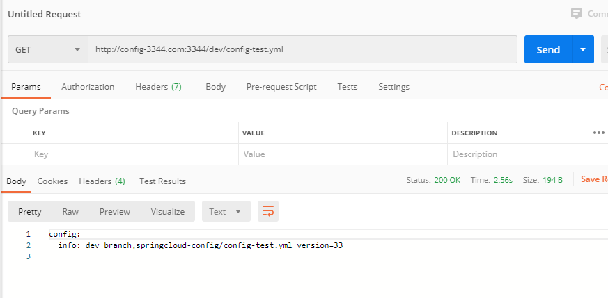

##### 修改结果http://localhost:3344/actuator/bus-refresh

结果同时刷新

##### 定点通知 

http://localhost:3344/actuator/bus-refresh/config-client:3355

### SpringCloudStream

#### 能干嘛:屏蔽底层消息中间件的差异，降低切换成本，统一消息的编程模型

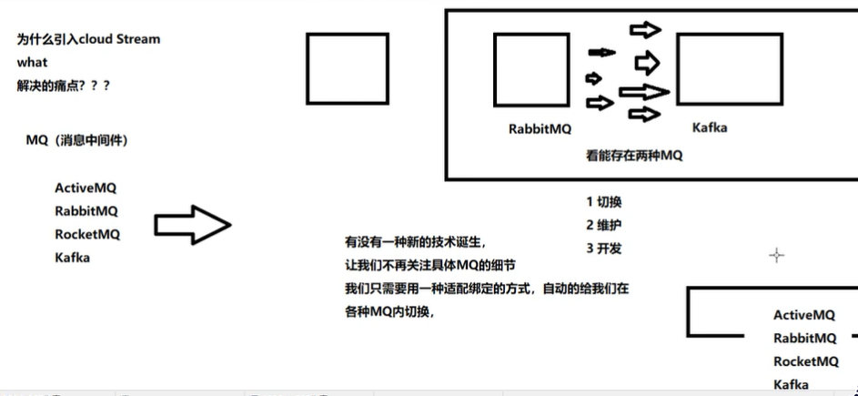

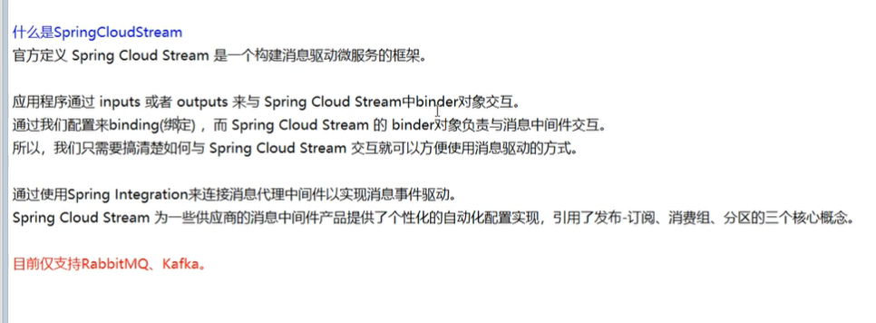

#### 怎么用

api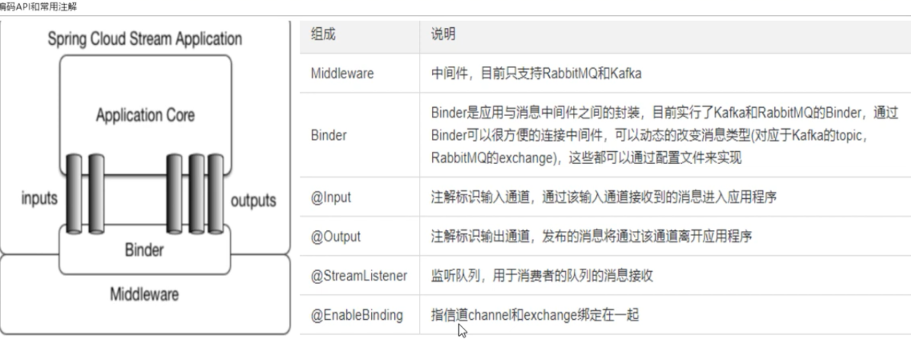


1. pom

   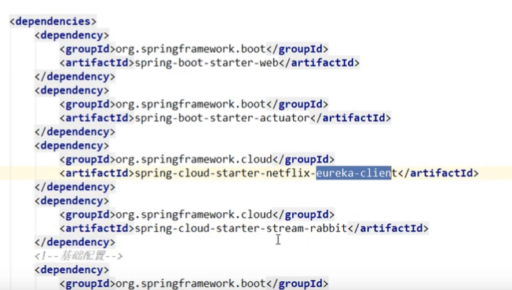

2. yml

   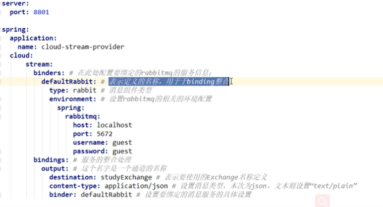

   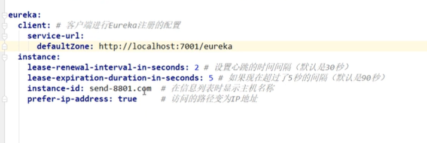

3. 主启动

   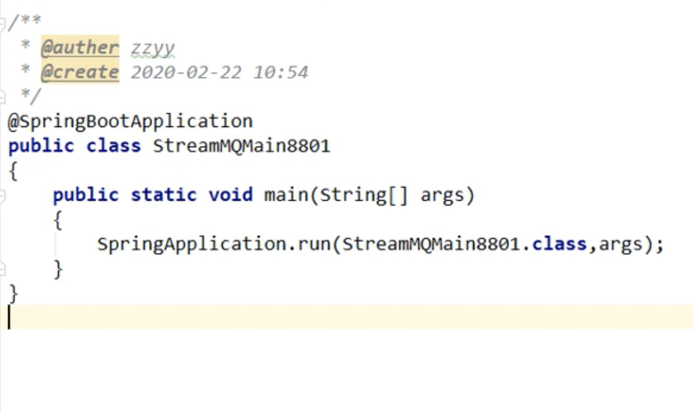

4. 业务类

   1. service

      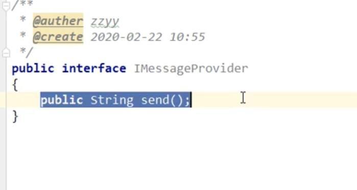

   2. serviceimpl

      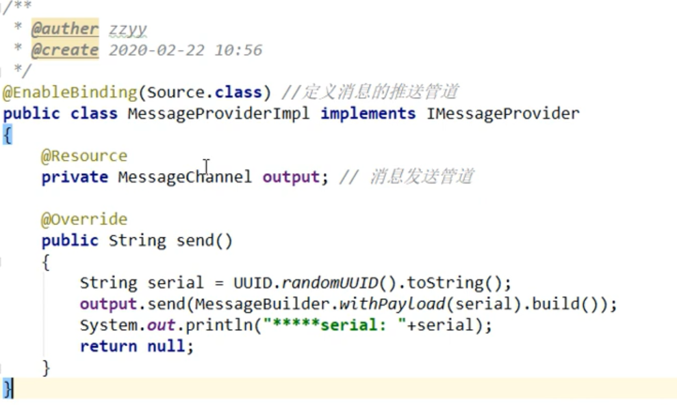

      

5. controller

   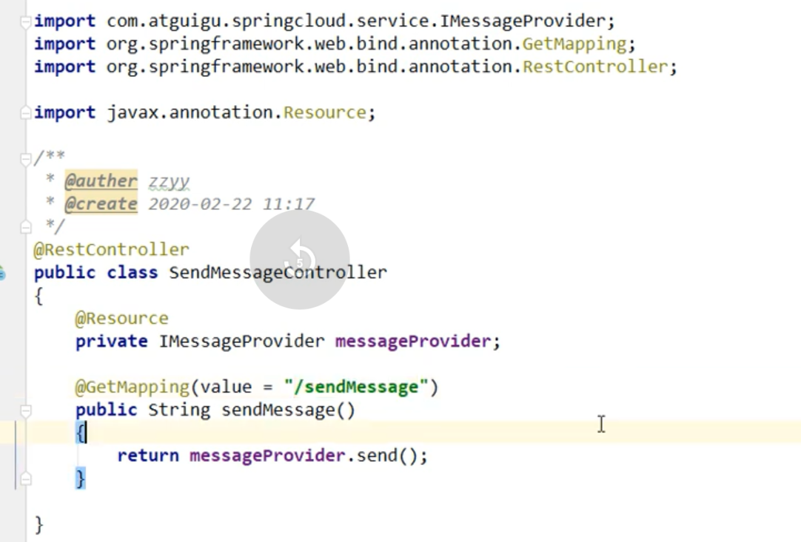

6. 可以看到rabbitmq的图形有变化

#### 消息驱动之消费者

1. pom

   ```xml
    <dependencies>
           <dependency>
               <groupId>org.springframework.cloud</groupId>
               <artifactId>spring-cloud-starter-stream-rabbit</artifactId>
           </dependency>
           <dependency>
               <groupId>org.springframework.cloud</groupId>
               <artifactId>spring-cloud-starter-netflix-eureka-client</artifactId>
           </dependency>
           <dependency>
               <groupId>org.springframework.boot</groupId>
               <artifactId>spring-boot-starter-web</artifactId>
           </dependency>
           <dependency>
               <groupId>org.springframework.boot</groupId>
               <artifactId>spring-boot-starter-actuator</artifactId>
           </dependency>
           <!--通用都要的-->
           <!--热部署-->
           <dependency>
               <groupId>org.springframework.boot</groupId>
               <artifactId>spring-boot-devtools</artifactId>
               <scope>runtime</scope>
               <optional>true</optional>
           </dependency>
           <dependency>
               <groupId>org.springframework.boot</groupId>
               <artifactId>spring-boot-starter-test</artifactId>
           </dependency>
           <dependency>
               <groupId>org.projectlombok</groupId>
               <artifactId>lombok</artifactId>
           </dependency>
           <dependency>
               <groupId>com.wb.springcloud</groupId>
               <artifactId>cloud-api-commons</artifactId>
               <version>${project.version}</version>
           </dependency>
       </dependencies>
   ```

   

2. yml

   ```yaml
   server:
     port: 8803
   spring:
     application:
       name: cloud-stream-provider
     cloud:
       stream:
         binders: #在此处配置绑定的rabbitmq的服务信息
           defaultRabbit: #表示定义的名称，用于binding整合
            type: rabbit #消息组件的类型
            environment: #设置rabbitmq的相关环境配置
               spirng:
                 rabbitmq:
                   host: localhost
                   port: 5672
                   username: guest
                   password: guest
         bindings: #服务的整合处理
           input: #这个名字是一个管道的名字
             destination: studyExchange #exchange的名称
             content-type: application/json
             binder: defaultRabbit #设置绑定的消息服务的具体设置
   
   eureka:
     client:
       service-url:
         defaultZone: http://localhost:7003/eureka/
     instance:
       prefer-ip-address: true #访问的路径变成ip
       instance-id: receive-8802.com #在信息列表时显示主机名称
       lease-expiration-duration-in-seconds: 5 #如果现在超过了5s
       lease-renewal-interval-in-seconds: 2 #设置心跳时间间隔
   
   
   
   ```

   

3. controller

   ```java
   package springclou.controller;
   
   import org.springframework.beans.factory.annotation.Value;
   import org.springframework.cloud.stream.annotation.EnableBinding;
   import org.springframework.cloud.stream.annotation.StreamListener;
   import org.springframework.cloud.stream.messaging.Sink;
   import org.springframework.messaging.Message;
   import org.springframework.stereotype.Component;
   
   /**
    * Create By WeiBin on 2020/3/20 10:38
    */
   @Component
   @EnableBinding(Sink.class)
   public class ReceiveController {
   
       @Value("${server.port}")
       private String serverport;
   
       @StreamListener(Sink.INPUT)
       public void input(Message<String> message){
           System.out.println("消费者1号,-------->接收到的消息"+message.getPayload()+"\t"+"port:"+serverport);
       }
   }
   
   ```

   

4. 测试结果

5. 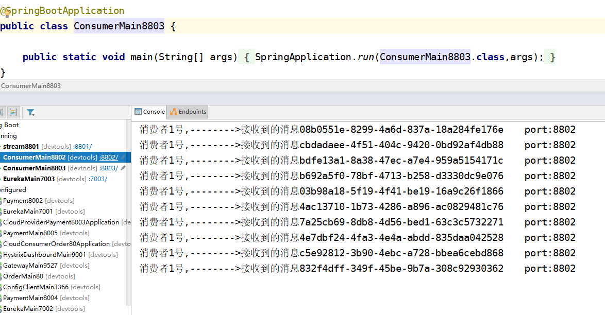

#### 出现重复消费的行为

##### 解决方法:分组

```yaml
#加上group
group: wb1
```

##### 消息持久化：就是分组之后，队列发送消息，8802还是会收到

### SpringCloud Sleuth 

#### 分布式请求链路跟踪

##### zipkin下载地址

dl.bintray.com/openzipkin/maven/io/zipkin/java/zipkin-server

##### 运行访问

localhost:9411/zipkin/

##### 80调用8001监控测试

- 8001

  1. pom

     ```xml
     <dependency>
     	<groupId>org.springframework.cloud</groupId>
         <artifactId>spring-cloud-starter-zipkin</artifactId>
     </dependency>
     ```

     

  2. yml

     ```yaml
     spring:
     	application:
     		name:
     	zikpin:
     	    base-url: http://localhost:9411
     	sletuth:	 
     		sampler:
     	 #采样率介于0-1 1表示全部菜鸡
     		probability: 1
     ```

     

  3. 业务类

     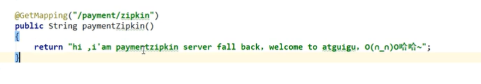

- 80消费方

  1. pom

     引入和8001一样

  2. yml 跟上面一样

  3. controller 

     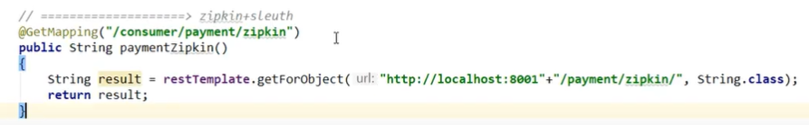

- 结果

  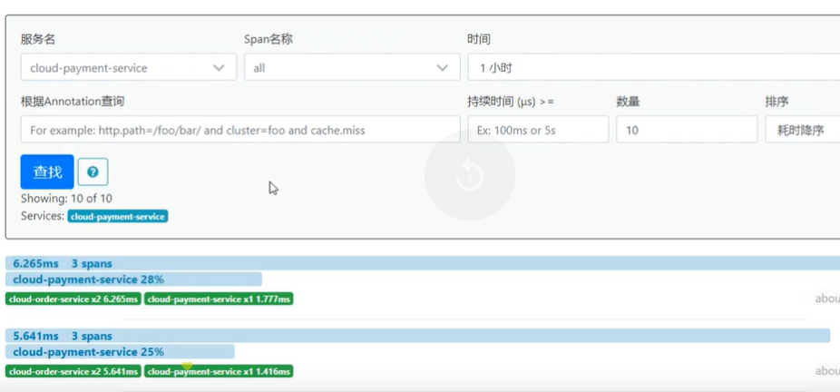

### CloudAlibaba

#### 简介

https://spring.io/projects/spring-cloud-alibaba#overview官网