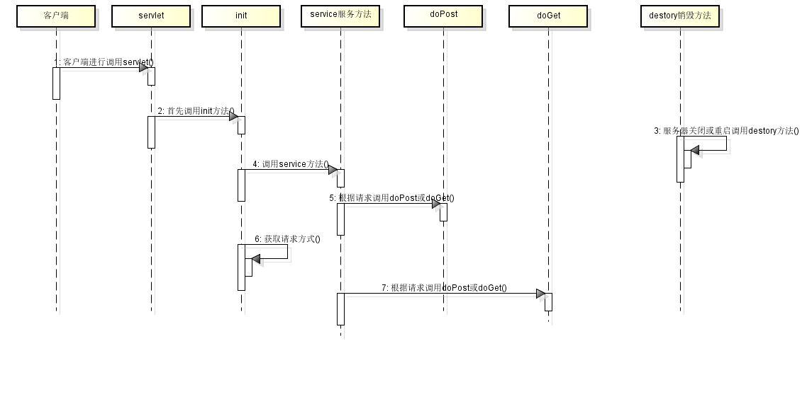

2.17作业
------------
把今天所讲的servlet的初始方法，服务方法，doGet,doPost,销毁方法，通过时序图表现出来？流程,运行的原理
------------------------------------------------------------
- 要明白servlet的生命周期流程以及调用顺序
- 1.首先调用servlet的构造方法————>init初始化方法————>service服务方法————>根据请求调用doPost|doGet方法————>服务器关闭或重启调用destory
- 销毁方法
- 2.时序图