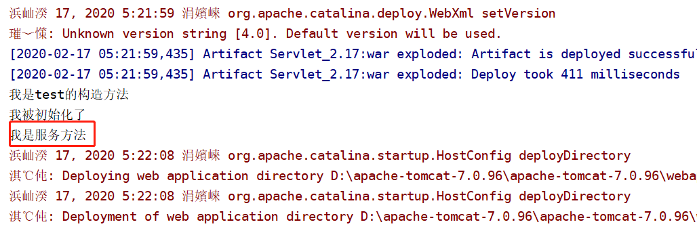
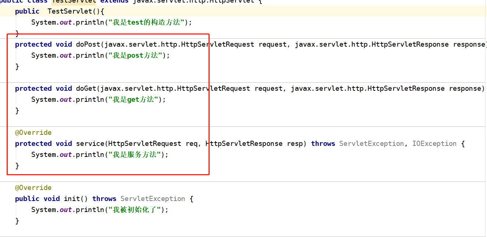
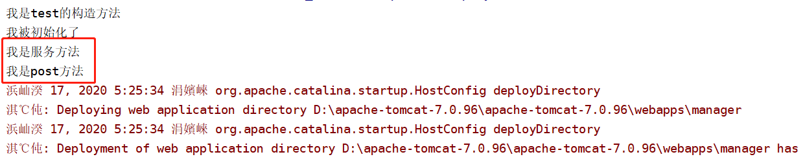
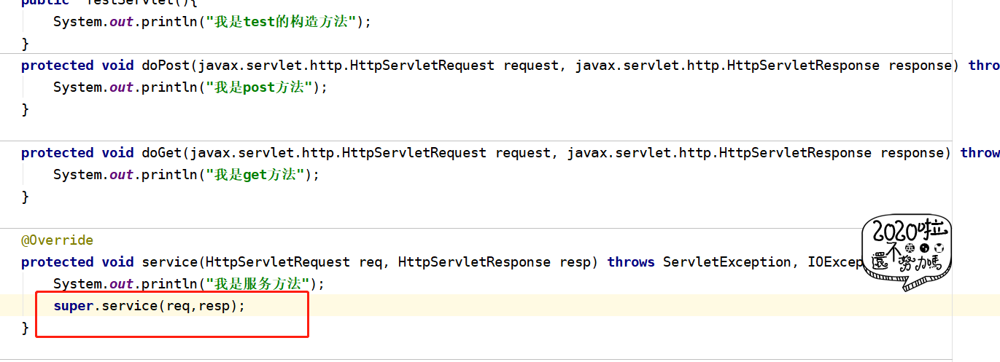
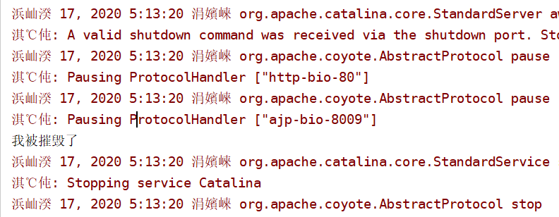
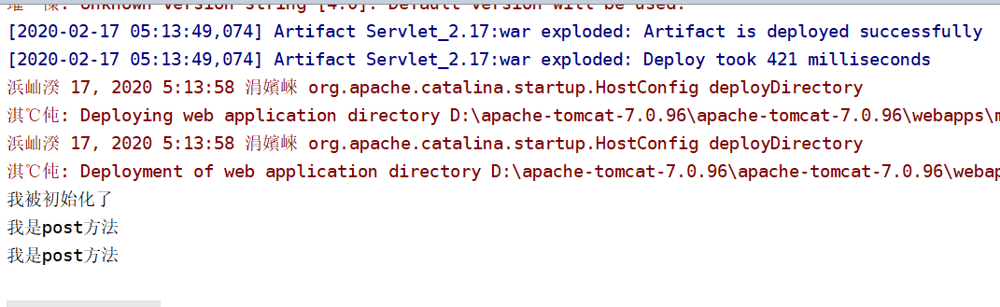

## 关于servlet的doXXX和service方法 ##
- 1.servlet的service方法可以不需要重写，他会自动根据请求去分配get|post方法
- 2.在get|post和service方法同时存在的时候,请求不会进入get和post方法,只会进入service方法,如果需要进入post|get方法,那么需要调用super.service()方法
- 3.如果重写了service方法,并且需要根据请求方式不同做不同的事情,那么你需要写super.service()方法
- 4. 服务器重启也会调用destory方法

- 5.第一次进入servlet会调用init方法,后续不会调用init但是会调用相对应的get或post方法

