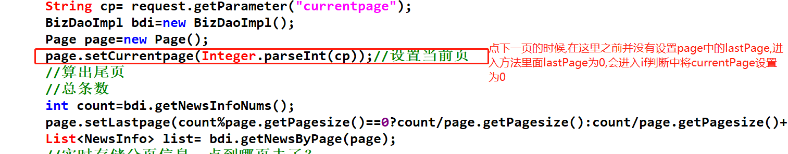

作业评讲
----
首先控制上一页,当页数小于或等于0时停在首页
------------------------
- 在page实体类中,对setCurrentPage()方法中进行判断,如果currentPage<=0那么this.currentPage=1
        
    
        public void setCurrentPage(int currentPage){
        if(currentPage<=0){
            this.currentPage=1;
        }else{
            this.currentPage=currentPage;
        }
        }
控制下一页,到最后一页时继续点击停在最后一页
------------------------
- 1.首先计算出总页数(尾页)
        
       
        //算出总条数
        int count=bdi.getNewsInfoNums();
        //三目运算符算出总页数
        //用总条数对每页显示条数取模,能除尽则取除数,不能则取除数+1
        int total=count%page.getPageSize()==0?count/page.getPageSize():count/page/getpageSize()+1; 
         page.setLastPage(total);

- 2.当currentPage>lastPage时,对currentPage赋值
     
        public void setCurrentPage(int currentPage){
            if(currentPage<=0){
                this.currentPage=1;
            }else{
            if(currentPage>this.lastPage){
                this.currentPage=this.lastPage;
            }else{
                this.currentPage=currentPage;
            }
            }
        }
    
- 3.上述2写的出来之后,出现bug首页没数据,下一页报错
- 4.原因
    
        在LoginServlet中并没有设置page中的lastPage属性
        if(currentPage>this.lastPage)进行判断时lastPage默认值为0
        即currentPage为0
        所以首页数据为空

- 5.下一页报错原因
     
        在pageServlet中设置page中的lastPage属性在赋值pageNum之后,进入方法判断为0
            if(currentPage>this.lastPage)进行判断时lastPage默认值为0
            即currentPage为0
            所以下一页数据为空
        

- 6.SQL语句报错原因
