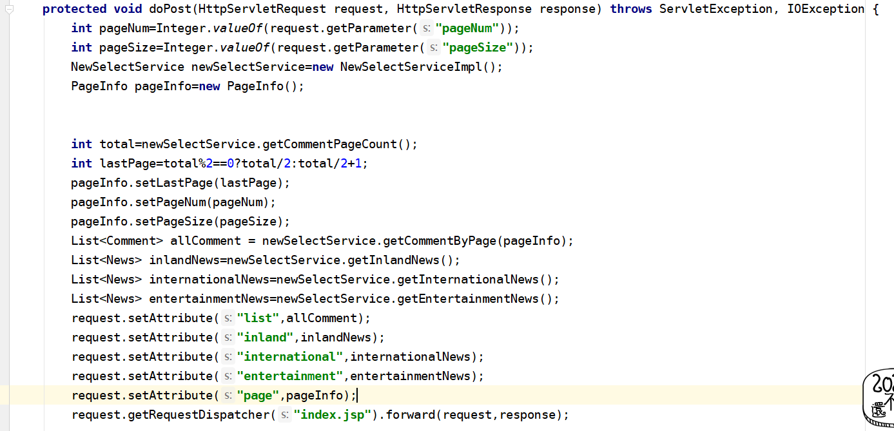

作业要求
----------
1.index.jsp页面分页
----------
- admin.jsp页面一样,用servlet调用dao层方法,存值然后跳转到页面,用pageInfo分页实体类帮助分页
- 1) servlet首页代码
- 2) PageServlet代码
- 3) 页面代码
- 4) 注意事项,因为首页index.jsp页面是直接显示数据的,所以web.xml中欢迎页面需要设置初始化即你显示首页数据的servlet
2.参照api，处理日期为年-月-日 不能再后台进行处理,只能在前端进行处理
----------------------------------------
- 1) 查看api,可以使用jstl的mft标签库中的formatDate
- 2) 导入标签库`<%@ taglib prefix="fmt" uri="http://java.sun.com/jsp/jstl/fmt" %>`
- 3) 页面写法为
- 4) 需要注意的是value格式化的日期，该属性的内容应该是  java.util.Date  类型的实例 
- 5) 所以comment实体类对应的日期类型不应为string类型而应该是date类型
最后结果
----------

 