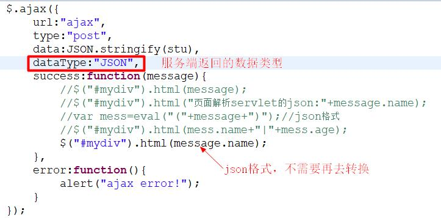
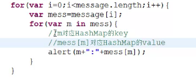

3月11日上课知识点
----------
1. 一、作业评讲
    1. 1.加上dataType之后,是否能直接返回?
        1. 1.1 加上了dataType之后,返回的msg对象<r>可以</r>直接调用json格式的json对象,dataType:"JSON"
        2. 1.2 dataType是服务端返回的数据类型,返回是json不需要再进行转换
        3. 
    2. 2.如果后台返回的是ArrayList集合？ajax如何解析？
        1. 2.1 用JSONArray转成json格式的json数组
        2. 2.2 前端直接用for循环的方式遍历取值即可
    3. 3.如果后台返回的是HashMap<>？ajax如何解析？
        1. 3.1 创建map集合并存值然后写出去
        2. 3.2 用JSONArray来转换map集合
            1. 3.2.1 前端显示message无反应,长度为1,for循环遍历取值也为空
            2. 3.2.2 需要用foreach再次去遍历for循环的取值
            3. 3.2.3 
        3. 3.3 页面,不管是js,还是jQuery,不同于java.因此前端解析数据,不能像java后台那样粗暴   
2. 二、上课内容-01
    1. 1.目标:
        1. 1.1 学会使用fastJson
        2. 1.2 三级联动+分层(servlet+service+dao)+jQuery实现ajax+($.getJSON()+fastjson)
    2. 2.内容
        1. 2.1 准备数据
            1. 2.1.1 两个表,省份表和城市表
            2. 2.2.2 字段 pid pname | cid cname pid
        2. 2.2 导入jar包,mysql连接包,fastjson包,创建三层架构
        3. 2.3 绑定省份信息 function bind_province(){}
        4. 2.4 $.getJSON(url,data,function(result)){//省略将服务器返回的数据显示到页面}
        5. 2.5 $.getJSON("provinceServlet",null,function(data){$(data).each(function(index,obj){ var proId=obj.pid;var name=obj.pname;//通jQuery获取java bean中的属性  });})
            1. 2.5.1 index是下标,obj是province对象
            2. 2.5.2 创建option  ` var option="<option value='"+proId+"'>"+name+"</option>`
            3. 2.5.3 追加迭代option
                1. 2.5.3.1 $("#province").append(option);
            4. 2.5.4 过滤 $("#province option:first").before("`<option> value='-1'>请选择省份</option>`");
        6. 2.6 新建servlet url="provinceServlet"
        7. 2.7 需要使用fastJson的API
        8. 2.8 ProvinceServiceImpl ps=new ProvinceServiceImpl();
            1. 2.8.1 <r> resopse.getWrite().write(JSON.toJSONString(ps.getProvinceInfo()));</r>
        9. 2.9 需要设置编码 <r> response.setContentType("application/json;charset=utf-8")</r>;
3. 三、上课内容-02
    1. 1.把省份数据(pid)传递给city
    2. 2.观察$.getJSON(),能否传递json到servlet,servlet接收的时候,不用io流,能否获取数据？
    3. 3.选择省份下拉列表中某一项的话,把该项的pid传递给city
        1. 3.1 //绑定省份的change事件,当选中某一项的时候,获取当前项的pid
        2. 3.2 $("#province").change(function(){
            1. var proid=$("#province option:selected").val();
        3. });
    4. 4.绑定城市方法
        1. 4.1 function bind_city(cityid){
            1. $.getJSON("cityServlet",{"cid":cityid},function(data){
                1. $(data).each(function(index,obj){
                    1. 
                2. });
            2. });
        2. }
    5. 5.创建city对应的实体类
        1. cid,cname,pid字段
    6. 6.创建cityDao和cityService
        1. 6.1 cityDao `List<City> getCityById(int pid);`
        2. 6.2 cityDaoImpl `select * from city where pid = #{pid}}`
        3. 6.3 cityService `List<City> getCityById(int pid);`
        4. 6.4 cityServiceImpl `return CityDao.getCityById(pid);`
    7. 7.CityServlet
        1. 7.1 request.getParameter("cid");获取cid
    8. 8.