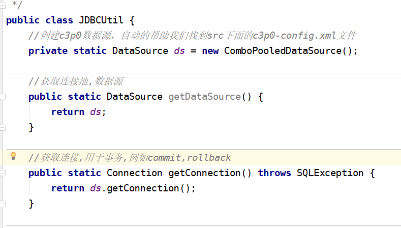

3.13日上课笔记
---------
1. 一、作业评讲
    1. 1.数据库新建表区县表,字段id,name,cid(区县id,区县名,城市id)
    2. 2.页面方法
        1. 2.1 绑定城市的change事件,传递城市id
            1. 2.1.1 $("#city").change(function(){
                1. var cityId=$("#city").val();
                2. $("#county").children().remove();
            2. });
        2. 2.2 绑定区县的方法
            1. 2.2.1 function bind_country(cityId){
                1. $.getJSON(
                    1. "countryServlet",
                    2. {"cityId":cityId},
                    3. function(data){
                        1. $(data).each(function(index,obj){
                            1. var qid=obj.qid;
                            2. var qname=obj.qname;
                            3. var option="<option value='"+qid+"'>"+qname+"</option>";
                            4. $("#country").append(option);
                        2. });
                        3. $("#country option:first").before("<option value=-1>请选择区县</option>")
                    5. }
                3. );
            2. }
    3. 3.新建一个接口 CountryDao
        1. public List<QuXian> getQuXianByCid(int cid); 
    4. 4.编写CountryDaoImpl实现CountryDao和继承BaseDao
        1. 添加未实现的方法 getQuXianByCid(cid);
        2. public List<QuXian> getQuXianByCid(int cid){
            1. select * from quxian where cid=?
            2. return quxian;
        3. }
    5. 5.新建接口CountryService 继承CountryDao
    6. 6.新建CountryServiceImpl 实现CountryService接口
    7. 7.新建一个Servlet url为"/countryServlet"
2. 二、上课内容-01
    1. 1.echarts:将数据图形化
    2. 2.认识任何一种新的技术或知识点,快速上手(开发过程中,比较常见)
    3. 3.目标
        1. 3.1 如何使用？
        2. 3.2 如何跟后台进行数据交互？
    4. 4.示例1:echarts入门案例
        1. 4.1 导入js的依赖包 ` `
        2. 4.2 创建一个div层 给定长宽和id`
`
        3. 4.3 自动加载 $(function(){abc();});
        4. 4.4 function abc(){
            1. var myChar=echarts.init(document.getElementById("main"));
        6. }
    5. 5.示例2:echarts与后台进行交互
        1. 5.1 编写ajax方法,$.getJSON(url,function(data){
            1. var arr1=new Array();
            2. var arr2=new Array();
            1. $(data).each(function(index,obj){
                1. arr1[index]=obj.gname;
                2. arr2[index]=obj.gnum;
            3. });
                1. 调用echarts abc(arr1,arr2);
        3. })
        4. 5.2 后台使用 list储存goods商品然后返回  response.setContentType("application/json;charSet=utf-8")
        5. 5.3 使用fastJSON response.getWirte().write(JSON.toJSONString(list));
3. 三、上课内容-02
    1. 1.c3p0连接池
        1. 1.1 传统JDBC很麻烦,装箱和拆箱比较麻烦
        2. 1.2 传递JDBC带来了一个非常恶心的问题
            1. 1.2.1 一个用户正在操作数据的时候,其他用户是访问不了数据库的
            2. 1.2.2 像IO流一样,一旦资源被占用后,其他的是没办法访问的
            3. 1.2.3 c3p0不是进一步封装JDBC
            4. 1.2.4 提出了一个池的概念
            5. 1.2.5 无论多少用户访问数据库,先进到池子里面去,然后c3p0会创建多个connection(连接通道),而不是有多少用户,创建多少连接通道
            6. 1.2.6 无论是框架还是其他项目,用连接池的方式比较常见
        3. 1.3 创建c3p0的项目
            1. 1.3.1 新建一个web项目
            2. 1.3.2 导入jar包,c3p0,DBUtils,pool,mysql-conetor-java
                1. 1.3.2.1 DBUtils+c3p0 ==》持久层框架
            3. 1.3.3 c3p0+DBUtils流程
                1. 1.3.3.1 在src下面创建c3p0-config.xml文件
                    1. 1 连接数据库,登录名,密码,并发访问量,空闲数......
                    2. 2 xml内部内容不需要记忆
                    3. 3 userSSL=false
                    4. 4 mysql中在高版本需要指明是否进行SSL连接
                        1. 4.1 true 需要连接
                        2. 4.2 false 不需要连接
                2. 1.3.3.2 各个参数
                    1. 1.initialPoolSize 初始化连接池内部的数量
                    2. 2.maxPoolSize 创建的最大连接通道数量
                    3. 3.minPoolSize 创建的最小连接通道数量
                    4. 4.acquireIncrement 
            4. 1.3.4 创建C3p0Utils
                1. 
            5. 1.3.5 DataSource:创建连接,关闭资源,创建多少个connection
        4. 1.4 select * from goods_cates 用c3p0如何处理？
            1. 1.4.1 创建GoodsDao接口 
                1. 1.4.1.1 List<Goods> getGoodsCates();
            2. 1.4.2 创建Goods的pojo pid,pname
            3. 1.4.3 创建GoodsDaoImpl实现GoodsDao //QueryRunner类加载数据源
                1. 1 QueryRunner queryRunner=new QueryRunner(C3p0Utils.getDatasource())
                2. 2 String sql="select * from goods_cates";
                3. 3 List<GoodsCates> list=null;
                4. 4 list=queryRunner.query(sql,new BeanListHandler<GoodsCates>(GoodsCates.class));
        5. 1.5 搭建服务层 GoodsService GoodsServiceImpl 
        6. 1.6 搭建servlet 并执行goodsServiceImpl的getGoodsCates的方法,然后返回给前端
        7. 1.7 Initializing c3p0-0.9.1.2 [built 21-May-2007 15:04:56; debug? true; trace: 10]
            1. 1.7.1 表明c3p0搭建没问题
        8. 1.8 c3p0+DBUtils 获取数据库内容时,<r>pojo的字段必须和数据库的字段名一样</r>
    2. 2.jndi连接池技术
    3. 3.流程
        1. 3.1 导jar包
        2. 3.2 创建c3p0-config.xml文件,配置好信息,包括数据库用户名密码和各种连接池数量
        3. 3.3 创建C3P0Utils工具包,分别带有返回数据源和连接通道的方法
        4. 3.4 创建dao,service,servlet层
        5. 3.5 页面异步调用返回得到list集合即可
4. 四、作业
    1. 1.结合上述所讲的echarts与后台交互数据,查看官网echarts:实例----官方实例,在其中找一个符合你身份echarts图形(与后台交互),除了今天讲的柱状图
    2. 2.把三级联动所有查询数据库(jdbc)的方式更改成c3p0+dbutil的格式
5. 五、预习
    1. 1.预习c3p0的增删改
    2. 2.过滤器+监听器