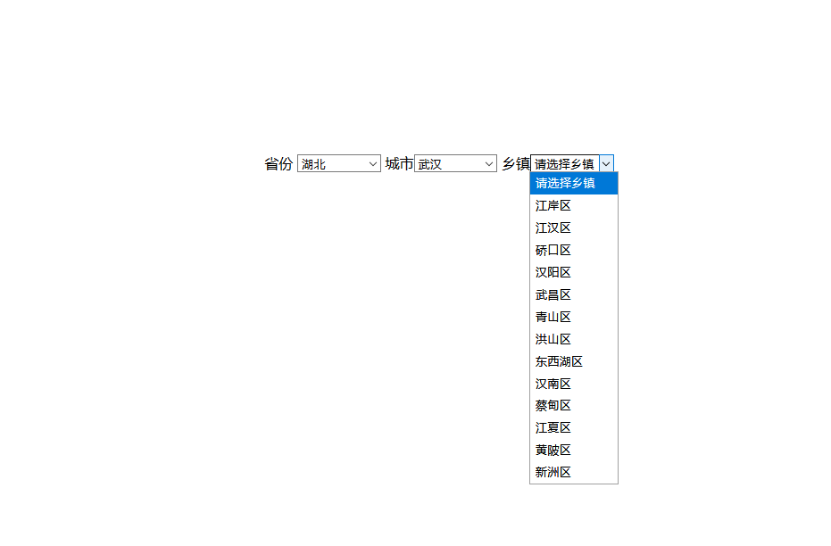

3.13作业
------
1. 1.结合上述所讲的echarts与后台交互数据,查看官网echarts:实例----官方实例,在其中找一个符合你身份echarts图形(与后台交互),除了今天讲的柱状图
    1. 1.1 数据 [
    2. {value: 335, name: '直接访问'},
    3. {value: 310, name: '邮件营销'},
    4. {value: 234, name: '联盟广告'},
    5. {value: 135, name: '视频广告'},
    6. {value: 1548, name: '搜索引擎'}
    7. ]
    8. 1.2  ['直接访问', '邮件营销', '联盟广告', '视频广告', '搜索引擎']
2. 2.编写实体类直接写value对应数值,然后name对应名称即可
    1. 
3. 3.用arrayList返回前端即可
    1. 
4. 4.结果图 

作业2 三级联动
-----
2. 1.先创表
3. 2.创建项目,然后导入相应jar包 
4. 3.先写页面 
5. 4.编写c3p0的xml配置文件,填写配置信息
6. 5.创建DBUtil的工具类
7. 6.编写分别的实体类
8. 7.在编写dao层分别获取省份,城市,乡镇的方法
    1. 
9. 8.在测试类中测试dao层方法
10. 9.编写服务层调用dao层方法
11. 10.编写servlet调用服务层
12. 11.在页面中调用servlet即可
13. 12.效果图
14. 13.整体项目结构
    1. 
