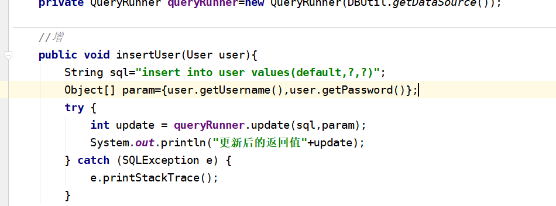
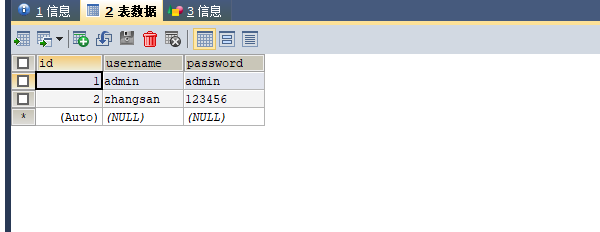
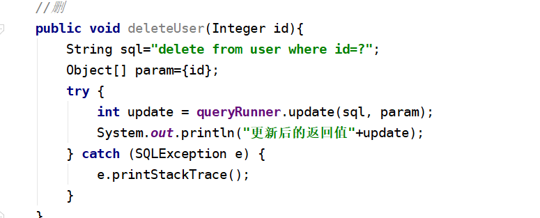
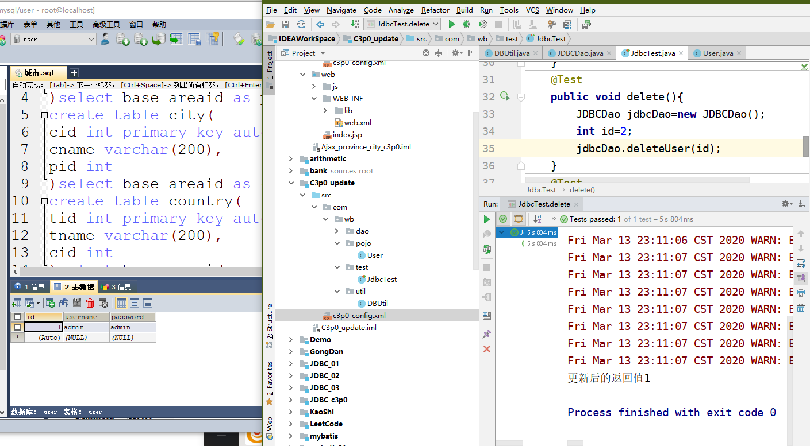
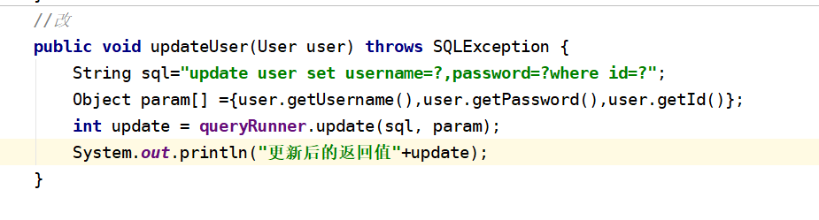
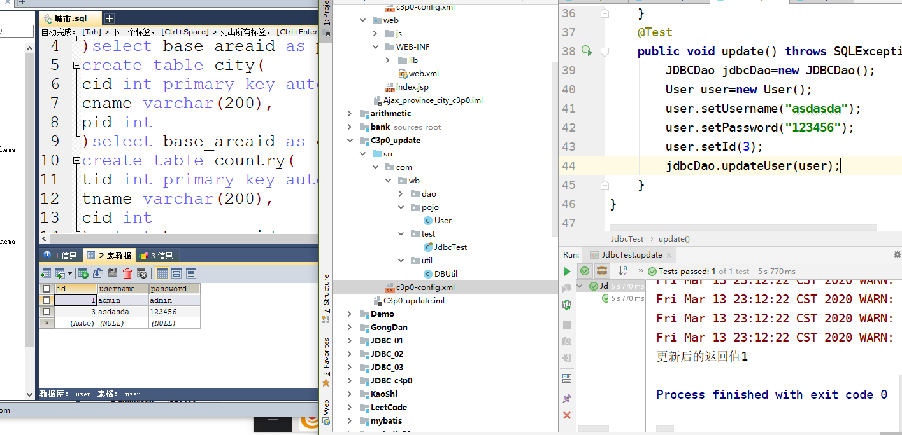

3.13预习
------
1. 一、c3p0的增删改
    1. 1.增 编写增添语句 `insert into user values(default,username,password);`
    2. 2.编写测试类测试 测试结果
    3. 3.删 
        1. 
        2. 
    4. 4.改 
        1. 
        2. 
2. 二、过滤器+监听器
    1. 1.配置过滤器