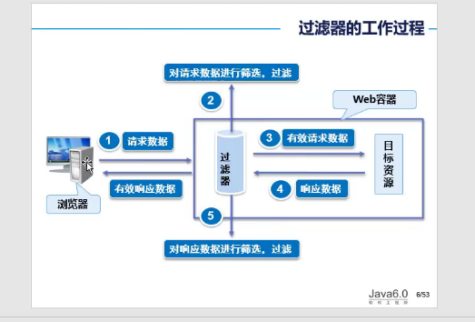
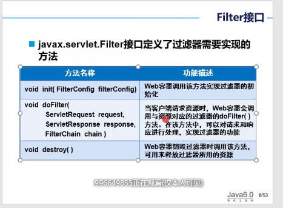
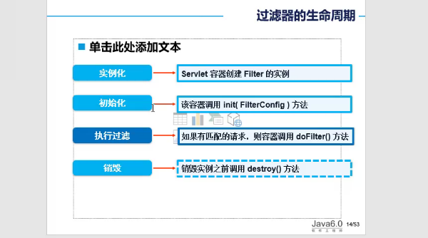
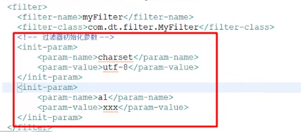
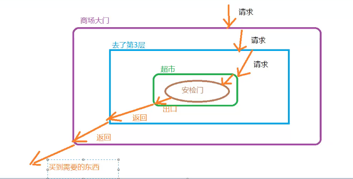
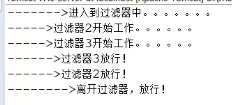

[TOC]

# 3月16日上课内容

## 一、上课内容-1

### C3P0+DBUtils框架

#### 回顾

1. QueryRunner是有Dbutil提供的一套增删改查的类
2. 查询方便,只需要query()就可以实现查询,不需要像传统的jdbc那样,封装和拆箱
   1. 
   2. 

### DBUtils+C3P0 实现对数据的增删改

#### 向数据表添加数据

1. SQL语句

   ```mysql
    insert into goods_cate values(default,'xx');
   ```

2. 在GoodsDaoImpl中添加addGoods方法,参数为GoodsCates good

   1. 用了c3p0连接池,不需要人为去连接,关闭,全部由c3p0去处理

   2. 分工问题

   3. 代码

      ```java
      int flag=0;
      String sql=" insert into goods_cate values(default,'xx')";
      QueryRunner qr=new QueryRunner(C3P0Util.getDataSource());
      flag = qr.update(sql,goods.getCate_name());
      ```

3. 服务层调用dao层

   ```java
   public int addGoods(GoodsCates good){
   	return GoodsDao.addGoods(good);
   }
   ```

4. 测试类

   ```java
   GoodsCates gc=new GoodsCates();
   gc.setCate_name=("神舟笔记本电脑");
   GoodsService gs=new GoodsServiceImpl();
   int flag=gs.addGoods(gc);
   System.out.println("执行的结果"+flag);
   ```

#### 对数据表的删除数据

1. 实现思路

   1. 传入商品id,进入数据库,进行删除
   2. 编写sql语句
   3. 编写dao层,用queryRunner直接update执行sql语句
   4. 编写service层调用dao层实现类
   5. 测试类调用即可

2. SQL语句

   ```mysql
   delete from goods_cates where id=?
   ```

3. dao层

   

4. service层

   

5. 测试代码

   

#### 对数据库数据的更新

1. SQL语句 

   ```mysql
   update goods_cates set cate_name=? where cate_id=?
   ```

2. dao层代码

   

3. service层代码

   ​	

4. 测试代码

   

#### 根据id返回JAVABean

1. SQL语句

   ```mysql
   select * from goods_cates where id=?
   ```

2. dao层代码

   ```java
   String sql=" select * from goods_cate where id=?";
   Goods gc=null;
   Object[] param={id};
   QueryRunner qr=new QueryRunner(C3P0Util.getDataSource());
   gc=qr.query(sql,new BeanHandler<Goods>(Goods.class),param);
   return gc;
   ```

3. service层代码

   1. 调用dao层即可

4. 测试层代码

   1. 调用service层即可

#### 查询唯一的数据

##### 示例：例如聚合函数,统计goods数目问题

1. SQL语句

   ```
   select count(1) from goods_cates;
   ```

2. dao层代码

   

3. service层代码

   ```java
   return goodsDao.getGoodsCount();
   ```

4. 测试层代码

   

   

   

   

   

##### 查询count代码,调用的是new ScalarHandler方法


## 二、上课内容-2

### 过滤器

#### 过滤器概念

##### 作用:过滤器用于拦截传入的请求和传出的响应

1. 认识传入的请求

2. 把web.xml中的welcome-file-list删除

3. 创建index.html

   

4. tomcat服务器会默认的访问index页面,就算删除了项目的web.xml文件

   

5. 如何访问项目下的一个页面

   1. 直接/+页面名称即可

6. 很多网上链接，感觉是进入了静态网页，其实不是

##### 如何把action="abc.html"请求到login的servlet中

1. 修改xml文件即可

   

2. servlet页面

   

3. 请求：不分格式，不分后缀

   

4. 过滤器的作用不仅仅是过滤，还有拦截(请求和响应)，还可以监视数据流

   

##### request

1. request是来自于普通的html5网页的
2. get方式请求中文并没有乱码

#### 过滤器如何使用

##### 如何利用过滤器进行编码设置

1. 创建MyFilter实现filter接口

   ```java
   public class MyFilter implements Filter{
   	//过滤器的方法
   	//destory init doFliter方法
   }
   ```

2. 代码

   

3. web.xml设置与servlet高度相似   //java找全路径都是包名加类名的全路径

   ```xml
   <filter>
   	<filter-name>myFilter</filter-name>
   	<filter-class>全路径</filter-class>	
   </filter>
   <filter-mapping>
       <filter-name>myFilter</filter-name>
       <url-pattern>/*</url-pattern>
    <!-- /* 代表过滤所有的请求  -->
   </filter-mapping>
   ```

4. doFilter方法代码

   ```java
   public void doFilter(ServletRequest arg0,ServletResponse arg1,FilterChain arg2) throw IOException,ServletException{
       System.out.println("——————>进入到了过滤器中");
       arg0.setCharacterEncoding("urf-8");
       //FilterChain理解
      	 //作用:放行
       arg2.doFilter(arg0.arg1);
        System.out.println("离开过滤器-->放行");
   }
   ```

5. 普通的请求也会经过过滤器

## 三、上课内容-3

### 过滤器

#### 过滤器的工作过程



#### Filter接口



#### Filter的生命周期

##### 示例

1. init方法

   ```java
   System.out.println("------>过滤器初始化");
   ```

2. destory方法

   ```java
   System.out.println("------>过滤器销毁了");
   ```

3. 只要项目被加载,init方法就会执行

   1. Servlet中的init方法只会被初始化调用1次
   2. Filter中的init方法也只调用一次

4. 停止服务端会调用desotry方法

5. 小结:通过上述的实验---->init()只会调用一次,doFilter()----->会被调用多次,destory()----->也只会调用一次；销毁的方法，不要在console(控制台)取停止运行项目,而应该在servers中取停止，才会调用destory方法

##### 理论



##### 过滤器的初始化参数

1. utf-8:在过滤器类中,是一个固定的值,那么像这样的值可以固化到配置文件xml中,大家都可以去读取

2. 配置代码

   ```xml
   <filter>
       <filter-name></filter-name>
       <filter-class></filter-class>
       <!-- 过滤器初始化参数,内部的key-value,只需要在加载项目过程中读取一次即可
   		像这种参数,没必要每次过滤的时候都去读取
   	-->
       <init-param>
               <param-name>charset</param-name>
               <param-value>utf-8</param-value>
       </init-param>
   </filter>
   ```

3. 如何读取

   ```java
   //通过初始化参数
   private String charset="";
   /**那么doFilter可以改成charset*/
   //在init中的代码
   //获取的是web.xml中filter标签内部init-param标签的键
   this.charset=arg0.getInitParameter("charset");
   System.out.println("------>获取初始化的value"+charset);
   ```

## 四、上课内容-4

### 过滤器

#### 多个初始化参数如何设置



#### 过滤器链

##### 图解



##### 示例:创建多个过滤器

1. 创建过滤器MyFilter2,MyFilter3

2. 编写xml文件

3.  结果图

   

4. 结果:过滤器的特色，嵌套，一层包一层的关系

## 五、作业

#### 作业1:有多个参数的情况下,那么init()方法如何获取？

#### 作业2:如果请求/* 换成单独的/ 或*,那么/ 或 * 有什么区别？请用实验说明，描述？ 

## 六、预习

#### 监听器,jsp+servlet(@Webservlet 注解),前面所讲的知识点复习

#### mybatis+spring+spring mvc eclipse(不用担心工具问题) ssm 并不是最终目标