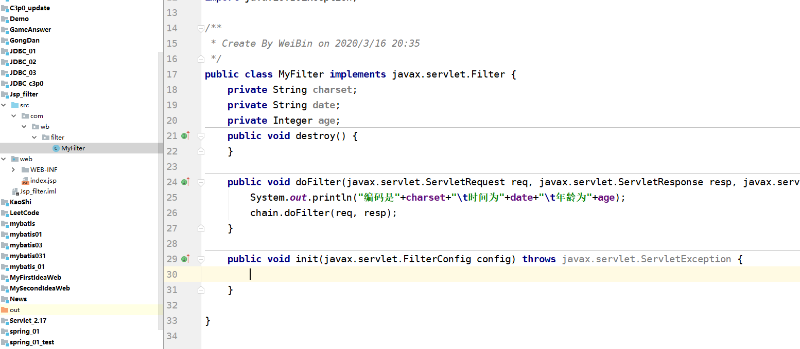
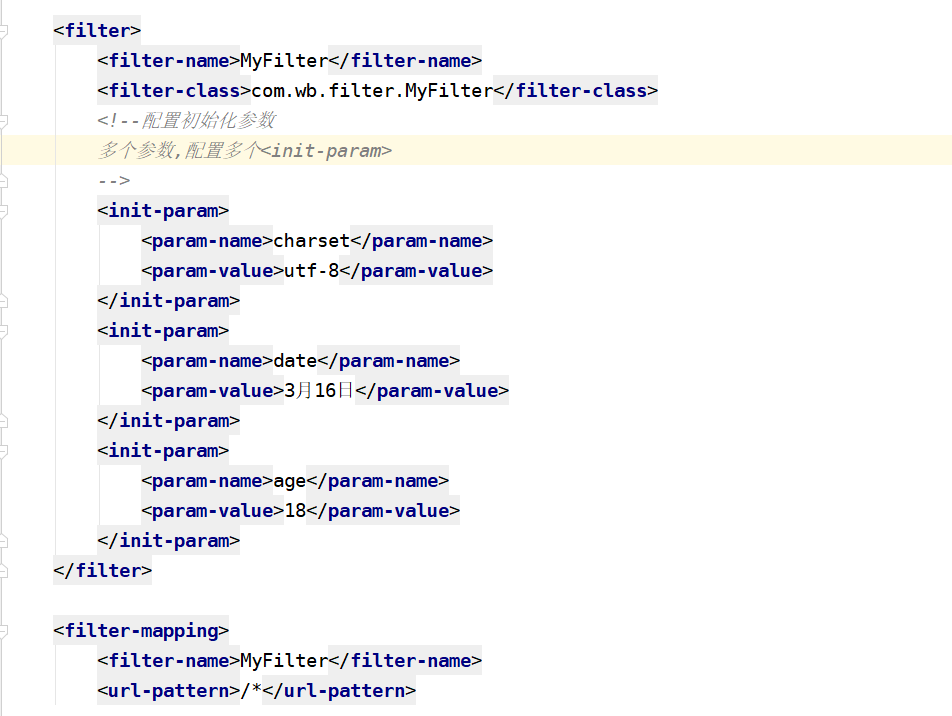
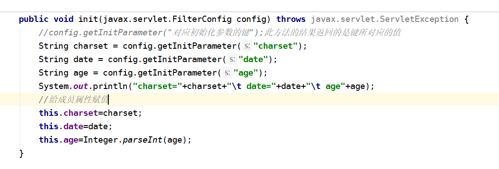
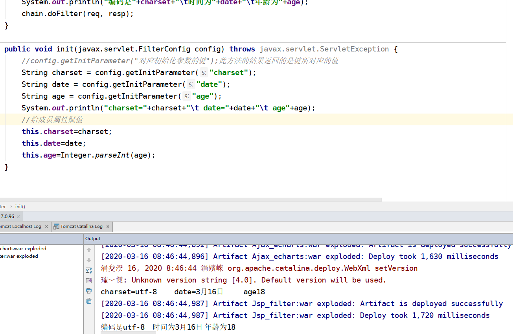
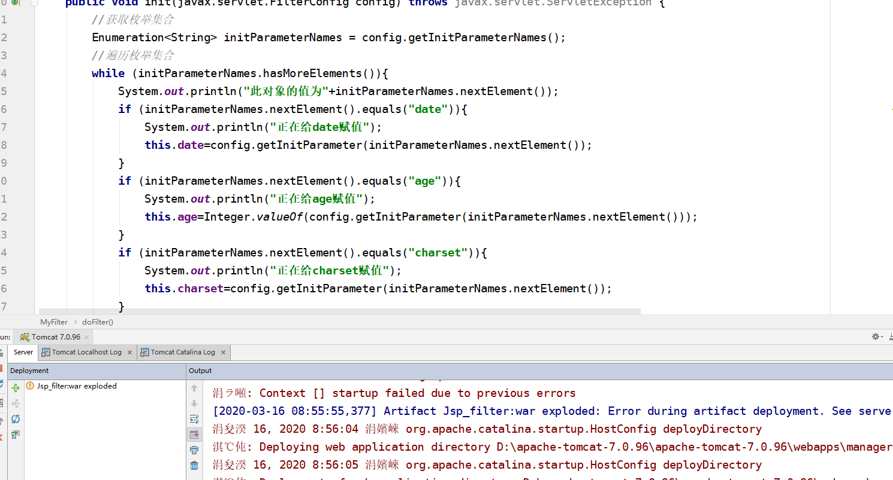
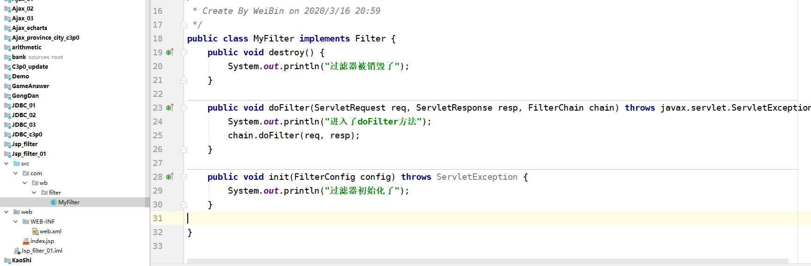
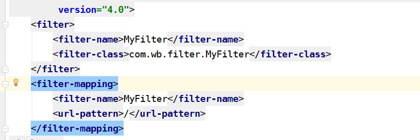
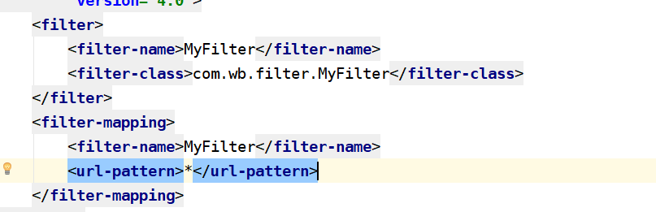

[TOC]

## 3.16作业

### 作业1：有多个参数的情况下,那么init()方法如何获取？

#### 思路

1. 创建web项目
2. 创建filter过滤器
3. 定义多个属性并且xml配置多个属性
4. 在init方法中获取属性
5. 打印在控制台即可

#### 代码

1. 创建web项目,生成filter,在Filter中自定义2个以上属性

   

2. 配置xml文件

   

3. 在init方法中编写代码测试能否获取到初始化的参数

   

4. 启动web项目,观察控制台结果

   

5. 小结:上述案例可以看出,多个参数可以用FilterConfig多次调用getInitParameter()方法来取值

##### 观察发现config有getInitParameterNames()方法,返回的是一个枚举集合,所以得出也可以遍历枚举来取得初始化参数的值

此方法并没有跑起来，不知道什么原因

### 作业2：如果请求/* 换成单独的/ 或*,那么/ 或 * 有什么区别？请用实验说明描述？

#### 思路

1. 创建web项目
2. 编写filter
3. 修改filter的url-pattern
4. 分别以a标记,表单,get,post 等不同请求去测试
5. 然后观察区别（我们都知道/*是过滤所有请求）

#### 代码

1. 创建web项目,生成filter,在Filter中写好输出语句来作为是否进入了过滤器的判断

   

2. 编写一个servlet用来接收请求(没有其他要求)

3. 编写xml配置文件

   1. /的配置

      

   2. *的配置

      

4. 分别查看/和*的结果

   |      |   直接网址访问   |      a标记       |     get请求      |     post请求     |
   | ---- | :--------------: | :--------------: | :--------------: | :--------------: |
   | /    | 没有进入dofilter | 没有进入dofilter | 没有进入dofilter | 没有进入dofilter |
   | *    |  进入了dofilter  |  进入了dofilter  |  进入了dofilter  |  进入了dofilter  |

#### 小结

1. 看出/并没有过滤任何请求,而*则过滤了所有请求
2. 测试时候,如果直接写地址+端口号+"/",后台表示进入了dofilter，代表"/"匹配的是单个/,并且自己测验时发现并不能匹配/test这种servlet请求
3. *可以匹配你所有,类似模糊匹配,可以写成\*.jsp,\*.html,\*.js等形式,即过滤这种后缀的文件和请求
4. /是精确匹配,只匹配"/"