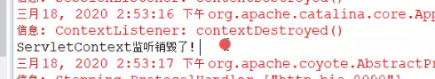

[TOC]

# 3.18日上课内容

## 一、作业评讲

### 作业1：过滤器，初始化多个参数

#### 过程

##### 代码


------


##### java代码

```java
public void init(Filterconfig arg0){
  Emumeration<String> emumeration=arg0.getInitParameterNames();
    while(emumeration.hasMoreElements()){
     System.out.println(arg0.getInitParameter(emumeration.nextElements));
    }
}
```

##### 结果


### 作业2:/* 换成/ 或 * 作用和区别？

#### 过程

1. 编写两个jsp页面

2. 新建一个servlet

   ```java
   System.out.println("进入到loginServlet中");
   ```

3. 新建一个filter

   ```java
   //在doFilter中编写代码
   	System.out.println("--------》拦截一些请求，停在当前位置");
   ```

   

4. 测试结果

   1. /:代表根目录下面的文件,类似于全局变量,根目录下面的请求,都可以直接访问,不会进入filter
   2. *:等同于 /\*

## 二、上课内容-1

### 监听器

#### 监听器是什么？


#### 监听器入门示例

##### ServletContextListener 监听器的接口

##### 步骤

1. 创建项目

2. 创建LoginServlet

3. 在doget中输出一句话

   ```java
   System.out.println("进入了loginservlet");
   ```

   

4. 新建一个监听器放在listener包下，名字叫MyListener

5. 实现接口ServletContextListener，添加未实现方法

   ```java
   public void contextDestoryed(ServletContextEvent arg0){
       System.out.println("监听器销毁了");
   }
   public void contextInitialized(ServletContextEvent arg0){
       System.out.println("监听器初始化了");
   }
   ```

6. 配置监听器的xml文件

   ```xml
   <listener>
   <listener-class>包名+类名全路径</listener-class>
   </listener>
   ```

7. 运行结果

   

   

8. 总结:**ServletContextEvent监听项目运行(启动,停止)**

#### 项目中的session如何监控？

1. 监控是否注销？
2. 监控是否启动？

## 三、上课内容-2

### 监听器

#### 监听session

##### 案例

1. 新建一个MySessionListener实现HttpSessionListener

2. 结果

   

3. 在servlet中创建一个session

   ```java
   Httpsession session=request.getSession()
       System.out.println("session被创建出来，监控器监控session1分钟后销毁");
   ```

4. xml配置文件

   

5. 执行测试结果

   

6. 一分钟后结果

   

7. 小结:session的创建和销毁由监控器帮我们处理了

##### 问题：如何把session时间从xml文件设置转换到servlet中

在servlet加上如下代码

```java
session.setMaxInactiveInterval(60);//单位秒
```

##### 作用：如何知道一个运行的网页session什么时候销毁？

使用监听器就可以

**例如：一个注册的用户，过半个小时后，要注销掉当前的用户，可以给session设置时间**

#### 监听request

##### 案例

1. 新建Listener实现ServletRequestListener

   

2. 在servlet中进行测试

   

   * **问题：为什么request，还没等到session销毁，request就销毁了？**
     * reques只要到达服务端后，使命就完成了！
   * session的默认的生命时间是多少呢？
     * 一次会话期

## 四、上课内容-3

### 监听器

#### 监听attributeList,监听器获取不同作用域的数据

##### 案例1.测验context获取

1. 创建Listener,实现接口ServletContextAttribute,ServletRequestAttruibute

   

   

2. 新建一个ContentServlet

   ```java
   System.out.println("进入了ContextServlet");
   ServletContext servletContext=getServletContext();//得到servletContext对象
   servletContext.setAttribute("aa","小明");
   ```

   

3. 获取结果

   

##### 练习:测试获取request属性

###### 思路：

1. 创建项目
2. 创建一个Listener监听器
3. 创建一个servlet编写测试代码
4. 启动项目进行测验
5. 观看测验结果

###### 具体实现

1. 创建项目,新建Listener监听器

   ```java
   /*
    * 版权所有(C)，2020，所有权利保留。
    * 项目名： Jsp_listener_01
    * 文件名： MyListener.java
    * 模块说明：
    * 修改历史:
    * 2020-3-18 16:37:47 - WeiBin - 创建。
    */
   
   package com.wb.listener; /**
    * Create By WeiBin on 2020/3/18 16:37
    */
   
   import javax.servlet.ServletContextAttributeEvent;
   import javax.servlet.ServletContextAttributeListener;
   import javax.servlet.ServletRequestAttributeEvent;
   import javax.servlet.ServletRequestAttributeListener;
   import javax.servlet.annotation.WebListener;
   import javax.servlet.http.HttpSessionAttributeListener;
   import javax.servlet.http.HttpSessionBindingEvent;
   
   @WebListener()
   public class MyListener implements ServletContextAttributeListener,
           HttpSessionAttributeListener, ServletRequestAttributeListener {
   
       @Override
       public void attributeAdded(ServletContextAttributeEvent servletContextAttributeEvent) {
           System.out.println("context添加了attribute名字是"+servletContextAttributeEvent.getName()+"\t|值是"+servletContextAttributeEvent.getValue());
       }
   
       @Override
       public void attributeRemoved(ServletContextAttributeEvent servletContextAttributeEvent) {
           System.out.println("context移除了attribute名字是"+servletContextAttributeEvent.getName()+"\t|值是"+servletContextAttributeEvent.getValue());
       }
   
       @Override
       public void attributeReplaced(ServletContextAttributeEvent servletContextAttributeEvent) {
           System.out.println("context替换了attribute名字是"+servletContextAttributeEvent.getName()+"\t|值是"+servletContextAttributeEvent.getValue());
       }
   
       @Override
       public void attributeAdded(ServletRequestAttributeEvent servletRequestAttributeEvent) {
           System.out.println("request添加了attribute名字是"+servletRequestAttributeEvent.getName()+"\t|值是"+servletRequestAttributeEvent.getValue());
   
       }
   
       @Override
       public void attributeRemoved(ServletRequestAttributeEvent servletRequestAttributeEvent) {
           System.out.println("request移除了attribute名字是"+servletRequestAttributeEvent.getName()+"\t|值是"+servletRequestAttributeEvent.getValue());
       }
   
       @Override
       public void attributeReplaced(ServletRequestAttributeEvent servletRequestAttributeEvent) {
           System.out.println("request替换了attribute名字是"+servletRequestAttributeEvent.getName()+"\t|值是"+servletRequestAttributeEvent.getValue());
       }
   
       @Override
       public void attributeAdded(HttpSessionBindingEvent httpSessionBindingEvent) {
           System.out.println("session添加了attribute名字是"+httpSessionBindingEvent.getName()+"\t|值是"+httpSessionBindingEvent.getValue());
       }
   
       @Override
       public void attributeRemoved(HttpSessionBindingEvent httpSessionBindingEvent) {
           System.out.println("session移除了attribute名字是"+httpSessionBindingEvent.getName()+"\t|值是"+httpSessionBindingEvent.getValue());
       }
   
       @Override
       public void attributeReplaced(HttpSessionBindingEvent httpSessionBindingEvent) {
           System.out.println("session替换了attribute名字是"+httpSessionBindingEvent.getName()+"\t|值是"+httpSessionBindingEvent.getValue());
       }
   }
   
   ```

   

2. 创建servlet

   ```java
   /*
    * 版权所有(C)，2020，所有权利保留。
    * 项目名： Jsp_listener_01
    * 文件名： RequestServlet.java
    * 模块说明：
    * 修改历史:
    * 2020-3-18 16:35:35 - WeiBin - 创建。
    */
   
   package com.wb.servlet;
   
   import javax.servlet.http.HttpSession;
   import java.io.IOException;
   
   /**
    * Create By WeiBin on 2020/3/18 16:35
    */
   @javax.servlet.annotation.WebServlet(name = "RequestServlet",urlPatterns = "/request")
   public class RequestServlet extends javax.servlet.http.HttpServlet {
       protected void doPost(javax.servlet.http.HttpServletRequest request, javax.servlet.http.HttpServletResponse response) throws javax.servlet.ServletException, IOException {
   
       }
   
       protected void doGet(javax.servlet.http.HttpServletRequest request, javax.servlet.http.HttpServletResponse response) throws javax.servlet.ServletException, IOException {
           System.out.println("进入了request");
           request.setAttribute("bbb","大宝");
           request.setAttribute("bbb","小宝");
           request.removeAttribute("bbb");
           System.out.println("——————————————————");
           HttpSession session=request.getSession();
           session.setAttribute("cccc","张三");
           session.setAttribute("cccc","李四");
           session.removeAttribute("cccc");
           System.out.println("————————————————");
       }
   }
   ```

   

3. 测试结果

   

##### 监听作用域的目的(作用)

* **跟踪作用域(这种情况)，用监听器,存值，存对象**

##### 案例:测试获取监听session对象属性

1. 被监听的类需要实现接口
2. 效果

## 作业

### 把今天所讲的监听器+过滤器用在新闻发布系统案例

###### 例如:所有的编码集问题可以用过滤器(request,response)

###### 监听器：监听request,session[登录进去后,3分钟后把当前用户注销]

## 预习

#### servlet3.0 注解