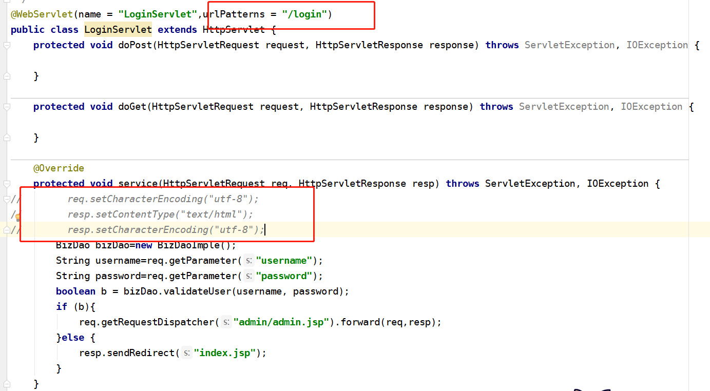
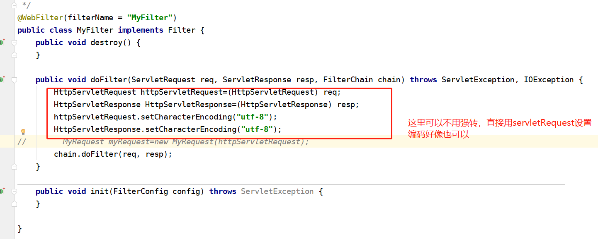
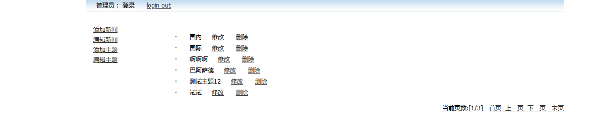
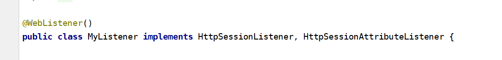
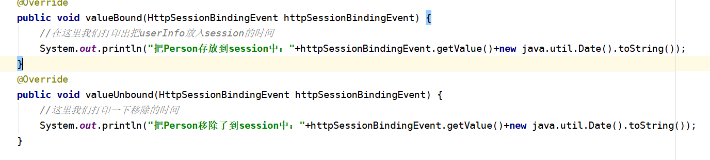
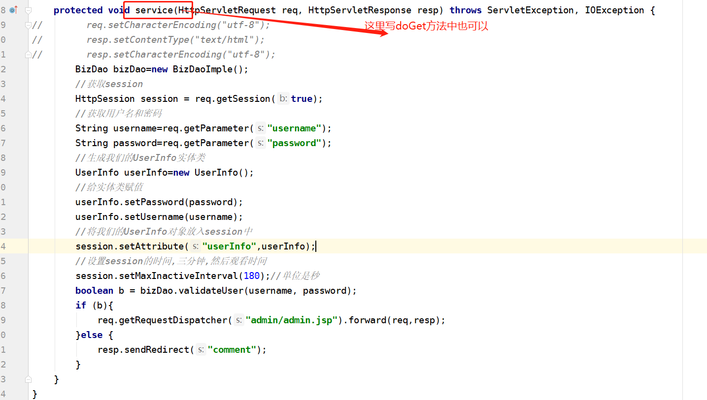
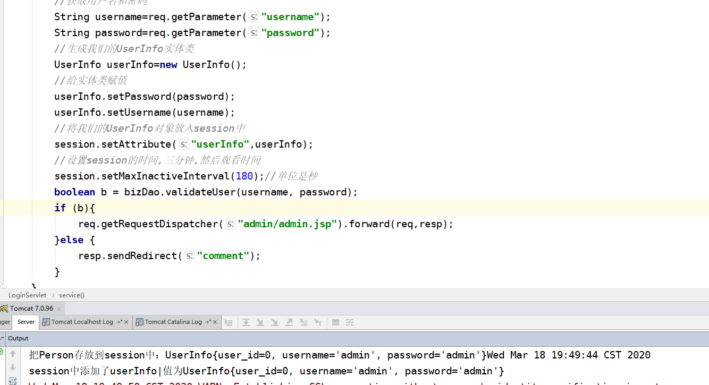
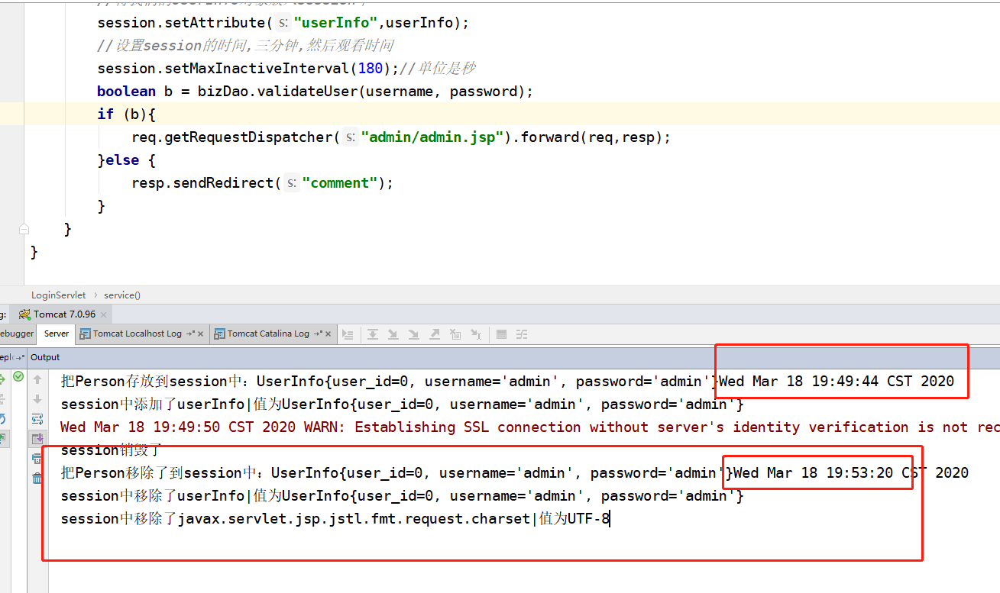

## 3.18日作业

### 作业1：用过滤器设置新闻发布系统的编码

#### 思路

1. 代码重构,将之前的每个servlet中设置编码的代码删除，做测试
2. 然后新建一个过滤器(MyFilter)
3. 在过滤器中设置请求和响应的编码格式
4. 最后运行项目，看测试结果

#### 具体实现

1. 首先先跑一下我们的项目看有没有出现乱码问题

2. 然后先随便注释一下一个servlet的设置编码的代码

   

3. 然后新建一个过滤器Filter

4. 在Filter的doFilter方法中编写如下代码

   ```java
    public void doFilter(ServletRequest req, ServletResponse resp, FilterChain chain) throws ServletException, IOException {
           HttpServletRequest httpServletRequest=(HttpServletRequest) req;
           HttpServletResponse HttpServletResponse=(HttpServletResponse) resp;
           httpServletRequest.setCharacterEncoding("utf-8");
           HttpServletResponse.setCharacterEncoding("utf-8");
           chain.doFilter(req, resp);
       }
   ```

   

5. 然后再运行项目发现之前删除的servlet设置编码的也没有出现乱码,那么就可以把所有的servlet的编码设置都去掉了

   

### 作业2：设置登录之后，3分钟以后将用户的session销毁

#### 思路

1. 首先实现监听器，监听我们的session
2. 在我们的用户登录的实体类即User类中实现监听接口
3. 在登录的servlet中获取登录的用户名和密码，然后保存到User对象中,用session存储起来，并且设置好session的销毁时间
4. 测试观察结果即可

#### 具体实现

1. 创建监听器,实现session监听的接口

   

2. 然后listener的具体代码如下

   ```java
   import javax.servlet.annotation.WebListener;
   import javax.servlet.http.HttpSessionAttributeListener;
   import javax.servlet.http.HttpSessionBindingEvent;
   import javax.servlet.http.HttpSessionEvent;
   import javax.servlet.http.HttpSessionListener;
   
   @WebListener()
   public class MyListener implements HttpSessionListener, HttpSessionAttributeListener {
   
       @Override
       public void attributeAdded(HttpSessionBindingEvent httpSessionBindingEvent) {
           System.out.println("session中添加了"+httpSessionBindingEvent.getName()+"|值为"+httpSessionBindingEvent.getValue());
       }
   
       @Override
       public void attributeRemoved(HttpSessionBindingEvent httpSessionBindingEvent) {
           System.out.println("session中移除了"+httpSessionBindingEvent.getName()+"|值为"+httpSessionBindingEvent.getValue());
       }
   
       @Override
       public void attributeReplaced(HttpSessionBindingEvent httpSessionBindingEvent) {
           System.out.println("session中替换了"+httpSessionBindingEvent.getName()+"|值为"+httpSessionBindingEvent.getValue());
       }
   
       @Override
       public void sessionCreated(HttpSessionEvent httpSessionEvent) {
           System.out.println("session被创建了");
       }
   
       @Override
       public void sessionDestroyed(HttpSessionEvent httpSessionEvent) {
           System.out.println("session销毁了");
       }
   }
   ```

3. 我们的User类实现监听接口HttpSessionBindingListener并且编写重写方法

   

4. 在我们的loginServlet中编写Session，并且设置Session有效期

   

5. 运行项目，观察控制台结果

   **运行开始**

   ​	

   **运行结束**

   ------

   

#### 思考:既然session是一次会话期,那么我们可以用session来判断用户是否登录在线，以防止用户不在线还可以正常访问我们本来需要登录的页面?

1. 我们用户登录创建session
2. 然后在页面中做判断,用reqest取在session中的值,看我们的session用户是否存在,如果存在，才让访问，否则的话回到登录页面

