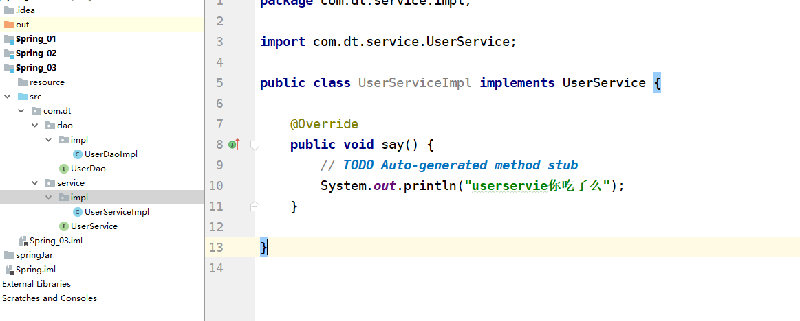

## 3.20作业

### 作业1：在UserServiceImpl类，如何用spring方式实现UserDao的注入？

#### 思路

1. 导入作业素材
2. 注入的过程，就是在xml文件中配置我们需要用到的类，然后用ApplicationContext容器对象来获取容器中的bean(也就是我们配置好的类)

#### 步骤

1. 建项目

2. 导jar包

3. 导素材

   

4. 写xml配置文件

   **xml文件要写在src的根目录下**ApplicationContext.xml

   ```xml
   
   ```

   

5. 编写测试文件进行测试

### 作业2：用di的方式，实现UserServiceImpl中say()调用？

1. 获取UserService对象后直接调用即可

