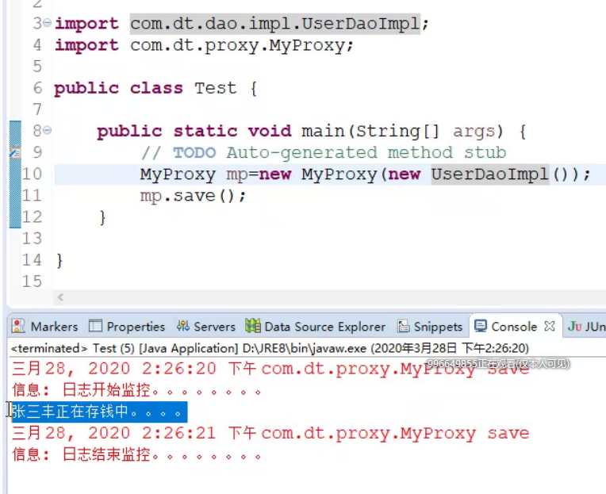
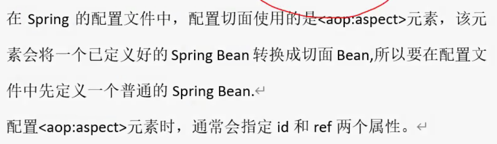
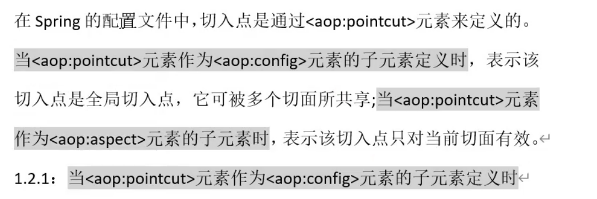
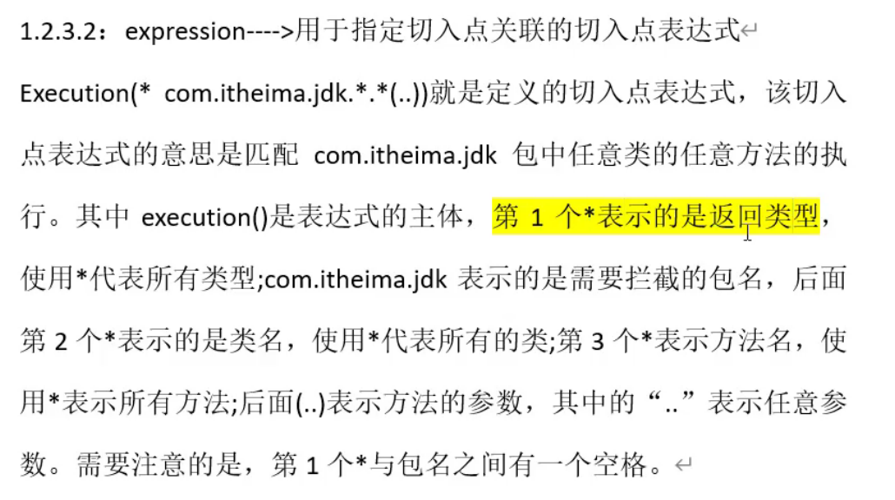
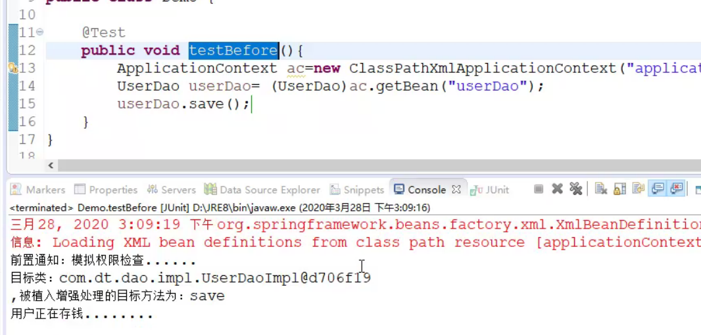
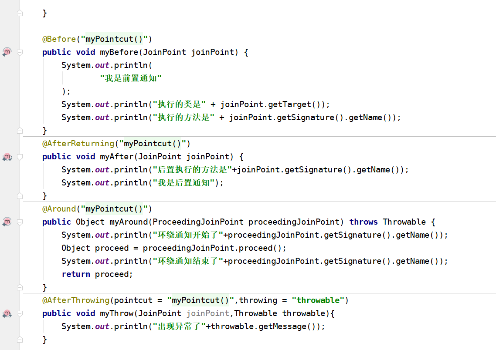
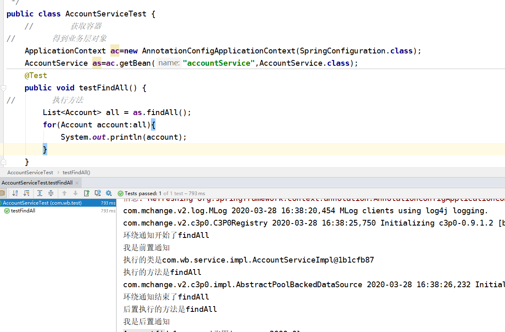

## 3.28上课内容

### 一、作业评讲

#### 静态代理

1. 创建项目

2. 创建Bank接口 给定save方法

3. 创建UserDao实现Bank接口

4. 创建代理类 实现Bank接口

   ```java
   Logger logger=Logger.getLogger(MyProxy.class.getName());//获取当前类的日志信息
   
   private Bank delegete;
   
   public MyProxy(Bank bank){
       this.delegete=bank;
   }
   
   public void save(){
    	logger.info("日志开始监控")   
           delegete.save();
   }
   

   ```

5. 测试类

   ```java
   MyProxy mp=new MyProxy(new UserDaoImpl());
   mp.sve();
   ```

6. 结果

   

##### 总结

**静态代理:代理类和被代理类都需要去实现共同的接口**

误区:静态代理并不代表要用static

### AspectJ

#### 两种方式:

1. 使用XML的声明式AspectJ
2. 基于注解的声明式

#### 使用XML的声明式AspectJ

1. 配置切面

   

2. 配置切入点

   

##### xml示例

1. 导jar包

2. 创建UserDao接口和save方法

3. 实现UserDao接口

4. 编写切面类 MyAspect(前置通知) 在此类中编写通知

5. 前置通知

   ```java
   public void myBefore(JoinPoint joinPoint){
       print("前置通知:模拟权限检查......");
       print("目标类:"+joinPoint.getTarget());
       print(",被植入的增强处理的目标方法为:"+joinPoint.getSignature().getName);      
   }
   ```

6. xml配置

   ```xml
   <!--目标类-->
   <bean id="userDao" class="实现类的全限定路径"></bean>
   <!--切面类-->
   <bean id="myAspect" class="切面"></bean>
   <!--AOP编程 切面编程-->
   
   <aop:config>
   	<aop:aspect ref="myAspect">
           <!--配置切入点,通知最后增强的哪些方法-->
           <aop:pointcut expression="" id=""/>
       </aop:aspect>
       <!--关联通知和切入点-->
       <aop:before method="myBefore" pointcut-ref="myPointCut"/>
   </aop:config>
   
   ```

   

7. expression表达式

   

8. 测试结果

   

#### 自我总结

1. 首先声明一个切面 Declaring an aspect

   ```xml
   <aop:config>
       <aop:aspect id="myAspect" ref="aBean">
           ...
       </aop:aspect>
   </aop:config>
   
   <bean id="aBean" class="...">
       ...
   </bean>
   ```

   

2. 配置一个切入点 两种方式

   ```xml
   <aop:config>
       <aop:pointcut id="businessService"      expression="execution(* com.xyz.myapp.service.*.*(..))"/>
   </aop:config>
   ```

   ```xml
   <aop:config>
       <aop:pointcut id="businessService"
           expression="com.xyz.myapp.SystemArchitecture.businessService()"/>
   
   </aop:config>
   ```

3. 声明一个通知advice

   1. #### Before advice

      ```xml
      <aop:aspect id="beforeExample" ref="aBean">
      
          <aop:before
              pointcut-ref="dataAccessOperation"
              method="doAccessCheck"/>
      
          ...
      
      </aop:aspect>
      可以直接将切入点在前置通知中声明
      ```

      

   2. #### After returning advice

      ```xml
      <aop:aspect id="afterReturningExample" ref="aBean">
      
          <aop:after-returning
              pointcut-ref="dataAccessOperation"
              method="doAccessCheck"/>
      
          ...
      
      </aop:aspect>
      ```

      ```xml
      <aop:aspect id="afterReturningExample" ref="aBean">
      
          <aop:after-returning
              pointcut-ref="dataAccessOperation"
              returning="retVal"
              method="doAccessCheck"/>
      
          ...
      
      </aop:aspect>
      ```

      

   3. #### After throwing advice

      ```xml
      <aop:aspect id="afterThrowingExample" ref="aBean">
      
          <aop:after-throwing
              pointcut-ref="dataAccessOperation"
              throwing="dataAccessEx"
              method="doRecoveryActions"/>
      
          ...
      
      </aop:aspect>
      ```

      

   4. #### After (finally) advice

      ```xml
      <aop:aspect id="afterFinallyExample" ref="aBean">
      
          <aop:after
              pointcut-ref="dataAccessOperation"
              method="doReleaseLock"/>
      
          ...
      
      </aop:aspect>
      ```

      

   5. #### Around advice

      ```xml
      <aop:aspect id="aroundExample" ref="aBean">
      
          <aop:around
              pointcut-ref="businessService"
              method="doBasicProfiling"/>
      
          ...
      
      </aop:aspect>
      ```

      

#### 注解实现AOP





#### xml还是注解

XML样式将是现有Spring用户最熟悉的，并且由真正的POJO支持。当使用AOP作为配置企业服务的工具时，XML是一个不错的选择（一个很好的测试是您是否将切入点表达式视为配置的一部分，您可能希望独立更改）。可以说，使用XML样式可以从您的配置中更清楚地了解系统中存在哪些方面。

XML样式有两个缺点。首先，它没有完全将要解决的需求的实现封装在一个地方。 DRY原则说，系统中的任何知识都应该有单一，明确，权威的表示。在使用XML样式时，关于如何实现需求的知识会分散在支持Bean类的声明和配置文件中的XML中。使用@AspectJ样式时，只有一个模块-方面-将该信息封装在其中。其次，与@AspectJ样式相比，XML样式在表达能力上受到了更多限制：仅支持“单例”方面实例化模型，并且无法组合以XML声明的命名切入点。例如，使用@AspectJ样式

#### 作业

1. 用xml方式实现aspectJ
2. 用注解方式实现aspectJ

#### 项目

一个人做一个

#### 预习

spring-jdbc

