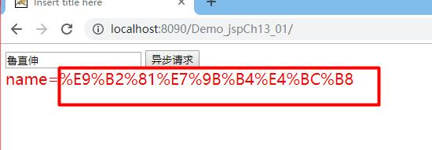

# 3月9日上课知识点 #
1. 一、作业评奖
    1. 1.js的方式进行异步和json格式数据的传输,采用xmlHtpp.open("post","ajax",true)和xmlHttp.send(JSON.Stringify(cd))
    2. <h3>2.注意：用js的方式实现ajax的时候,传递json对象,那么类型是post</h3>
    3. ### 3.作业要求:用jQuery的方式实现ajax,如何传递json到后台？###
        1. $.ajax({settings});
        2. 
        3. ajax两个面试题
            1. 1.在jQuery中的datatype是什么意思？
                1. datatype:指的不是data的数据类型，而是指的服务器预期返回的类型
            2. 2.json,那么解释一下什么是jsonp?
                1. jsonp:跨域(两个不同的服务器之间通讯)请求,返回的json对象
    4. ### 4.作业代码 ###
        1. 1.新建项目,导入jQuery的js包
        2. 2.web.xml配置初始页面
        3. 3.新建index.jsp页面，导入jQuery包 ``
        4. 4.页面内容
            1. `<input type="button" id="btnAjax" value="异步请求"/>`
            2. `

`
        5. 5.js代码
            1. var uname=$("uname").val();
            2. var cd={"name":uname};//页面input框的输入值
            3. $.ajax({
                1. url:"ajax",
                2. type:"get",
                3. data:cd,
                4. success:function(msg){
                    1. $("#mydiv").html(message);
                    1. },
                5. error:function(){
                    1. alert("error");
                6. }  
            4. });
        6. 6.新建servlet,servlet对应的url="/ajax"
        7. 7.servlet代码
            1. 
            2. 7.1 用流的方法取得值是null
                1. 更改type:"post"
            3. 7.2 更改post后取得值为name=admin,并且在前端并没有用json去解析json对象
                1. 问题:为什么js实现ajax时候,需要用jsonStringify()函数取解析json格式?而jQuery却可以不用？
                    1. 因为jQuery封装了js的库函数而演变过来,那么jQuery不是不需要解析，而是data(封装)，data封装后的数据格式变为key=value的形式
            4. 7.3 传回前端出现乱码
            5. 
                1. 造成原因:解决方法.在inputstreamReader(ist,"utf-8")
            6. 7.4 用json2.js进行json格式转换才能解析  
2. ##二、上课内容-1  ##
    1. 1.后台如何解析json？
        1. 1.1 在servlet中需要json中name中的值?
            1. 1.1.1 可以用字符串分割split
            2. 1.1.2 json 的PDF中的eval()方法是用来转换的
            3. 1.1.3 涉及后台解析需要jar包的支持
        2. 1.2 如何解析传递过来的json的代码
            1. 1.2.1 
            2. 1.2.2 导入json-lib-2.4-jdk15的jar包
            3. 1.2.3 将字符串转换成json对象 用JSONObject.fromJson();
            4. 1.2.4 然后用jsonObject.get("键")来获取值;
        3. 1.3 如果解析传递过来的json数组
            1. 1.3.1 解析代码
            2. 1.3.2 不同的json,指的是内部存放的数据，各有千秋
    2. 2.借助jsonUtil.java工具类,解析前端传递进来的json
        1. 2.1 新建一个stu的javaBean类，前端传入一个json格式的stu
            1. 
        2. 2.2 导入我们的jsonUtil工具包,放在util包下
        3. 2.3 直接通过调用JsonUtil.getObject4JsonString(str,类名.class)得到的就是一个实体类
3. ## 三、上课内容-2##
    1. 1.servlet也有json数据,传递到前端？
        1. 1.1 传入json,io流获取后直接返回前端
            1. 1.1.1 前端获取的是json格式的字符串,返回success的数据是json,那么如何调用json那样对json的值进行输出？
            2. 1.1.2 直接message.name进行输出结果为:undefined,看起来是json实际上是json字符串
            3. 1.1.3 使用javaScript的eval()方法将JSON字符串转换为JavaScript对象
                1. 
                2. 
            4. 1.1.4 使用json.parse(json字符串)方法后就可以直接调用了
4. ## 四、作业 ##
    1. 作业1：
        1. 请把dataType 加上去后,不用eval解析,是否可以？
    2. 作业2：
        1. 如果servlet返回的json数据是ArrayList<>(),那么前端success()如何解析？
        2. 如果servlet返回的json数据是HashMap<>(),那么前端success()如何解析？
5. ## 五、预习 ##
    1. 1、二级联动
    2. 2、echarts
        1. 作用：把数据变成图形的方式显示出来
        2. 要求：通过给大家的echarts框架,观察官方实例柱状图，用Hubilder创建1个demo版

create by wb 2020/3/9 17:37:16
------------------------------