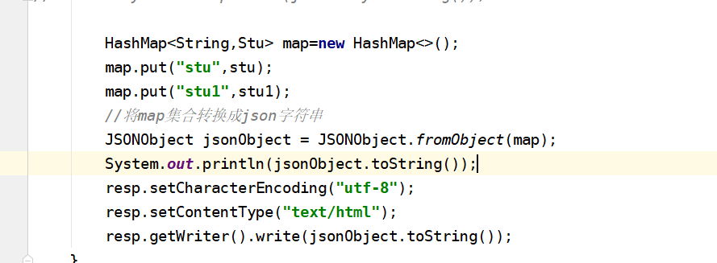

3.9日作业
------
1.  作业1:加上datatype
    1.  
    2.  结果:表明当加上dataType:"json"之后,可以直接对msg进行调用即可
2.  作业2:
    1.  2.1 如何处理ArrayList<>集合
        1.  servlet代码:
        2.  前端js代码:
        3.  结果：
    2.  2.2 如何处理HashMap<>集合
        1.  servlet代码:
        2.  前端js代码:
        3.  结果:

预习
-----------
1. 1.二级联动
    1. 1.1 就是两个下拉列表框.就拿你在网上注册的时候要填个人地址,我假设它有两个下拉列表(其实还可以有更多)第一个下拉列表中让你选择的省,而另一个下拉列表让你选择的是城市,当你在省的下拉列表中的选择发生改变的时候,城市的下拉列表也应当跟着你所选择的省名称而发生改变.这样就产生了一种联动的较果.也就是简单的二级联动..
