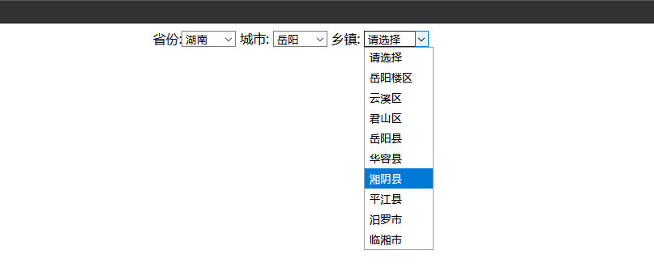

预习
--
1. 1.二级联动
    1. 1.1 页面代码
        1. 页面:
        2. jQuery代码
            1. 
    2. 1.2 servlet代码
        1. 初始化servlet:
        2. 省份查询servlet:
        3. 城市查询servlet:
    3. 1.3 服务层代码
    4. 1.4 dao层代码
    5. 1.5 效果图
2. 2.Echarts
    1. 2.1 html代码
    2. 2.2 效果图