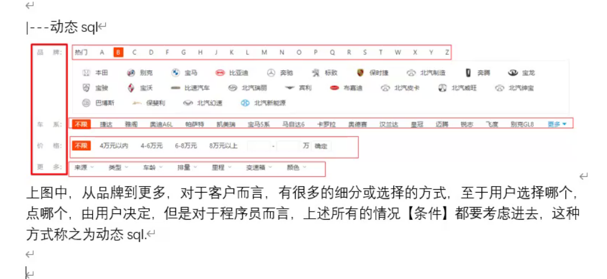

## myBatis动态SQL语句

### 一、课堂内容1

简介



#### 动态SQL

1. 导入了核心包后为什么还需要导入依赖包?
2. 因为核心包与依赖包是相辅相成的一套体系[类似医生与护士之间的关系]核心包工作的时候,需要依赖包的支持
3. 如果你用的是maven自动构建jar包的时候, maven会自动的帮我们导入依赖包

##### 搭建mybatis项目

##### if案例

1. 导入需要的依赖包和mybatis的核心包

2. 配置mybatis.xml文件,配置数据库连接

   ```java
   <?xml version="1.0" encoding="UTF-8" ?>
   <!DOCTYPE configuration
           PUBLIC "-//mybatis.org//DTD Config 3.0//EN"
           "http://mybatis.org/dtd/mybatis-3-config.dtd">
   <configuration>
       <settings>
           <setting name="logImpl" value="LOG4J"/>
       </settings>
       <typeAliases>
           <package name="com.school.pojo"></package>
       </typeAliases>
       <environments default="default">
           <environment id="default">
               <transactionManager type="JDBC"></transactionManager>
               <dataSource type="POOLED">
                   <property name="driver" value="com.mysql.jdbc.Driver"></property>
                   <property name="url" value="jdbc:mysql://localhost:3306/school"></property>
                   <property name="username" value="root"></property>
                   <property name="password" value="996649855"></property>
               </dataSource>
           </environment>
       </environments>
       <mappers>
       <package name="com.school.mapper"></package>
       </mappers>
   </configuration>
   ```

   

3. 导入log4j属性配置文件

4. 创建mapper包和mapper接口

   ```java
   public List<Customer> findCustomer();
   ```

5. 在mapper包下新建mapper.xml文件

   ```xml
   <?xml version="1.0" encoding="UTF-8" ?>
   <!DOCTYPE mapper
     PUBLIC "-//mybatis.org//DTD Mapper 3.0//EN"
     "http://mybatis.org/dtd/mybatis-3-mapper.dtd">
   <mapper namespace="mapper的包名+类名">
     <select id="接口方法名" parameterType="参数类型" resultType="返回值类型">
   	select * from t_customer where 1=1
         <!-- username从pojo类中获取-->
     <if test="username!=null and username!=''">
   	and username like concat('%',#{username},'%')
     </if>
     <if test="jobs!=null and jobs!=''">
         and jobs=#{jobs}
     </if>    
     </select>
   </mapper>
   ```

   

6. 创建pojo包和对应的实体类Customer

   ```java
   private int id;
   private String username;
   private String jobs;
   private String phone;
   //生产set get方法
   ```

7. 创建测试类

   ```java
   public void findCustomerTest(){
       SqlSessionFactory ssf=SqlSessionFactoryUtil.getSqlSessionFactory();
       SqlSesssion.sqlsession=ssf.openSession();
   //用mybatis提供的getMapper方法,获取反射的类,返回的是接口或类对象
       Mapper m=sqlSession.getMapper(Mapper.class);
       //调用m的查询方法
       m.findCustomer();
   }
   ```

   

8. 测试结果

   接口---->xml文件 么有实现类

   BizMapper接口

##### choose (when, otherwise) 案例


