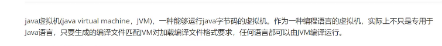
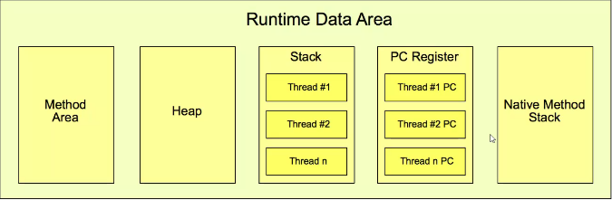
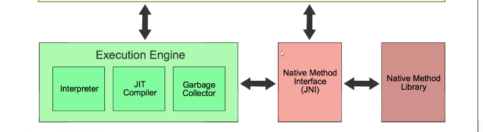
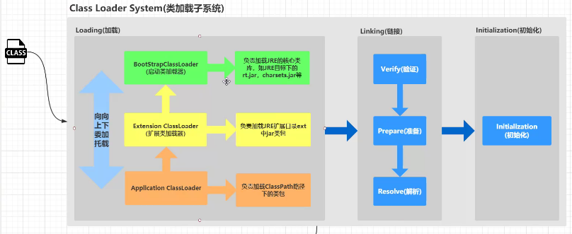
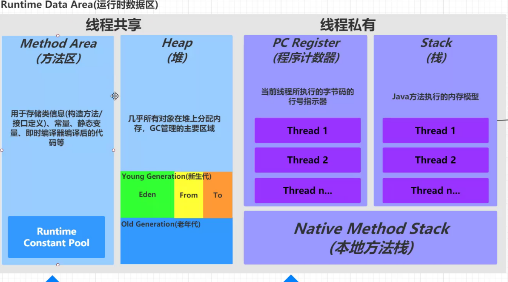
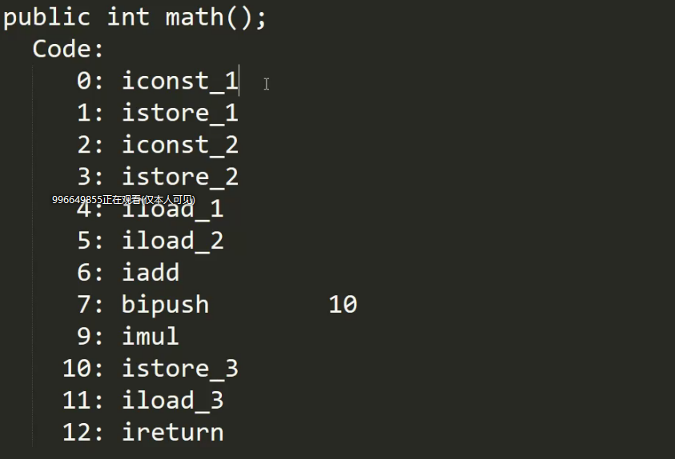
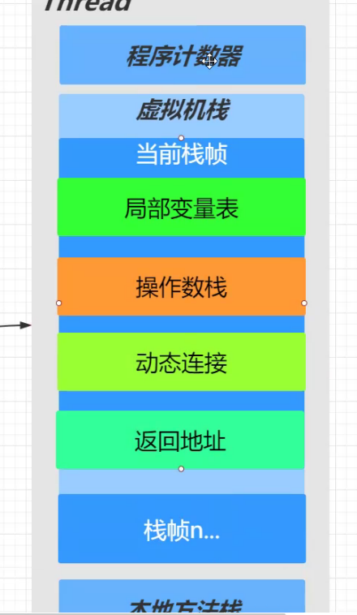
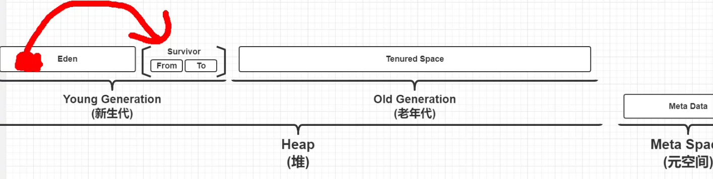

## JAVA面试训练营之JVM

### Java虚拟机



规范---------标准

实现--------- hotspot  jrockit  j9  淘宝VM 


### JVM



### 执行引擎



### 类加载子系统



### 运行时数据区



- class文件 javac编译

- javap反编译

- jvm指令集

  

- 

- 虚拟机栈运行方法

  1. 栈帧:对应方法,有多个

  2. 当前栈帧

  3. 操作数栈

     先进后出

     压栈

     instore_1 将int1放入到局部变量表

  4. slot 槽 一个槽对应32位

  5. 局部变量表 队列

  6. iload_1  把局部变量表的数值拿出放到操作数栈的栈顶

  7. iadd  int加法

  8. bipush 10  从常量池中拿

  9. imul 乘法运算

  10. 返回地址 指针

  11. 程序计数器 比较小的内存,每一个线程都有，存放的是将要执行代码的序号，确保程序的正确执行

  12. 本地方法栈  natice本地方法

  13. openJDK 

  14. 动态链接 程序运行期间把符号引用转成直接引用

  15. 静态连接  解析阶段，把符号引用转成了直接引用

  16. 符号引用 方法的名字，明确的知道内存运行入口在哪 

  17. 直接引用 new Object()存在堆中,ref直接引用找到堆中的对象

- 堆中为什么要分带？

  - gc管理回收，引用消失被gc标记
  - 新生代 占3/1
  - 老年代 占3/2
  - gc 垃圾收集
  - youtGC/minorGc 青GC  fullGc/MajorGC 针对整个区域进行回收,STW 停顿时间,  Old GC 只针对于老年代进行回收,是CMS中独有的 MixedGC G1混合
  - survivor 幸存区域
  - 

### JVM调优

1. 停顿时间: 垃圾收集器做垃圾回收中断应用执行的时间
2. 吞吐量:垃圾收集的实际和总时间占比

### GC调优步骤

1. 打印GC日志

   ```
    -xx:+PrintGCdetails -xx:PrintGCDateStamps -Xloggc: c/:log.log
   ```

   

2. 分析日志得到关键性指标

3. 分析GC原因，调优JVM参数


