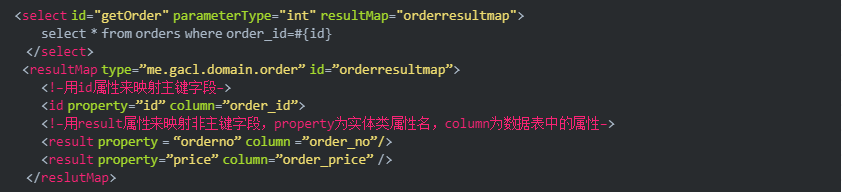
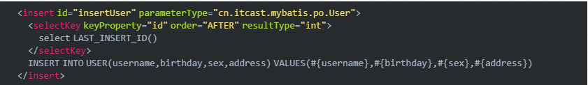
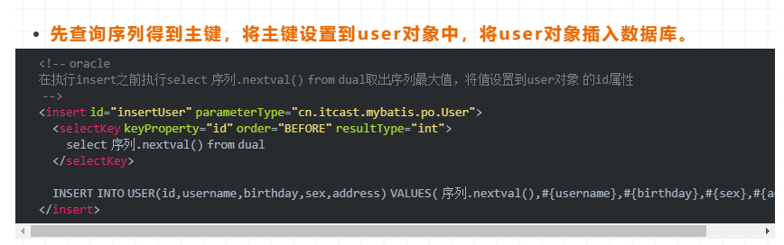
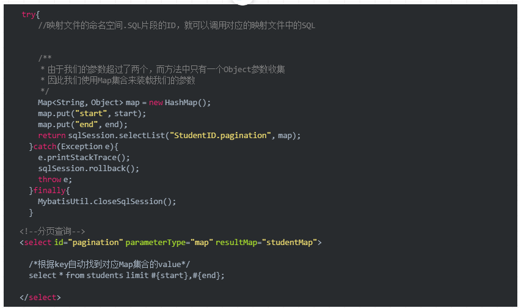

MyBatis常见面试题
------------
1. 1.#{}和${}的区别是什么？
    1. 1.1 #{}解析传递进来的参数数据
    2. 1.2 ${}对传递进来的参数原样拼接在SQL中
    3. 1.3 #{}是预编译处理，${}是字符串替换
    4. 1.4 使用#{}可以有效的防止SQL注入,提高系统安全性
2. 2.当实体类中的属性名和表中的字段名不一样 ，怎么办 ？
    1. 2.1 通过在查询的sql语句中定义字段名的别名，让字段名的别名和实体类的属性名一致
    2. 2.2 通过来映射字段名和实体类属性名的一一对应的关系
3. 3.如何获取自动生成的(主)键值?
    1. 3.1 如果我们一般插入数据的话，如果我们想要知道刚刚插入的数据的主键是多少，我们可以通过以下的方式来获取
        1. 3.1.1 通过LAST_INSERT_ID()获取刚插入记录的自增主键值，在insert语句执行后，执行select LAST_INSERT_ID()就可以获取自增主键
        2. 3.1.2 mysql 
        3. 3.1.3 oracle 
4. 4.在mapper中如何传递多个参数?
    1. 4.1 使用占位符的思想
        1. 4.1.1 在映射文件中使用#{0},#{1}代表传递进来的第几个参数
        2. 4.1.2 使用@param()注解来命名参数
    2. 4.2 使用Map集合作为参数来装载
5. 5.Mybatis动态sql是做什么的？都有哪些动态sql？能简述一下动态sql的执行原理不？
    1. 5.1 Mybatis动态sql可以让我们在Xml映射文件内，以标签的形式编写动态sql，完成逻辑判断和动态拼接sql的功能。
    2. 5.2 Mybatis提供了9种动态sql标签：trim|where|set|foreach|if|choose|when|otherwise|bind。
    3. 5.3 其执行原理为，使用OGNL从sql参数对象中计算表达式的值，根据表达式的值动态拼接sql，以此来完成动态sql的功能。
6. 6.Mybatis的Xml映射文件中，不同的Xml映射文件，id是否可以重复？
    1. 6.1 如果配置了namespace那么当然是可以重复的，因为我们的Statement实际上就是namespace+id,如果没有配置namespace的话，那么相同的id就会导致覆盖了。
7. 7.通常一个Xml映射文件，都会写一个Dao接口与之对应，请问，这个Dao接口的工作原理是什么？Dao接口里的方法，参数不同时，方法能重载吗？
    1. 7.1 Dao接口，就是人们常说的Mapper接口，接口的全限名，就是映射文件中的namespace的值，接口的方法名，就是映射文件中MappedStatement的id值，接口方法内的参数，就是传递给sql的参数
    2. 7.2 Mapper接口是没有实现类的，当调用接口方法时，接口全限名+方法名拼接字符串作为key值，可唯一定位一个MappedStatement
    3. 7.3 Dao接口里的方法，是不能重载的，因为是全限名+方法名的保存和寻找策略。
    4. 7.4 Dao接口的工作原理是JDK动态代理，Mybatis运行时会使用JDK动态代理为Dao接口生成代理proxy对象，代理对象proxy会拦截接口方法，转而执行MappedStatement所代表的sql，然后将sql执行结果返回。
8. 8.接口绑定有几种实现方式,分别是怎么实现的?
    1. 8.1 通过注解绑定,就是在接口的方法上面加上@Select@Update等注解里面包含Sql语句来绑定
    2. 8.2 通过xml里面写SQL来绑定,在这种情况下,要指定xml映射文件里面的namespace必须为接口的全路径名.
