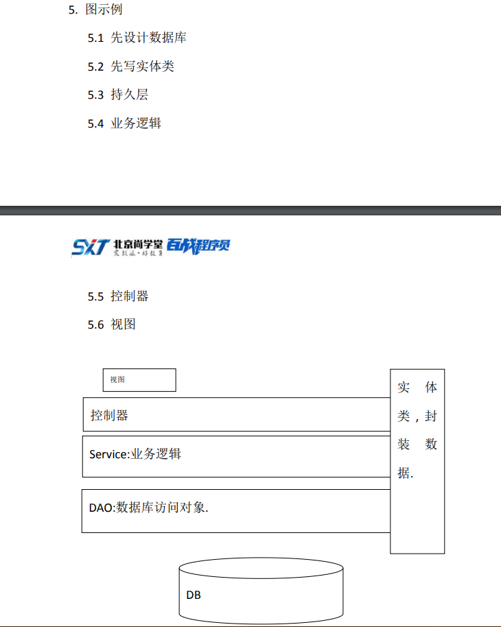

MyBatis第一天
----------
- 1.MVC开发模式
    - 1. M:Model模型，实体类，业务类和dao
    - 2. V:view视图,JSP
    - 3. C:Controller 控制器,servlet
        - 3.1 作用:视图和逻辑分离
    - 4.MVC适用场景:大型项目开发
    - 5.图实例 
    - 
- 2.搭建MyBatis
    - 1. 导入jar包
    - 2. 编写MyBatis.xml配置文件
    - 3. xml文件头
    
----------         
    <?xml version="1.0" encoding="UTF-8" ?>
    <!DOCTYPE configuration
            PUBLIC "-//mybatis.org//DTD Config 3.0//EN"
            "http://mybatis.org/dtd/mybatis-3-config.dtd">
        

1. 2
    1.  4.xml文件各个标签的作用
        1.  configuration:必备标签
        2.  environments:数据库配置环境
            1.  transactionManager type="JDBC"
            2.  property name="driver" value="com.mysql.jdbc.Driver"
            3.  property name="url" value="jdbc:mysql://locathost:3306/库名"
            4.  property name="username" value="数据库用户名"
            5.  property name="password" value="数据库密码"
1. 3.填写mapper映射的xml的文件路径
    1. mapppers标签
        1. mapper标签 mapper resource="包名"
1. 4.在mapper包下建立mapper.xml文件
    1. 编写需要执行的 SQL 命令
    2. 把 xml 文件理解成实现类
    3. xml 文件内容

----------
    <?xml version="1.0" encoding="UTF-8"?>        
    <!DOCTYPE mapper  
    PUBLIC "-//mybatis.org//DTD Mapper 3.0//EN"  
    "http://mybatis.org/dtd/mybatis-3-mapper.dtd">

1. 5.mapper namespace="对应mapper的接口所在的路径"
    1. select标签 id="方法名" resutlType 返回值类型 parameterType 定义参数类型
        1. 中间写sql语句

1. 6.测试
    1. 首先加载配置文件 InputStream is=Resources.getResourceAsStream("mybatis.xml");
    2. 工厂设计模式:SqlsessionFactory factory=new SqlSessionFactoryBuilder().bulid(is); 
    3. 生产sqlSession:SqlSession session=factory.openSession();
    4. session.selectList("方法名");
    5. 三种查询
        1. 1.适用查询结果需要遍历 selectList
        2. 2.返回结果只有一个数据 selectone
        3. 3.返回值是map selectMap

MyBatis第二天
----------
1. 1.注解
    1. 1.注解前面的@XXX,表示引用一个@inte
        1. @interface 表示注解声明
    1. 
    1.     2.注解语法: @XXXX(属性名= 值)
        1.     如果注解只需要给一个属性赋值,且这个属性是默认属性,可以省略
属性名
2. 2.路径
    1. 1. 编写路径为了告诉编译器如何找到其他资源. 
    2. 2. 路径分类
    3. 
        1. 2.1 相对路径: 从当前资源出发找到其他资源的过程
        2. 2.2 绝对路径: 从根目录(服务器根目录或项目根目录)出发找到其他资源的过程
            3. 2.2.1 标志: 只要以/开头的都是绝对路径
        4. 绝对路径:
            1. 3.1 如果是请求转发 / 表示项目根目录(WebContent)
            2. 3.2 其他重定向,` <script/>,<style/>,location.href` 等/都表示服务器根目录(tomcat/webapps 文件夹)
        4. 如果客户端请求的控制器,控制器转发到JSP后,jsp中如果使用相对
路径,需要按照控制器的路径去找其他资源. 4.1 保险办法:使用绝对路径,可以防止上面的问题.  

MyBatis第三天
----------
1. 1 MyBatis 接口绑定方案及多参数传递
    1. 1 在mapper包下创建对应的接口,包名与namespace一致,方法名与xml的id一致
    2. 2 xml配置接口扫描 mappers下 mapper package="包名"
    3. 3 接口中如果是多参数的话,那么xml中可以不写parameterType
    4. 4 在接口中声明的方法,可以采用注解的形式@param("abc");那么对应xml的写法为select * from a where abc=#{abc}
1. 2 动态SQL
    1. 1 MyBatis中动态sql在mapper.xml中添加逻辑判断
        1. 1 if的使用 OGNL 表达式,直接写 key 或对象的属性.不需要添加任
何特字符号
        1. 2. select * from a where 1=1 and `<if> test="abc!=null and abc!=''"` and abc=#{abc}`</if>`
        2. 3.where的使用 如果第一个where后面是and 可以省略 使用方法

----------
     select * from a     
        <where>
            <if test="abc!=null and abc!=''">
            and abc=#{abc}
       </where>
----------
1. 2 动态SQL
    1. 
        1. 4.choose when otherwise的使用
            1. 只有有一个成立,其他都不执行.
            2. 
        1. `<set>`用在修改 SQL 中 set 从句
        2. 
1. 3 ThreadLocal
    1. 线程容器,给线程绑定一个 Object 内容,后只要线程不变,可以随时取出

----------

    

    final ThreadLocal<String> threadLocal = new
    ThreadLocal<>();
         threadLocal.set("测试");
            new Thread(){
            public void run() {
     String result = threadLocal.get();
         System.out.println("结果:"+result);
        };
            }.start();

Mybatis第四天
----------

    

   
            