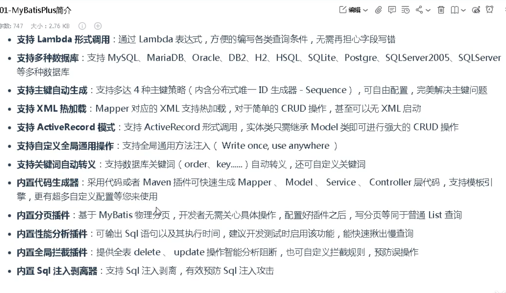
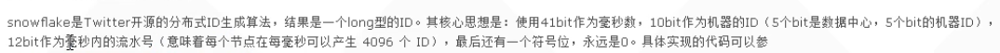
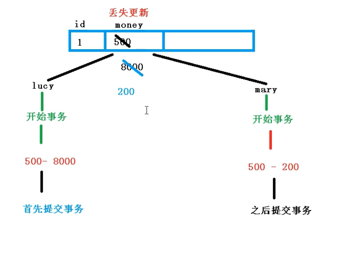

## MybatisPlus

#### 什么是mybatisPlus



> 是一个Mybatis的增强工具

#### mp入门

1. 创建数据库,窗口数据库表,添加数据,用于mp操作

2. 创建mapper继承

   ```java
   public interface UserMapper extends BaseMapper<User>{
       
   }
   ```

   

3. 调用userMapper.SelectList(null)

> 开启mybatis日志

```properties
mybatis-plus.configuration.log-impl=org.apache.ibatis.logging.stdout.StdOutImpl
```


#### mp添加操作

```java
public void addUser(){
    userMapper.insert(new User());
}
//会自动加入id如果不设置的话,ID主键生成策略
```

#### mp的主键策略

1. 数据库自动增长

   > 分表分库不方便

2. UUID每次生成随机唯一值

   > 排序不方便

3. REDIS生成id

   > 原子操作

4. ID_WORKER mp自带

   > snowflake算法
   >
   > 

#### mp更新修改操作

```java
public void updateUser(){
    
    userMapper.updateById(new User(2L));
    
}
```

#### 自动填充

不用set注入

1. 在属性上加@TableField(fill=FieldFill.INSERT)

   @TableField(fill=FieldFill.INSERT_UPDATE)

2. 创建类,实现接口MetaObjectHandler的方法

   ```java
   
   @Component
   public class MyMetaObjectHandler{
       //两个方法
       public void insertFill(MetaObject object){
          this.setFieldValByName("createTime",new Date(),object);
       }//metaObject元数据
        public void updateFill(MetaObject object){
           
       }
       
       
   }
   ```

   

#### mp的乐观锁

> 解决某些问题
>
> 1. 丢失更新：
> 2. 悲观锁：串行操作，只能同时一个人操作
> 3. 乐观锁：加入版本号来解决 




