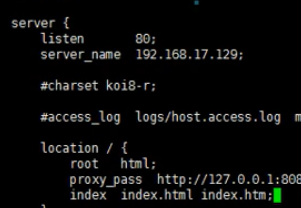

## Nginx第一天

### Nginx大纲

1. Nginx基本概念
2. Nginx安装、常用命令和配置文件
3. Nginx配置实例1-反向代理
4. Nginx配置实例2-负载均衡
5. Nginx配置实例3-动静分离
6. Nginx配置高可用集群
7. Nginx原理

### Nginx基本概念

#### Nginx简介

##### Nginx什么是Nginx？

1. 
2. 

#### Nginx安装

官网http://nginx.org/en/docs/beginners_guide.html

#### Nginx运行

启动


#### Nginx常用命令

- systemctl start nginx

#### Nginx配置文件

- **nginx.conf**
- Nginx配置文件三部分
  - 全局块，值越大可以处理的并发数量就越大
    - 
  - event块
    - worker_connection 1024
    - 支持最大连接数为1024
    - 配置Nginx与用户网络连接模块
  - http块,配置最频繁的部分,代理、缓存、日志
    - http全局块
      - 
    - server块，与虚拟主机相关
      - server块
      - location块

#### Nginx配置实例(反向代理准备工作)

- 实现效果

  - 打开浏览器,在浏览器输入地址,跳转liunx系统tomcat主页面

- 具体实现

  - 在liunx系统中安装tomcat,使用默认端口8080

- 

- 访问过程的分析

  

- 具体配置

  1. 在windows系统的host文件，设置域名和对应ip关系的配置
     1. 添加内容在host文件
     2. 你的liunx ip  对应到www.123.com

- 在nginx进行请求转发的配置

- 

#### 反向代理2

- 实现效果

  使用nginx根据访问的路径跳转到不同端口的服务中，监听端口900、

- 准备工作

  1. 准备两个tomcat服务器，一个8080，一个8081
  2. 创建两个测试页面

- 找到配置文件进行配置 

  

- 注意事项

  关闭enforce

- location的正则表达式

- 

#### Nginx示例2- 负载均衡

- 实现效果

  - 浏览器地址输入地址: 192.168.189.167/edu/a,html，负载均衡效果，平均分配到8080和8081中去

- 准备工作

  - 两台tomcat服务器
  - 在tomcat里面的webapps目录中，创建名称时edu文件夹，在edu文件夹中创建页面a.html

- 在nginx中配置config配置文件

  

  

- 重启nginx

- 效果

- 

#### Nginx配置实例2 动静分离

- 什么是动静分离

  

  

- 准备工作

  1. 在liunx系统中准备静态资源，进行访问

  

- 具体配置

  - 在nginx配置文件中进行配置
  - 

- 测试 输入ip地址+www(image)/a.jpg

  

  

- autoindex  on 列出文件夹下的文件

#### Nginx配置高可用集群

- 什么是高可用？

  

- 

- 需要

  - 需要两台nginx服务器
  - 需要keepalived
  - 需要虚拟ip

- 准备工作

  1. 两台服务器
  2. 在两台服务器上都安装nginx
  3. 安装keepalived
     1. yum安装
     2. yum install keepalived -y

#### 高可用主配模式

- 完成高可用配置

  配置keepalived的配置文件

  ```conf
  global_defs {
     notification_email {
       acassen@firewall.loc
       failover@firewall.loc
       sysadmin@firewall.loc
     }
     notification_email_from Alexandre.Cassen@firewall.loc
     smtp_server 192.168.189.167
     smtp_connect_timeout 30
     router_id LVS_DEVEL
  }
  vrrp_script chk_http_port{
    script "/etc/nginx/nginx_check.sh" 
    interval  2
    weight  2	
  }
  vrrp_instance VI_1 {
      state MASTER  #备份服务器上将master改为backup
      interface ens32  #网卡 
      virtual_router_id 51 #virtual——router——id 必须相同
      priority 100 #主备机取不同的优先级 主机值较大
      advert_int 1 
      authentication {
          auth_type PASS
          auth_pass 1111
      }
      virtual_ipaddress {
          192.168.189.50 
      }
  }
  ```

  配置脚本文件

  ```sh
  #!/bin/bash
  A='ps -C nginx -no-header |wc -1'
  if [ $A -eq 0 ];then
       /usr/sbin/nginx
       sleep 2
        if  [ 'ps -C nginx --no-header |wc -1' -eq 0];then
  	killall keepalived
        fi
  fi			
  ```

- 两台服务器都启动

- 


