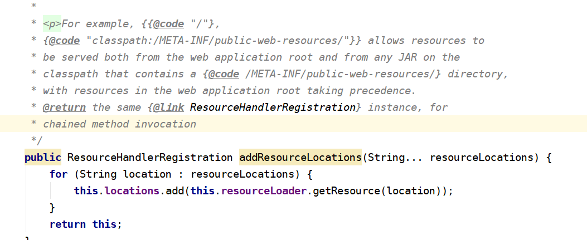

## SpringMvc注解配置

1. 加载项目,WebInit初始化项目

   1. web.xml配置方式

      ```xml
      <servlet>
          <servlet-name>dispatcher</servlet-name>
                     <servlet-class>
                       org.springframework.web.servlet.DispatcherServlet
          </servlet-class>
                     <init-param>
                       <param-name>contextConfigLocation</param-name>
                       <param-value>/WEB-INF/spring/dispatcher-config.xml</param-value>
                     </init-param>
                     <load-on-startup>1</load-on-startup>
                   </servlet>
                  
                   <servlet-mapping>
                     <servlet-name>dispatcher</servlet-name>
                     <url-pattern>/</url-pattern>
                   </servlet-mapping>
      
      ```

      ```java
      public class MyWebAppInitializer implements WebApplicationInitializer {
       
          @Override
           public void onStartup(ServletContext container) {
             XmlWebApplicationContext appContext = new XmlWebApplicationContext();
             appContext.setConfigLocation("/WEB-INF/spring/dispatcher-config.xml");
       
             ServletRegistration.Dynamic dispatcher =
               container.addServlet("dispatcher", new DispatcherServlet(appContext));
             dispatcher.setLoadOnStartup(1);
             dispatcher.addMapping("/");
           }
      ```

      

   2. 普通方式

      ```java
      public void onStartup(ServletContext container) {
             // Create the 'root' Spring application context
             AnnotationConfigWebApplicationContext rootContext =
               new AnnotationConfigWebApplicationContext();
             rootContext.register(AppConfig.class);
       
             // Manage the lifecycle of the root application context
             container.addListener(new ContextLoaderListener(rootContext));
       
             // Create the dispatcher servlet's Spring application context
             AnnotationConfigWebApplicationContext dispatcherContext =
               new AnnotationConfigWebApplicationContext();
             dispatcherContext.register(DispatcherConfig.class);
       
             // Register and map the dispatcher servlet
             ServletRegistration.Dynamic dispatcher =
               container.addServlet("dispatcher", new DispatcherServlet(dispatcherContext));
             dispatcher.setLoadOnStartup(1);
             dispatcher.addMapping("/");
           }
      ```

      

2. 配置webConfig

   > 
   >
   > ```
   > configurePathMatch  帮助配置HandlerMappings路径匹配选项，例如尾部斜杠匹配，后缀注册，路径匹配器和路径帮助器。为以下对象共享配置的路径匹配器和路径帮助器实例：
   > configureContentNegotitaion 配置内容协商选项。
   > configureAsyncSupport 配置异步请求处理选项。
   > configureDefaultServletHandling 配置默认访问例如/ 必须有
   > addResourceHandlers 过滤静态资源 /static/**
   > addCorsMappings 配置跨域请求
   > addViewControllers 配置初始化访问页面
   > configureViewResolvers 根据字符串放回
   > configureMessageConverters  消息转换器
   > extendMessageConverters 用来增加自定义消息转换器
   > configureHandlerExceptionResolvers   配置异常解析器
   > extendHandlerExceptionResolvers 自定义异常解析器
   > getValidator 验证
   > MessageCodesResolver  用于构建来自数据绑定和验证错误代码的消息代码 返回空是默认值
   > ```

   

3. springMVC整合thymelaf

   [thymeleaf整合案例](https://github.com/thymeleaf/thymeleafexamples-stsm/blob/3.0-master/src/main/java/thymeleafexamples/stsm/web/SpringWebConfig.java)

4. 整合需要注意

   1. 用xml的方式配置
   2. 返回封装数据至json格式需要导入jackson的全家桶jar包
   3. 需要设置中文乱码
   4. 取不到值的原因可能是出现model和request共存的情况
   5. 需要在web.xml中加载springmvc的配置文件
   6. 在整合jackson中出现版本不兼容问题spring以上只支持jackson2.9以上
   7. ssm配合tomcat以及idea的时候,不会自动导入maven所以需要重新artifact一下
   8. 有点注解和xml混合搭配使用的错误

#### 项目整合配置

1. springmvcConfig配置

   ```xml
   <?xml version="1.0" encoding="UTF-8"?>
   <beans xmlns="http://www.springframework.org/schema/beans"
          xmlns:mvc="http://www.springframework.org/schema/mvc"
          xmlns:context="http://www.springframework.org/schema/context"
          xmlns:xsi="http://www.w3.org/2001/XMLSchema-instance"
          xsi:schemaLocation="
          http://www.springframework.org/schema/beans
          http://www.springframework.org/schema/beans/spring-beans.xsd
          http://www.springframework.org/schema/mvc
          http://www.springframework.org/schema/mvc/spring-mvc.xsd
          http://www.springframework.org/schema/context
          http://www.springframework.org/schema/context/spring-context.xsd">
       <!--开启注解扫描-->
       <context:component-scan base-package="com.bpp.controller">
           <context:include-filter type="annotation" expression="org.springframework.stereotype.Controller"></context:include-filter>
       </context:component-scan>
       <!--配置thymeleaf视图解析器-->
       <bean id="viewResolver" class="org.thymeleaf.spring5.view.ThymeleafViewResolver">
           <!--设置优先级-->
           <property name="order" value="1"/>
           <!--设置编码-->
           <property name="characterEncoding" value="UTF-8"/>
           <!--注入thymeleaf模板引擎-->
           <property name="templateEngine" ref="templateEngine"/>
       </bean>
       <!--配置thymeleaf模板引擎bean-->
       <bean id="templateEngine" class="org.thymeleaf.spring5.SpringTemplateEngine">
           <!--注入thymeleaf解析器-->
           <property name="templateResolver" ref="templateResolver" />
       </bean>
       <!--配置thymeleaf解析器-->
       <bean id="templateResolver" class="org.thymeleaf.spring5.templateresolver.SpringResourceTemplateResolver">
           <!--设置模板前缀-->
           <property name="prefix" value="/WEB-INF/templates/"/>
           <!--设置模板后缀-->
           <property name="suffix" value=".html"/>
           <!--设置模板模式-->
           <property name="templateMode" value="HTML5"/>
           <!--设置编码-->
           <property name="characterEncoding"  value="UTF-8" />
           <!--设置是否缓存  默认为true  改为false表示可以实时刷新修改的页面-->
           <property name="cacheable" value="false"/>
       </bean>
       <!--过滤静态资源-->
       <mvc:resources mapping="/css/**" location="/css/"></mvc:resources>
       <mvc:resources mapping="/img/**" location="/img/"></mvc:resources>
       <mvc:resources mapping="/js/**" location="/js/"></mvc:resources>
       <mvc:resources mapping="/favicon" location="/favicon.ico"/>
   
       <!--开启springMVC注解的支持-->
       <mvc:annotation-driven >
           <!-- 消息转换器 配置中文乱码专用-->
           <mvc:message-converters register-defaults="true">
               <bean class="org.springframework.http.converter.StringHttpMessageConverter">
                   <property name="supportedMediaTypes"><list>
                       <!--设置controller返回数据的编码-->
                       <value>text/html;charset=UTF-8</value>
                       <value>text/plain;charset=UTF-8</value>
                       <value>application/json;charset=UTF-8</value>
                   </list>
                   </property>
               </bean>
               <!--开启Jackson
            -->
               <bean class="org.springframework.http.converter.cbor.MappingJackson2CborHttpMessageConverter"></bean>
           </mvc:message-converters>
       </mvc:annotation-driven>
   </beans>
   ```

   

2. web.xml配置

   ```xml
   <?xml version="1.0" encoding="UTF-8"?>
   <web-app xmlns="http://xmlns.jcp.org/xml/ns/javaee"
            xmlns:xsi="http://www.w3.org/2001/XMLSchema-instance"
            xsi:schemaLocation="http://xmlns.jcp.org/xml/ns/javaee http://xmlns.jcp.org/xml/ns/javaee/web-app_4_0.xsd"
            version="4.0">
   
       <!--配置 DispatcherServlet-->
       <servlet>
           <servlet-name>dispatcherServlet</servlet-name>
           <servlet-class>org.springframework.web.servlet.DispatcherServlet</servlet-class>
           <init-param>
               <param-name>contextConfigLocation</param-name>
               <!--配置文件路径-->
               <param-value>classpath:SpringMvcConfig.xml</param-value>
           </init-param>
           <!--优先级-->
           <load-on-startup>1</load-on-startup>
       </servlet>
       <servlet-mapping>
           <servlet-name>dispatcherServlet</servlet-name>
           <!--路径映射-->
           <url-pattern>/</url-pattern>
   
       </servlet-mapping>
   
       <!--配置ico文件-->
       <servlet-mapping>
           <servlet-name>default</servlet-name>
           <url-pattern>*.ico</url-pattern>
       </servlet-mapping>
   
       <!--过滤器-->
       <!--过滤器解决监听问题-->
   </web-app>
   ```

   

3. spring注解配置扫描

   ```java
   package com.bpp.config;
   
   import com.mchange.v2.c3p0.ComboPooledDataSource;
   import org.apache.ibatis.session.SqlSession;
   import org.apache.ibatis.session.SqlSessionFactory;
   import org.mybatis.spring.SqlSessionFactoryBean;
   import org.mybatis.spring.annotation.MapperScan;
   import org.springframework.beans.factory.annotation.Value;
   import org.springframework.context.annotation.*;
   import org.springframework.core.io.support.PathMatchingResourcePatternResolver;
   import org.springframework.jdbc.core.JdbcTemplate;
   import org.springframework.stereotype.Controller;
   
   import javax.sql.DataSource;
   import javax.xml.crypto.Data;
   import java.beans.PropertyVetoException;
   import java.io.IOException;
   
   /**
    * Create By WeiBin on 2020/3/30 21:48
    * spring的配置类  默认扫描  不扫描controller
    * MapperScan 默认扫描映射包
    * 属性文件一定要指定来源！！！！！！
    */
   @Configuration
   @ComponentScan(basePackages = "com.bpp",excludeFilters =
           {@ComponentScan.Filter(type = FilterType.ANNOTATION,classes = Controller.class)})
   @MapperScan("com.bpp.dao")
   @PropertySource("classpath:c3p0.properties")
   public class SpringConfig {
   
       @Value("${jdbc.driver}")
       private String driverClass;
       @Value("${jdbc.user}")
       private String user;
       @Value("${jdbc.url}")
       private String jdbcUrl;
       @Value("${jdbc.password}")
       private String password;
   
   
       /**
        * 配置数据源
        */
       @Bean(name = "datasource")
       public DataSource getDatasource() throws PropertyVetoException {
           ComboPooledDataSource dataSource=new ComboPooledDataSource();
           dataSource.setUser(user);
           dataSource.setDriverClass(driverClass);
           dataSource.setPassword(password);
           dataSource.setJdbcUrl(jdbcUrl);
           return dataSource;
       }
   
     //配置核心Mybatis核心工厂
       @Bean
       public SqlSessionFactoryBean sqlSessionFactoryBean(DataSource ds) throws IOException {
            SqlSessionFactoryBean bean = new SqlSessionFactoryBean();
          bean.setDataSource(ds);//配置数据源
           bean.setTypeAliasesPackage("com.bpp.pojo");//设置实体类别名
            PathMatchingResourcePatternResolver resolver = new PathMatchingResourcePatternResolver();
   //         bean.setMapperLocations(resolver.getResources("classpath:/mapper/*.xml"));//配置Mapper映射文件的路径
            return bean;
       }
   
   }
   ```

   

4. 初始化加载spring

   ```java
   public class WebInit implements WebApplicationInitializer {
       @Override
       public void onStartup(javax.servlet.ServletContext servletContext) throws ServletException {
          AnnotationConfigWebApplicationContext rootContext =
            new AnnotationConfigWebApplicationContext();
          rootContext.register(SpringConfig.class);
   
          // Manage the lifecycle of the root application context
          servletContext.addListener(new ContextLoaderListener(rootContext));
   
       }
   
   }
   ```

   

5. 属性文件配置

   ```properties
   #配置log4j的输入级别
   #打印到控制台
   log4j.rootCategory=INFO,CONSOLE,LOGFILE
   log4j.appender.CONSOLE=org.apache.log4j.ConsoleAppender
   log4j.appender.CONSOLE.layout=org.apache.log4j.PatternLayout
   #日志输出格式
   log4j.appender.CONSOLE.layout.ConversionPattern=-%p-%d{yyyy/MM/dd HH:mm:ss,SSS}-%l-%L-%m%n
   
   
   log4j.appender.LOGFILE=org.apache.log4j.FileAppender
   #日志文件保存位置
   log4j.appender.LOGFILE.File=D:/axis.log
   log4j.appender.LOGFILE.Append=true
   log4j.appender.LOGFILE.layout=org.apache.log4j.PatternLayout
   log4j.appender.LOGFILE.layout.ConversionPattern=-%p-%d{yyyy/MM/dd HH:mm:ss,SSS}-%l-%L-%m%n
   
   ```

#### springMvc之controller的跳转

1. 使用ModelAndView

   ```java
   return new ModelAndView("redirect:/toList");
   ```

2. 在return后直接redirect

3. return直接想要跳转的controller的方法名字


