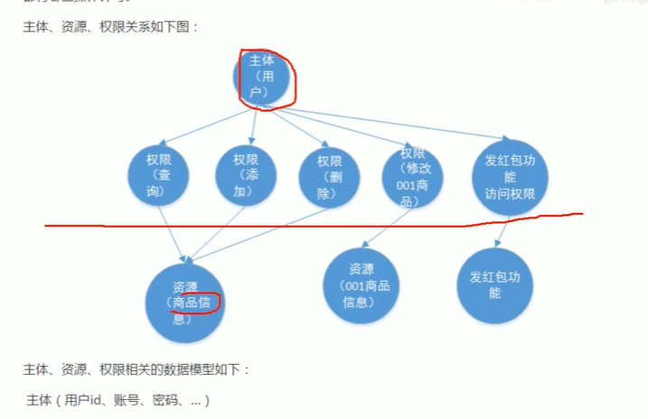
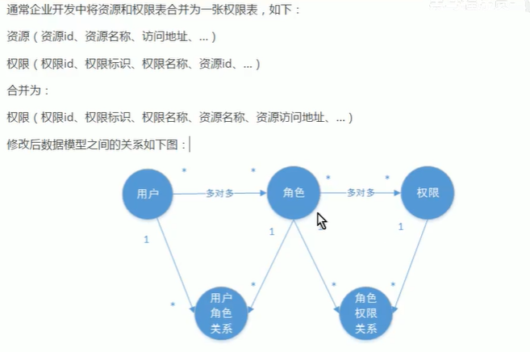
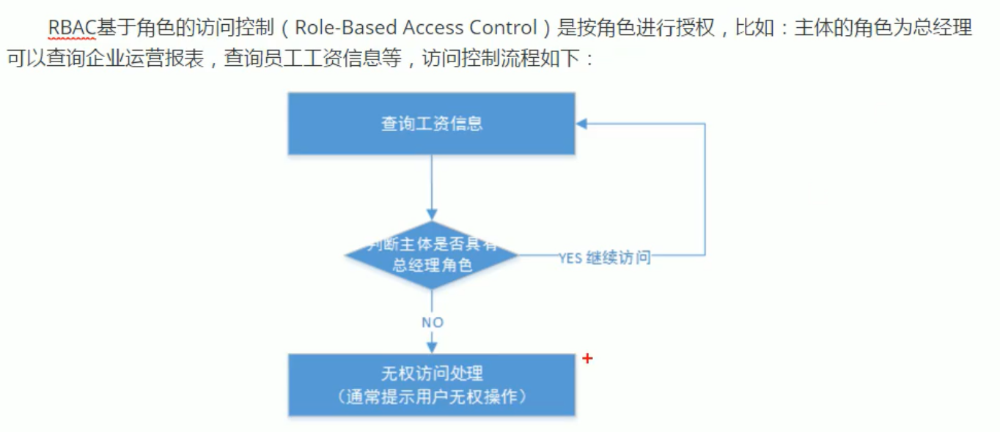
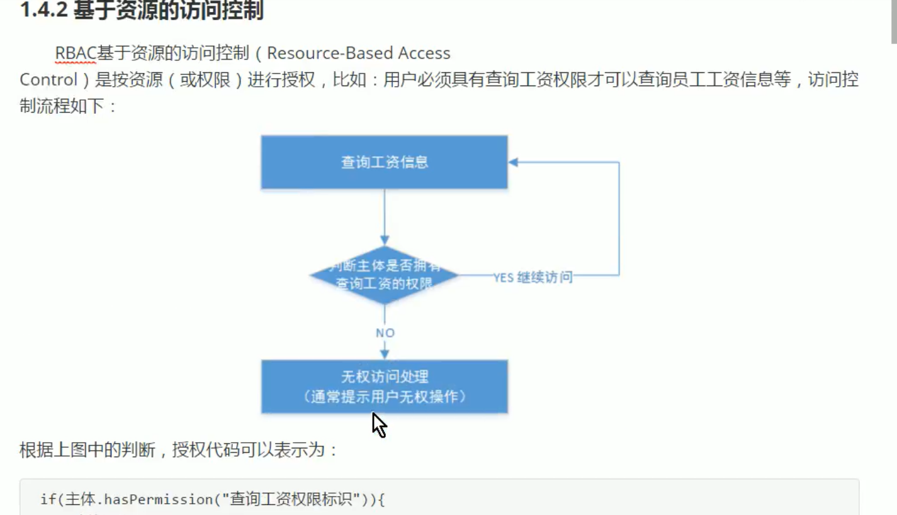
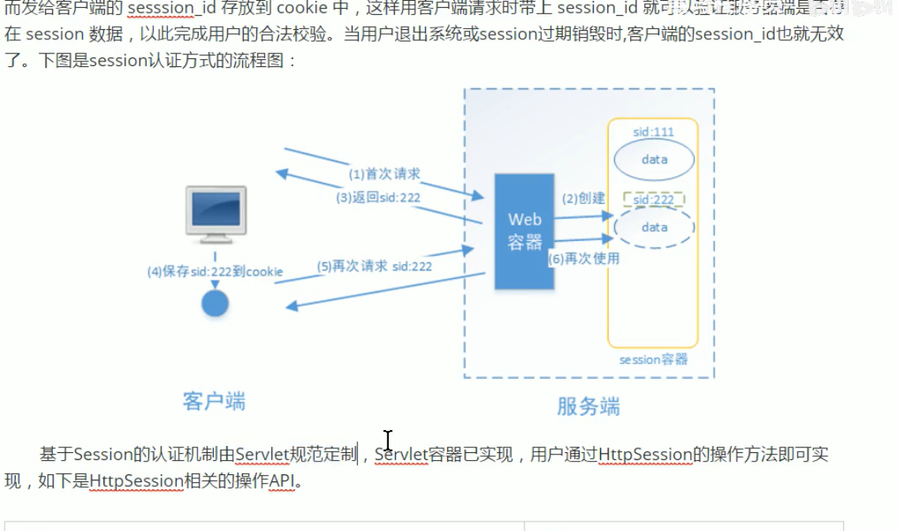
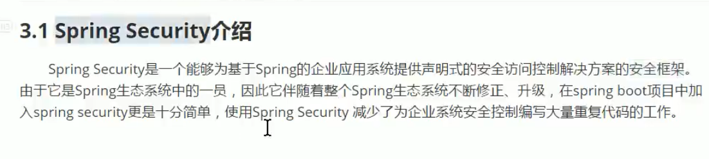
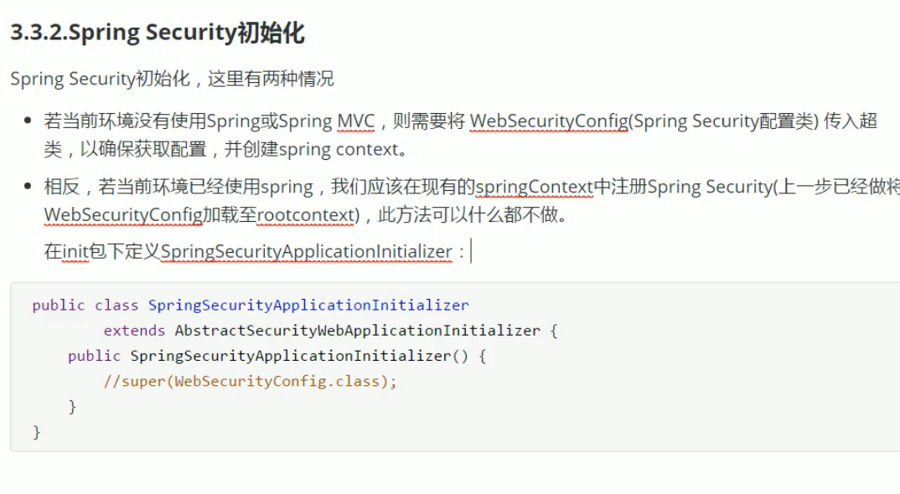
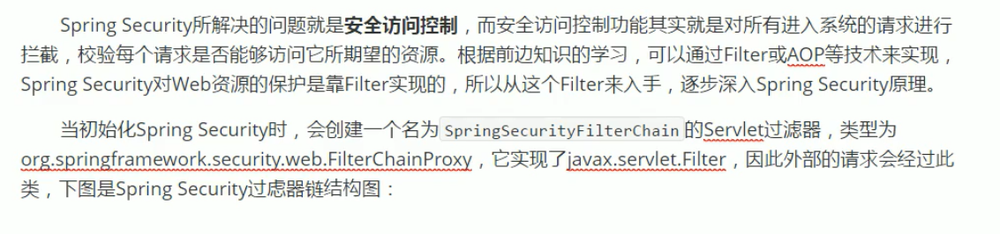
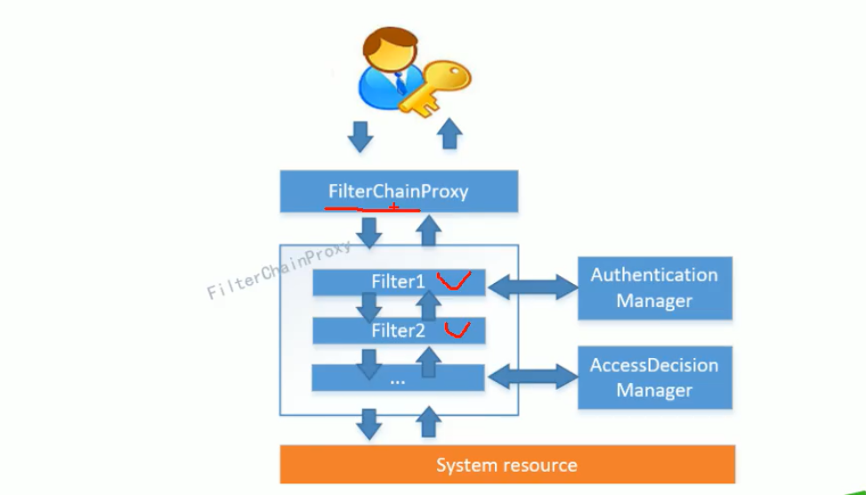
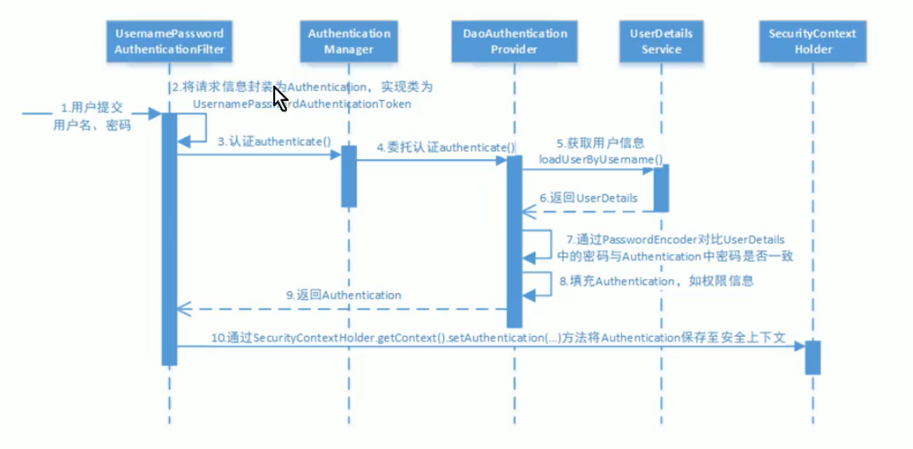

## SpringSecurityOAuth认证授权

### 基本概念

#### 系统为什么要认证？

> 认证时为了保护系统的隐私数据与资源，用户的身份合法课访问改系统的资源
>
> 判断一个用户的身份是够合法的过程,常见的用户身份认证方式有:用户名密码,二维码,手机短信登录,指纹认证

#### 什么是会话？

##### session方式

登录成功后,服务器生成session然后返回给客户端

##### token方式

登录成功后,服务器生成一个token，返回个客户端

#### 什么是授权？

> 授权是为了更细粒度的对隐私数据进行划分,授权是认证通过后发生的,控制不同的用户能够访问不同的资源
>
> 授权是用户认证通过根据用户的权限来控制用户访问资源的过程,拥有资源的访问权限则正常访问,没有权限则拒绝访问

#### 授权的数据模型

授权可简单理解为who对what进行how操作

who:主体, 用户

what:即资源,系统功能资源,实体资源(数据资源)由资源类型和资源实例组成,比如商品信息为资源类型,商品编号为001的商品为资源实例

how:权限/许可(Permission)

##### 关系图



##### 通过角色来指定权限访问



#### RBAC

##### 基于角色的访问控制(Role-Based AccessControl)



##### 基于资源的访问控制(Resource-Based AccessControl)



### 基于session的认证方式

#### 认证流程



#### 创建工程

##### 创建security-springmvc工程

- 导入依赖

- 创建config目录

  spring容器配置类

  ```java
  @Configuration
  @ComponentScan(包名)排除Controller包excuiter(type=FilterType=Annotation,value=Controller.class)
  public class ApplicationConfig(){
      
  }
  ```

  springmvc的容器配置类

  ```java
  @Configuration
  @EnableWebMvc
  @扫描包
  public class WebConfig implements WebMvcConfigurer{
      //这个配置相当于springMVC的xml文件
      //配置视图解析器
      @Bean
      public InternalResourceViewResolver viewResolver(){
          InternalResourceViewResolver viewResolver=new InternalResourceViewResolver();
          viewResolver.setPrefix("前缀");
          //设置后缀
          
          return viewResolver;
      }
      //重写addViewControllers方法用来指定默认访问的页面
  }
  ```

  spring加载的配置类

  ```java
  public class SpringApplicationInit extends AbstractAnnotationConfigDispatcherServletInitializer{
      @Override
      protected Class<?> getRootConfigClasses(){
          //配置根配置
      }
      servletConfig//配置webMvc配置
          getServletMappings//配置访问的路径
  }
  ```

  

#### 实现认证过程

1. 一个登陆页面

2. 创建一个认证接口,里面是一个认证的方法,一个UserDto类和AuthenticationRequest

   ```java
   //AuthenticationRequest方法是认证的信息
   //userDto是当前用户的登录信息
   ```

   

3. 一个实现类实现认证的接口

   ```java
   //认证校验用户身份信息是否合法
   //只要信息不为空,并且可以在数据库中查询到即可
   ```

4. 授权拦截器(用户里面加上Set\<string>权限控制集合>

 

### SpringSecurity快速上手

##### springSecurity介绍



##### 搭建工程

1. 创建工程

2. 引入springSecurity依赖

   spring-security-web/config

3. 不需要在写拦截器进行授权,其他配置文件一样

#### 认证

1. 默认提供了登录页面,不需要额外编写

2. 需要定义一个类去继承WebSecurityConfigurerAdapter

   ```java
   @EnableWebSecurity
   //定义用户信息服务,(查询用户信息)
   public UserDetailsService userDetailsService(){
       //内存查询
       InMemoryUserDetailsManager manager =new InMemoryUserDetailsManager();
       manager.createUser(用户名+密码+权限+.build());
       return manager;
   }
   //密码编码器
   public PasswordEncoder passwordEncoder(){
       return NoOpPasswordEncoder.getInstance();
   }
   //安全拦截机制
   //重写configure方法
   http.authorizeRequests().antMatch("/r/**").authenticated()//所有/r的请求必须通过
       .anyRequesy().permitAll();
   .formLogin()//允许表单登录
       .successForwardUrl("/")//登录成功后跳转页面
   ```

3. 需要定义这个类

   

4. 在默认视图里面重定向到login页面

5. controller里面配置好登录成功的页面

#### 授权

1. 定义拦截机制

   ```java
   http.antMachers().hasAuthority("p1");//是否含有某个权限
   ```

   

### spring sercurity应该详解

#### 集成springboot

配置根前面差不多

#### springSecurity工作原理

#### 结构总览





#### 认证流程



#### 