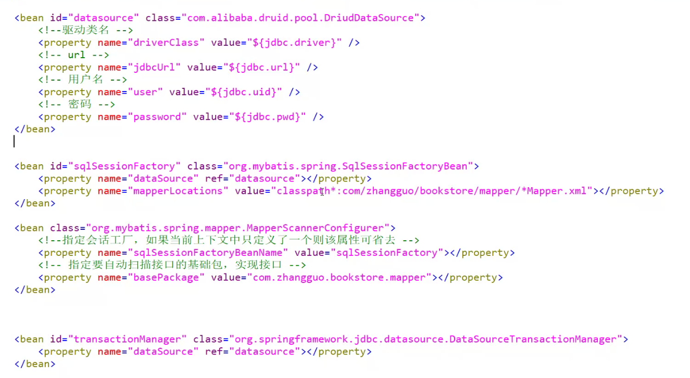
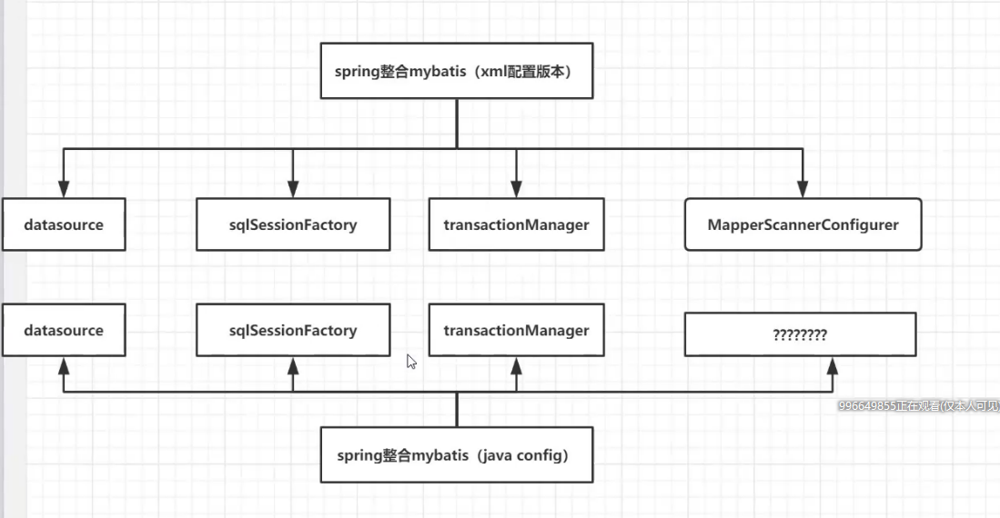
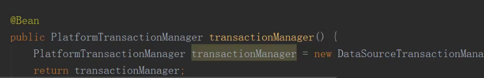
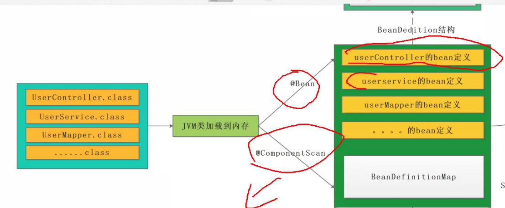
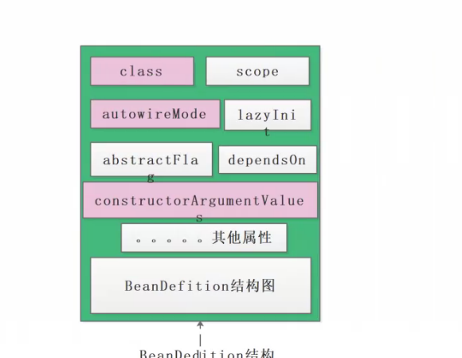
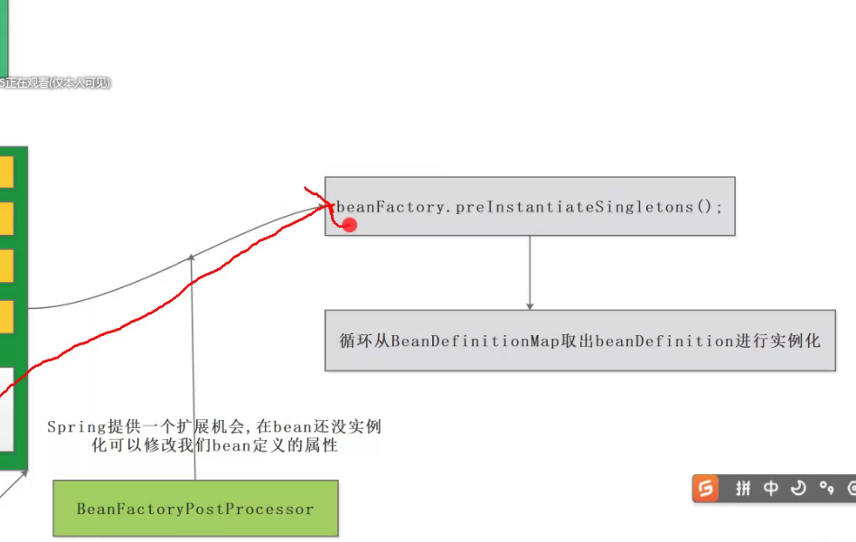
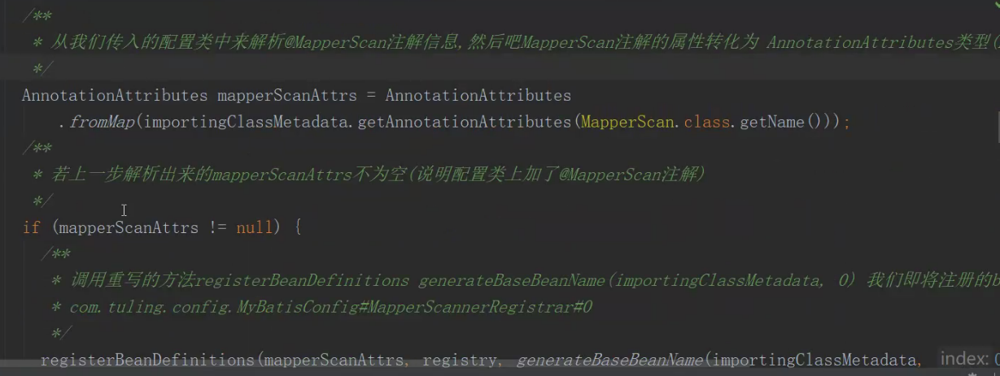
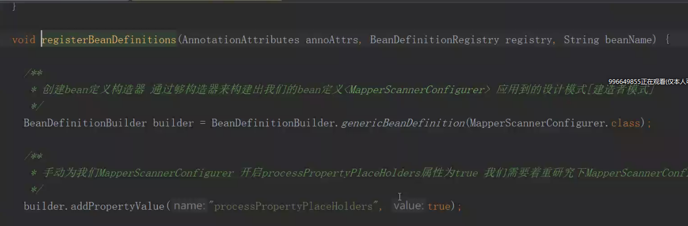
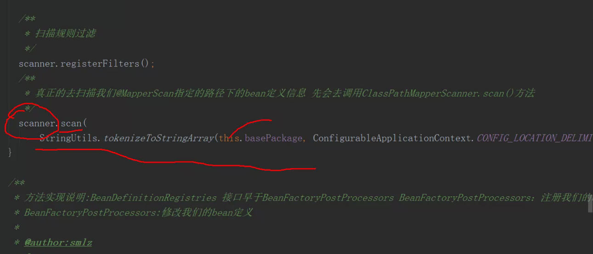

## Spring源码讲解-图灵学院

### spring整合mybatis







#### SqlSessionFactoryBean

#### MapperScannerConfigurer和@MapperScan的作用相同

#### spring java config版本 基于java类配置

#### BeanDefinition对象(Bean定义对象)

- 用来spring描述我们的单例对象

  ```java
  CityServiceImpl bean定义对象{
      beanClass===>用来生成指定的对象
      lazy:
      scope:
      .....
  }
  ```

  

- **AbstractBeanDefintion**

- JVM加载类到内存中，bean定义的解析

  

- BeanDefinitionMap来存储各种类的bean定义

- BeanDefinition结构

  

- IOC的getBean

  

- BeanFactoryPostProcessor用来在实例的时候可以允许我们自定义修改bean定义的属性

- **class属性用来指定我们要生成的对象的类**

- **autowireMode属性,注入模型**，控制单例对象属性赋值的方式

  | 类型 | 作用                                    |
  | ---- | --------------------------------------- |
  | 0    | 通过@CompementScan扫描的注入模型类型是0 |
  | 1    | byName                                  |
  | 2    | byType                                  |
  |      |                                         |
  |      |                                         |

  

- **constructorArgumentValue**

  用来控制单例对象去调用哪一个方法

- **BeanPostProcssor**定义在bean对象上的

- MapperScanner为我们容器导入一个bean定义对象

#### MapperScan注解

##### @Import注解 将类注册到容器中取

###### MapperScannerRegistrar类

> 实现类了ImportBeanDefinitionRegistrar
>
> ResourcedLoaderAware
>
> 有一个registerBeanDefinitions注册bean定义





###### 接口不能被实例化

###### classPathBeanDefinitonScanner====>用来扫描@Compement 等注解====>具体实现类上

###### ====>接口类型=====>写了一个 ClassPathMapperScanner扫描器




#### 对象

> MapperScannerConfigurer 生成代理对象
>
> SqlSessionFactoryBean 解析xml
>
> MapperProxy 代理对象执行