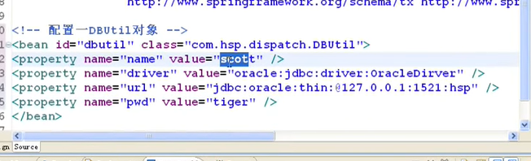

[TOC]

# Spring第二天

## 如何装配Bean

### 如何给集合注入值

#### 集合的种类

1. map
2. set
3. list
4. 数组
5. collection 

```
Collection col=new ArrayList()是正确的
```

#### 示例

1. 定义一个Collection的包

2. 创建一个Department类

   1. 有一些属性,name.empName;
   2. 设置set和get方法

3. 编写配置文件

   1. ```java
      <bean id="department" class="Department">
      <property name="name" value="财务部"/>
          //如果装配数组和list
       <property name="empName">
          <list>
          <value>大明</value>
          <value>小明明</value>
          <value>吓跑，OMG</value>
          </list>
        </property>
      </bean>
      ```

4. 编写测试文件

   1. ```java
      ApplicationContext ac=new ClassPathXmlApplicationContext("xml文件");
      Departemnt department=(Department)ac.getBean("department");
      for(String empName:department.getEmpName){
      System.out.print(empName)
      }
      ```

   2. List集合取值是有序的

5. 装配set集合

   1. ```java
      //xml文件
      <ref bean="id" />
      //遍历
      for(String setEmpName:department.getSetEmpName){
      System.out.print(setEmpName)
      }
      ```

   2. Set集合取值是无序的

   3. List集合可以有相同对象,Set集合放相同对象会覆盖,只能设置不同对象

6. 装配map集合

   1. ```java
      <map>
      	<entry key="1" value-ref="emp1" />   
          <entry key="2" value-ref="emp2" />    
      </map>
      //遍历map集合的方法
          //1.迭代器
          //2.Entry 
          for(Entry<String,Employee> entry1:department.getEmpMaps().entrySet()){
              print(entry1.getKey()+"\t"+entry1.getValue());
          }
      ```

   2. 迭代器遍历

   3. 

### 装配基本Bean

#### 内部Bean

1. ```java
   <bean id="" class="">
   <property name="" value="">
   	<bean id="" class=""></bean>
   </property>
   </bean>
   ```

2. 内部bean 表名这个bean当前bean可用,其他人不能重用

3. ref的方式可以引用

### 装配继承关系的bean

#### 示例

1. 创建student和gradate,前者继承后者,后者有属性学位degree
   1. 
2. xml配置bean
   1. 
3. 编写测试文件测试
   1. 
4. 问题:
   1. 如果自己配置属性name,age则会替换从父对象继承的数据

#### 装配Properties

1. 创建properties属性

2. 配置xml文件

   1. ```java
      <bean>
      	<props>
          <prop key="pp1">abcd</prop>
          <prop key="pp2">hello</prop>
          </props>
      </bean>
      ```

3. 通过properties取出数据

   1. ```java
      Properties properties=department.getPp();
      System.out.println(properties.get("键名").toString())
      ```

   2. 

### 如果用构造函数注入

#### 构造参数索引

1. 构建一个包,constructor

2. 创建一个类 Employee 赋予name,age属性,编写get/set方法和构造方法

3. xml配置对象

   1. ```java
      <bean id="employee" class="">
      <!-- 通过构造函数来注入 --!>
      <constructor-arg index="0" type="java.lang.String" value="大明"/>
      <constructor-arg index="1" type="int" value="23"/>
      </bean>
      ```

      

4. **set注入的缺点是无法清晰表达哪些属性是必须的,哪些是可选的,构造注入的优势是通过构造强制依赖关系,不可能实例化不完全的或无法使用的bean**

#### 自动装配bean的属性值

#### 示例

1. 创建dog和master 主人有名字和一只狗

2. 配置bean.xml

   1. ```
      //配置一个master对象
      <bean id="master" class="Master">
   	<property name="name" value="魏斌"/>
      	//传统
      	<property ref="dog"/>
      	//自动装配
      </bean>
      //配置一个dog对象
      <bean id="dog" class="Dog">
      	<property name="name" value="小黄"/>
      	<property name="age" value="15"/>
      </bean>
      ```
      

3. 测试文件

   1. 获取上下文容器调用getBean方法
   2. 如果不自动装配,会出现自动装配
   3. autowire="byName" 是根据容器中是否有相同名字的id的对象
   4. autowire="byType" 根据类型找对象,但是只能有唯一的对象,多个对象会抛异常
   5. autowire="constructor" 根据构造函数来找对象,查找和bean的构造参数一致的一个或多规格bean，若找不到或找到多个,抛异常。按照参数的类型装配
   6. autowire="autodetect" 在5和4之间选一个方式,不确定性的处理与5和4一致
   7. autowire="default"  在beans里面配置 default-autowire="xxx",不写的话是no,如果bean中不写autowire代表的是autowire="default"
   8. autowire="no" 不自动装配 ,所谓自动装配是在没有set属性的时候,去自动装配

4. 自动装配细节

   1. 
   2. 


#### context:annotation-config

1. 代表启用注解,激活在类中探测到的各种注解

#### 使用spring的特殊bean

1. 

2. 实现了接口的后置器处理Bean

3. bean工厂

4. 分散配置

   1. 打包

   2. 编写一个工具类DBUtil有属性 driverName,url,username,password

   3. 配置xml DBUtil

      1. ```java
         <bean id="dbutil" class="DBUtil">
         //四种属性
         
         </bean>
         ```

         
      
   
4. 用属性文件来注入值,分散配置
   
   1. 
   
   2. 配置spring的特殊的bean
   
         1. ```
            context:property-placeholder location="classpath:你的属性文件路径"
            ```
   ```
      
   2. 引入了我们的db.properties文件
      
         3. 多个要用逗号分隔
   ```


## SpringAop

### AOP编程

#### AOP概念

1. aop(aspect oriented programming) 面向切面（方面）编程，是对所有对象或者是一类对象编程
2. 核心：（不，还） 
   1. 在不增加代码的基础上
   2. 还增加新的功能
3. 发展
   1. 汇编(伪机器指令 mov jump) 面向机器
   2. c语言(面向过程) 语句1:语句2;....---》系统软件(操作系统,数据库,语言本身,杀毒软件,防火墙,驱动)
   3. c++ 结构体 过程>对象 的过度
   4. java语言(面向对象-->类,对象) 属性：变量；行为-->函数
   5. 面向切面 spring(-->aop) 
      1. 初步原理图
      2. 

#### AOP特别提醒

1. aop编程，实际上在开发框架本身用的较多，在实际项目中，用的不是很多
2. **但是将来回越来越多，这是趋势**

#### AOP原理+案例

#### 前置通知 MethodBeforeAdvice

##### 案例

###### 文字

1. 假设有两个 service

2. 一个接口 有一个方法sayHello 两个service来实现这个接口

3. 需求

   1. 在调用Test1Service sayHello前完成日志记录
   2. 在调用Test2Service sayHello前也要完成日志记录

4. 传统方法

   ```java
   Test1Service t1=new Test1Service();
   //写日志
   t1.sayHello();
   
   Test2Service t2=new Test2Service();
   //写日志代码
   t2.sayHello();
   //将写日志的代码提取出来当做一个类(可以完成写日志的功能)[术语]通知
   //spring框架提供了五种通知
   ```

   

5. 代理对象

   1. 继承一个类(Spring提供的ProxyFactoryBean)
   2. 这个代理对象也去实现这个接口，代理接口，完成代理任务
   3. sayHello(){}
   4. 织入

#### 具体代码实现

1. 编写一个接口,写一个方法sayHello,以及name属性

   ```java
   System.out.println("hi"+name);
   ```

2. 编写一个实现类去实现

3. 前置通知

4. 编写一个类MyMethodBeforeAdvice实现MethodBeofreAdice接口

   1. 有一个before方法

   2. ```java
      //before代码块的内容
      /**
      * method:被调用方法名字
      * args:给method传递的参数
      * target:目标对象
      */
      public void before(Method method,Object[] args,Object target){
          System.out.println("日志记录"+method.getName);
      }
      ```

#### bean.xml配置

##### 思路

1. 被代理的对象
2. 前置通知对象

##### 代码

```xml
<!--配置被代理的对象-->
<bean id="test1ServiceImpl" class="com.wb.aop.impl.Test1ServiceImpl">
        <property name="name" value="魏斌"></property>
    </bean>
<!--配置前置通知-->
 <bean id="myMethodBeforeAdvice" class="com.wb.aop.MyMethodBeforeAdvice"></bean>
<!--配置代理的对象-->
 <bean id="proxyFactoryBean" class="org.springframework.aop.framework.ProxyFactoryBean">
    <!--配置代理接口集-->
 <property name="proxyInterfaces">
    <list>
     <value>com.wb.aop.TestService</value>
     </list>
    </property>   
  <!--把通知织入到代理对象-->
    <property name="interceptorNames">
    <list>
        <value>myMethodBeforeAdvice</value>
     </list>
    </property>
    <!-- 配置被代理对象 -->
     <property name="target" ref="test1ServiceImpl">
     </property>
</bean>
```

#### 自我总结

##### 思路

1. 首先创建项目
2. 编写好接口和方法
3. 编写实现类去实现方法
4. 然后编写通知类(这里是前置通知)MyMethodBeforeAdvice实现MethodBeforeAdivce接口中的before方法
5. 然后配置xml文件
   1. 首先配置被代理对象的bean(即你要new或者是getBean得到的对象)
   2. 配置事务通知类的bean
   3. 配置动态代理对象
      1. 首先配置proxyFactoryBean
      2. 然后配置接口集(即你要进行操作的方法的接口或者被代理对象继承的接口)包名+类名的全路径 proxyInterfaces
      3. 将通知织入到代理对象 即你的通知类的bean interceptorNames
      4. 最后指定被代理对象 target
   4. 最后运行即可

##### 一些概念

1. 切面: before函数里面要做的事情，就是要处理的事务，或者日志之类的
2. 通知:事务通知的类
3. 连接点:即连接方法的一个点,一个连接点总是表示一个方法的执行
4. 织入:将通知织入到代理对象中,即应用到对象上，可以在任意时候被织入
5. 目标对象:被代理对象，你要new或者getBean的对象
6. 切入点:就是要切入的位置,方法前还是后，具体哪个方法上执行
7. 引入:
8. AOP代理:就是动态代理的对象,用来替代被代理对象的

##### 所谓aop个人理解

就是用动态代理技术来代理某个对象,这个对象可以配置通知,来实现切入的目的以达到切面编程的效果

#### 后置通知 AfterReturningAdvice

#### 环绕通知 MethodInterceptor

##### 案例

1. ```java
   public void sayHi(){
       //连接点
       xxxx//你具体做的事情
       //连接点    
   }
   ```

2. 在before后after前

3. 开发代码

   1. 实现MethodInterceptor类的invoke方法

   2. 

      ```java
      System.out.println("调用方法前执行");
      Object obj= MethodInvocation.proceed();
      System.out.println("调用方法后执行");
      return obj;
      ```

   3. 配置环绕通知xml

      ```xml
      <bean id="" class="MyMethodInterceptor" >
          
      </bean>
      ```

#### 异常通知 ThrowsAdvice

##### 案例

1. 实现ThrowAdvice接口(该接口是标识性接口,没有方法)

2. 编写方法

   ```java
   void afterThrowing(Method m,Object[] os,Object target,Exception e){
   	System.out.println("出大事了"+e.printstack);
   }
   ```

3. bean.xml配置异常通知对象然后织入到代理对象中即可

#### 引入通知  NameMatchMethodPointcutAdvisor

##### 作用:可以自定义通知点

##### 案例

1. 直接配置xml即可

2.  

   ```xml
   <!--定义前置通知的切入点-->
   <bean id="myMethodBeforeAdviceFilter" class="NameMatchMethodPointcutAdvisor">
       <property name="advice" ref="MyMethodBeforeAdvice"/>
       <property>
       	<list>
           	<value>sayHello</value>
           </list>
       </property>
   </bean>
   ```


### 使用<aop:advisor>实现aop

1. 创建日志类，实现相对应的处理器（通知）类

   | 处理器               | 功能       |
   | -------------------- | ---------- |
   | AfterReturningAdvice | 后置处理器 |
   | MethodBeforeAdvice   | 前置处理器 |
   | ThrowsAdvice         | 异常通知   |
   | MethodInterceptor    | 环绕通知   |
   |                      |            |

   

2. 