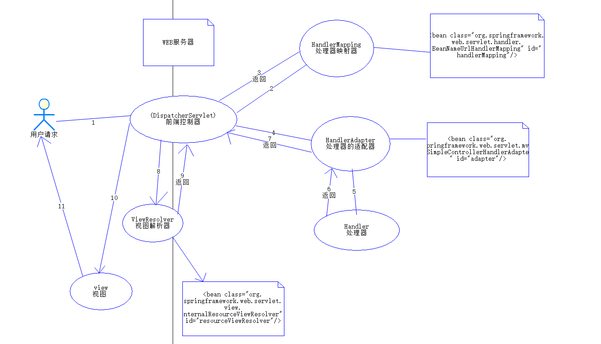

## springMVC

### 什么是springMvc

> 是spring提供的一个实现了web mvc设计模式的轻量级web框架
>
> 比struts系列框架更加优异

#### 什么是轻量级?

> 与当前的系统没有关系，任何地方都可以运行，不依赖于任何的系统

##### swing:重量级[依赖windows系统]

#### springMVC的特点

> 1. 是spring框架的一部分
> 2. 提供了一个前端控制器(DisPatcherServle),程序员无需额外开发控制器对象
> 3. 可自动的绑定用户的输入,并能够随意转换类型
> 4. 内置校验器
> 5. 支持国际化[i18n]
> 6. 支持多种视图技术
> 7. 使用基于XML的配置文件

### 搭建一个简单的入门示例

1. 导入jar包

2. 新建applicationContext.xml

   ```xml
    <beans xmlns="http://www.springframework.org/schema/beans"
          xmlns:context="http://www.springframework.org/schema/context"
          xmlns:tx="http://www.springframework.org/schema/tx"
          xmlns:aop="http://www.springframework.org/schema/aop"
          xmlns:xsi="http://www.w3.org/2001/XMLSchema-instance"
          xsi:schemaLocation="
          http://www.springframework.org/schema/beans
          http://www.springframework.org/schema/beans/spring-beans.xsd
          http://www.springframework.org/schema/context
          http://www.springframework.org/schema/context/spring-context.xsd
          http://www.springframework.org/schema/aop
          http://www.springframework.org/schema/aop/spring-aop.xsd
          http://www.springframework.org/schema/tx
          http://www.springframework.org/schema/tx/spring-tx.xsd">
        <!--配置请求,处理器handle-->
        <bean name="/first" class="com.wb.controller.FirstController">
        </bean>
        <!--处理器映射关系 将处理器handler的name作为url进行遍历查找-->
        <bean class="BeanNameUrlHandlerMapping">
        </bean>
        <!--处理器适配器 配置handlerEequest(方法调用) 响应request-->
        <bean class="SimpleControllerHandlerAdapter">			
        </bean>
        <!--配置视图-->
        <bean class="InternalResourceViewResolver">
        </bean>
   </beans>     
   ```

   

3. web.xml文件

   ```xml
   
   <servlet>
   	<!--1.配置前端控制器-->
       <servlet-name>		
       springMvc
       </servlet-name>
       <servlet-class>		
       org.springframework.web.servlet.DispatcherServlet
       </servlet-class>
       <!--2.初始化加载配置文件 -->
       <init-param>
       	<param-names>
           	contextConfigLocation
           </param-names>
           <param-value>
   classpath:applicationContext.xml
           </param-value>
       </init-param>
       <!--3.容器在启动时立即加载servlet-->
       <load-on-startup>1</load-on-startup>
   </servlet>
   	<servlet-mapping>		<servlet-name>		
       springMvc
       </servlet-name>
           <url-pattern>/</url-pattern>
   	</servlet-mapping>
   ```

   

4. 创建controller

   ```java
   public class FirstController implements Controller{
       @override
       public ModelAndView handleRequest(HttpServletRequest arg0,HttpServletResponse arg1) throws Exception{
         //创建ModelAndView对象
          ModelAndView mav=new ModelAndView();
           //模型 model 存储数据,传递数据
           //向模型中添加数据  
           mav.addObject("msg","springMVC");
           //视图
           mav.setViewName("/WEB-FIN/jsp/one.jsp")
           return mavv;
       }
   }
   ```

   

5. 小结:自定义控制器类,管理模型和视图,模型让他存储数据,传递业务关系。视图:跳转的页面信息

#### 练习代码

- web.xml

  ```xml
  <?xml version="1.0" encoding="UTF-8"?>
  <web-app xmlns="http://xmlns.jcp.org/xml/ns/javaee"
  		 xmlns:xsi="http://www.w3.org/2001/XMLSchema-instance"
  		 xsi:schemaLocation="http://xmlns.jcp.org/xml/ns/javaee http://xmlns.jcp.org/xml/ns/javaee/web-app_4_0.xsd"
  		 version="4.0">
  	<!--1. 配置dispatcherServlet-->
  	<servlet>
  		<servlet-name>springMvc</servlet-name>
  		<servlet-class>org.springframework.web.servlet.DispatcherServlet</servlet-class>
  		<!--配置参数初始化加载-->
  		<init-param>
  			<param-name>contextConfigLocation</param-name>
  			<param-value>classpath:applicationContext.xml</param-value>
  		</init-param>
  		<!--容器启动加载-->
  		<load-on-startup>1</load-on-startup>
  	</servlet>
  	<servlet-mapping>
  		<servlet-name>springMvc</servlet-name>
  		<url-pattern>/</url-pattern>
  	</servlet-mapping>
  
  </web-app>
  ```

  

- applicationContext.xml

  ```xml
  <?xml version="1.0" encoding="UTF-8"?>
  <beans xmlns="http://www.springframework.org/schema/beans"
  	   xmlns:mvc="http://www.springframework.org/schema/mvc"
  	   xmlns:context="http://www.springframework.org/schema/context"
  	   xmlns:xsi="http://www.w3.org/2001/XMLSchema-instance"
  	   xsi:schemaLocation="
         http://www.springframework.org/schema/beans
         http://www.springframework.org/schema/beans/spring-beans.xsd
         http://www.springframework.org/schema/mvc
         http://www.springframework.org/schema/mvc/spring-mvc.xsd
         http://www.springframework.org/schema/context
         http://www.springframework.org/schema/context/spring-context.xsd">
  		<!--1. 配置请求处理器  -->
  		<bean class="com.wb.controller.MyController" id="/myspring"/>
  		<!--2. 配置处理器关系映射 BeanNameUrlHandlerMapping-->
  		<bean class="org.springframework.web.servlet.handler.BeanNameUrlHandlerMapping" id="handlerMapping"/>
  		<!--3. 配置处理器适配器  SimpleControllerHandlerAdapter-->
  		<bean class="org.springframework.web.servlet.mvc.SimpleControllerHandlerAdapter" id="adapter"/>
  		<!--4. 配置视图解析器 InternalResourceViewResolver-->
  		<bean class="org.springframework.web.servlet.view.InternalResourceViewResolver" id="resourceViewResolver"/>
  </beans>
  ```

  

- controller

  ```java
  package com.wb.controller;
  
  
  import org.springframework.web.servlet.ModelAndView;
  
  import javax.servlet.http.HttpServletRequest;
  import javax.servlet.http.HttpServletResponse;
  
  /**
   * Create By WeiBin on 2020/4/18 16:52
   */
  public class MyController implements org.springframework.web.servlet.mvc.Controller {
  	@Override
  	public ModelAndView handleRequest(HttpServletRequest request, HttpServletResponse response) throws Exception {
  //		新建模型视图 同时设置返回的地址
  		ModelAndView modelAndView=new ModelAndView("one.jsp");
  //		模型保存值
  		modelAndView.addObject("msg","spring mvc的第一天");
  		return modelAndView;
  	}
  }
  
  ```

  

### springMVC的工作流程图解

