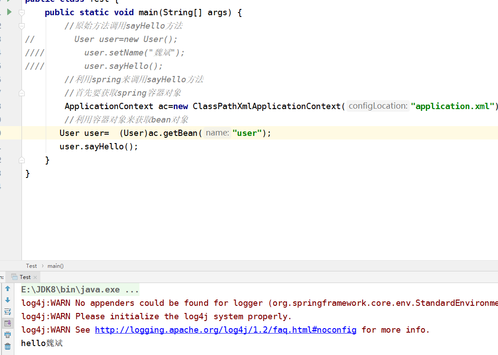

spring第一天
---------
1. 1.Core Container 核心容器 IOC 支持所有功能
2. 2.新建项目
    1. 2.1 示例1
        1. 
    2. 2.2 使用spring来调用
        1. 1.导入jar包
        2. 2.编写xml配置文件 application.xml
            1. 
        3. 3.注入bean对象
            1. 
            2. 效果图
                1. 
        4. 4.注意事项:需要导入一些jar包依赖
            1. 
3. 3.细节讨论
    1. 1.使用spring,没有new对象,我们把创建对象的任务交给了框架
    2. 2.bean的id是唯一的,不能相同
4. 4.在一个类中引用另一个类的bean
    1. 1 `<property name='byeService' ref='bybService'`
    2. 2 即引用另一个bean的id  用name 和ref
    3. 3 spring框架原理图(spring框架什么时候被加载,spring中配置的bean怎样被创建,bean与bean之间的关系怎样被维护？)
        1. 3.1 
        2. 3.2 当ClassPathXmlApplicationContext("")执行的时候,我们的spring容器对象被创建,同时applicationContext.xml配置，bean就会被创建(内存(HashMap/HashTable)) 采用的是java反射机制
        3. 3.3 
5. 5.spring案例总结
    1. 1.spring实际上是一个容器框架,可以配置各种bean,并且可以维护bean与bean之间的关系,当我们需要使用某个bean的时候,我们可以getBean(id)，使用即可
    2. 2.spring是一个容器框架,可以管理各个组件,并且可以配置各种bean
6. 6.ioc是什么?
    1. 1 ioc(inverse of controll) 控制反转:所谓控制反转就是把创建对象和维护对象(bean)的关系的权利从程序中转移到spring的容器文件(applicationContext.xml)中,而程序本身不再维护
    2. 2 学习框架,最重要的就是学习各个配置
7. 7.DI是什么
    1. 1 di(dependency injection) 依赖注入:实际上di和ioc是同一个概念,spring的设计者认为di更能表示spring核心,对象之间的依赖关系和属性之间的注入关系
8. 8.applicationContext做成单例
    1. 1 创建工具类
    2. 2 private static ApplicationContext ac=null;
    3. 3 创建私有的构造函数以及final修饰类
    4. 4 静态块来创建applicationContext 并且创建获取applicationContext的get方法
9. 9.阶段小结
    1. 1 MVC中model层（业务层+dao层+持久层框架）一个项目中,不一定全部由,可以根据实际情况选择
    2. 2 持久层 体现oop,主要解决关系模型和对象模型之间的阻抗

开始spring之旅
----------
1. 1 spring开发提倡接口编程,配合di技术可以达到层与层间的解耦
2. 2 案例2
    1. 2.1 spring的di配合接口编程,完成一个字母大小写转换
    2. 2.2 创建一个接口 ChangeLetter
    3. 2.3 用两个类实现这个接口
    4. 2.4 把对象配置进入到spring容器中
    5. 2.5 使用
    6. 2.6 通过上述案例,可以体会di配合接口编程,的确可以减少层(web层)和业务层的耦合度
    7. 2.7 思考题:验证用户validateUser 有一个方法chenck()有两个类CheckUser1 实现validateUser check//安装xml验证  checkUser2到数据进行验证

装配Bean
------
1. 1 配置bean
    1. 1 利用反射放在applicationContext上下文容器中
    2. 2 放在bean工厂 通过bean工厂来获取
2. 2 从ApplicationContext应用上下文容器中获取bean和从bean
3. 工厂容器中获取bean有什么区别？
    1. 1  当我们取实例化bean.xml,该文件中配置的bean被实例(该bean scope是Singleton)无论是否调用getBean方法,这个对象都会被实例化
    2. 2  从bean工厂中取出 延迟加载所有bean知道getBean()方法被调用
        1. 2.1 BeanFactory factory=new XmlBeanFactory(new ClassPathResource("bean.xml"))
        2. facotry.getBean("student");
    3. 3  如果我们使用beanFactory取获取bean,当仅仅实例化该容器,那么容器的bean不会被实例化,只有当你去getBean某个bean时,才会实时的去创建
    4. 4  scope='prototype' 实现延时加载
4. 3 bean的 scope 的细节 查看api
5. 4 使用应用上下文,三种获取applictionContext对象的方法
    1. 1 使用FileSystemXmlApplicationContext 通过文件路径获取(绝对路径来获取)
    2. 2 使用xmlWebApplicationContext 从web系统中加载
    3. 3 ClassPathXmlApplicationContext 通过类路径加载
Bean的生命周期
---------
1. 1 为什么总是一个生命周期当做一个重点？
    1. 1.1 往往笔试总是喜欢问生命周期的问题？
2. 2 生命周期
    1. 2.1 实例化(当我们的程序加载beans.xml文件开始),把我们的bean(单排 scope=singleton)实例化到内存(spring容器),利用构造函数输出构造函数被调用
    2. 2.2 设置属性值,注入属性,前提必须有set方法才能成功
    3. 2.3 调用BeanNameAware的setBeanName方法（该方法可以给arg0正在被实例化的bean id是多少,实现 BeanNameAware接口)
        1. 
    4. 2.4 调用BeanFactoryAware 如果实现了bean工厂关注接口,则(BeanFactoryAware)可以获取bean工厂
    5. 2.5 调用ApplicationContext的setApplicationContext方法
    6. 2.6 调用BeanPostProcessor的预初始化方法 即before方法
        1. 
        2. 理解一下后置处理器BeanPostProcessor 有点类似我们的web的filter,先调用before在调用after
        3. 例如需要解决每一个对象实例化的实际,过滤每个调用对象的ip地址,给所有对象添加一个熟悉或者函数=>aop(面向切面编程,针对所有对象编程)
        4. 
    7. 2.7 调用initialzitionBean 会调用afterPropertiesSet
    8. 2.8 调用了定制的初始化方法,自己配置init-method='init' 则可以在bean中定义自己的初始化方法
    9. 2.9 调用BeanPostProcessor的after方法
    10. 2.10 bean可以使用了
    11. 2.11 容器关闭
    12. 2.12 调用DisposableBean的destory方法,可以关闭数据连接,socket,文件流
    13. 2.13 定制销毁方法 配置bean的destory-method方法
3. 3 生命周期总结
    1. 3.1 1>2>6>9>10>11
4. 4 通过beanFactory获取的bean对象的生命周期是否和applicationContext的生命周期一样？不一样
    1. 4.1 
