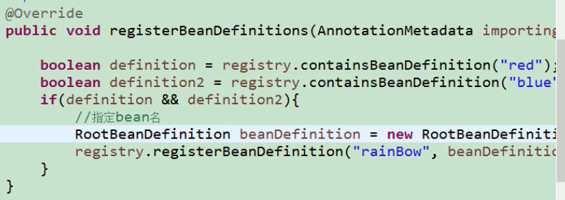

## Spring注解开发

### Spring注解入门

```java
//配置类
@Configuration//告诉Spirng这是一个配置类
@ComponentScan
public class MainConfig{
    //给容器注册一个Bean;类型为返回值的类型,id默认是方法名的id
    @Bean
    public Person getPerson(){
        
      return new Person;  
    }
   //注解包扫描  @ComponentScan(扫描包位置)
    //include 表示只扫描 excludeFilters 表示排除扫描
    //@Filter(type=FilterType.ANNOTATION,classese={Controller.class,Service.Class},userDefaultFilters=false//排除默认过滤规则) 根据注解排除  指定排除的规则
    //利用componentScans指定多个过滤规则
}
```

#### 总结过滤规则

1. ANNOTATION 按照注解

2.  ASSIGNABLE_TYPE 根据类型

3. ASPECTJ 根据切面

4. REGEX 根据正则表达式

5. CUSTOM 自定义规则

   

   

#### @Scope设置组件作用域

默认是单例

singleton:单例  ioc启动会调用方法创建对象放到ioc容器中

prototype:多例  获取对应实例的时候才会调用方法  获取多少次 会调用多少次

request:同一次请求创建一个实例

session:同一次会话请求创建一个实例

#### @Lazy  bean 懒加载

> 懒加载
>
> ​			单例bean：默认在容器启动的时候创建对象
>
> ​			懒加载:容器启动不创建对象,第一次使用Bean创建对象,并进行初始化

#### @Conditional

**作用：按照一定的条件进行判断,满足条件给容器这种注册bean**

```java
//获取操作环境
ConfigurableEnvironment environment = ac.getEnvironment();
String property = environment.getProperty("os.name");
System.out.println(property);
```

**condition**


#### 小结: 

1. 包扫描+组件标注注解
2. @Bean[导入的第三方包里面的组件]
3. @Import[快速的给容器中导入一个组件]
4. 使用Spring提供的FactoryBean工厂BEAN注册

#### @Import

1. 导入组件

2. ImportSelector导入选择器  返回需要导入的组件的全类名数组

   返回自定义需要返回的组件的全类名

3. ImportBeanDefinitionRegistrar

   //手动注册bean到容器中

   

4. 

### 生命周期

1. 指定初始化和销毁方法 @Bean后编写init和destory

2.  通过让Bean实现InitializingBean 定义初始化逻辑

   实现DisposableBean() 定义销毁逻辑

3. 可以使用JSR250  @PostConstruct注解，在Bean创建完成并且属性赋值完成进行初始化

   @PreDestroy 销毁

4. BeanPostProcessor,bean的后置处理器,在bean初始化前后进行一些工作

#### BeanPostProcessor 后置处理器

```java
@Component
public class MyBeanPostProcessor implements BeanPostProcessor {
	/**
	 *  初始化方法
	 * @param bean the new bean instance
	 * @param beanName the name of the bean
	 * @return
	 * @throws BeansException
	 */
	@Override
	public Object postProcessBeforeInitialization(Object bean, String beanName) throws BeansException {
		System.out.println("postProcessBeforeInitialization"+beanName+"\t=>"+bean);
		return bean;
	}

	/**
	 * 销毁方法
	 * @param bean the new bean instance
	 * @param beanName the name of the bean
	 * @return
	 * @throws BeansException
	 */
	@Override
	public Object postProcessAfterInitialization(Object bean, String beanName) throws BeansException {
		System.out.println("postProcessAfterInitialization"+beanName+"\t=>"+bean);
		return bean;
	}
}
```

##### 原理

```java
//以下过程是在populateBean()方法后执行的,给bean进行属性赋值
//下面进行初始化
wrappedBean = applyBeanPostProcessorsBeforeInitialization(wrappedBean, beanName);
//初始化方法
invokeInitMethods(beanName, wrappedBean, mbd);
//遍历得到容器中所有的BeanPostProcessor挨个执行BeforInitialization  一旦返回null,跳出for循环,不会执行后面的BeanpostProcessor
wrappedBean = applyBeanPostProcessorsAfterInitialization(wrappedBean, beanName);

```

ApplicationContextAware获取spring的ioc容器

bean赋值，注入其他组件,@Autowired,生命周期注解功能都是用BeanPostProcessor来实现的

#### @Value 赋值

1. 基本数值 
2. 可以写SpEL #{20-2}
3. 可以写${}取出配置文件中的值(在运行环境变量里面的值)

#### @PropertySource 加载外部配置文件


#### Autowired 自动装配

1. Spring利用依赖注入(DI),完成IOC容器中对对象的装配
2. 优先按照类型去找,如果有多个再将属性的名称作为组件的id取容器中取查找
3. @Qualifier("bookDao")指定需要装配的组件名
4. 如果容器中没有对象,创建Bean找不到此bean,默认一定要将属性赋值好,没有就会报错
5. @Autowired(required=false)不必须

#### Spring还支持使用@Resource(JSR250)和@Inject(JSR330)

##### @Resource：java规范,可以和Autowired一样实现自动装配,默认是按照组件名称进行装配的,也可以用name属性指定名称,没有支持@Primary功能和reqired=false

##### @Inject 需要导入javax inject jar包 也能使用

##### @Autowired:构造器，参数，方法，属性

**标注在方法上**

- 标注在方法,spring容器创建当前对象,就会调用方法,完成赋值
- 方法使用的参数,自定义类型的值从ioc容器中获取

**标注在构造器上**

- 默认加载ioc容器中的组件,容器启动的时候会调用无参构造器创建对象,再进行初始化赋值等操作
- 如果在有参构造器上加autowired注解,spring会调用有参方法

**也可以放在参数位置,效果也是一样的,都是从容器中获取参数组件的值**

*当只有一个有参构造器的时候,这个有参构造的参数的autoWired可以省略,参数位置的组件还是可以自动从容器中获取*

#### Aware注入Spring底层原理

1. 自定义组件想要使用Spring底层的一些组件(ApplicationContext,BeanFactory),只需要实现xxxAware接口,**在创建对象的时候,会调用自定义的aware接口**

   

#### @Profile

**profile:**Spring为我们提供的可以根据当前环境,动态的激活和切换一系列组件的功能

例如:开发环境,测试环境、生产环境

##### 入门示例:

1. 将业务逻辑组件和切面类都加入到容器中,告诉Spring哪个是切面类(@Aspect)
2. 在切面类上的每一个通知方法上标注通知注解,告诉Spring核实何地运行(切入点表达式)
3. 开启基于注解的aop模式@EnableAspectJjAutoProxy

**切面类**

```java
package com.wb.aop;

import org.aspectj.lang.JoinPoint;
import org.aspectj.lang.annotation.*;

/**
 * Create By WeiBin on 2020/4/2 18:34
 * 日志切面类  需要动态感知我们的方法
 * 通知方法
 * 1. 前置 logStart
 * 2. 后置 logEnd
 * 3. 返回 logReturn
 * 4. 环绕 手动推进目标方法运行 logException
 * 5. 异常
 *
 *  1. 给切面类的目标方法标注何时何地运行
 *  2. 将切面类和业务逻辑类都加入到容器中
 *  3. 需要在切面类上声明此类是切面@Aspect
 *  4. 要在configuration 加上@EnableAspectJAutoProxy 开启切面支持
 *  5. 可以用JoinPoint来获取方法的一些信息,方法名,参数
 *  6. returning “result” Object result可以获取返回值
 *  7. Exception在 throwing 中指定异常
 *  8. joinPoint参数一定要出现在参数表的第一位
 */
@Aspect
public class LogAspects {
   /**
    * 抽取公共的切入点表达式
    */
   @Pointcut("execution(public int com.wb.aop.MathCalculator.*(..))")
   public void cut(){

   }

   @Before("cut()")
   public void logStart(JoinPoint joinPoint){
      System.out.println(joinPoint.getSignature().getName()+"方法开始运行参数时"+joinPoint.getArgs().toString());
   }
   @After("cut()")
   public void logEnd(JoinPoint joinPoint){
      System.out.println(joinPoint.getSignature().getName()+"方法结束运行参数时"+joinPoint.getArgs().toString());
   }
   @AfterReturning(value = "cut()",returning = "result")
   public void logReturn(JoinPoint joinPoint,Object result    ){
      System.out.println(joinPoint.getSignature().getName()+"方法运行返回"+result);
   }
   @AfterThrowing(value = "cut()",throwing = "e")
   public void logException(JoinPoint joinPoint,Exception e){
      System.out.println(joinPoint.getSignature().getName()+"方法运行异常");
      e.printStackTrace();
   }
}
```

**业务类**

```java
package com.wb.aop;

/**
 * Create By WeiBin on 2020/4/2 18:32
 */

/**
 * 数学计算类
 */
public class MathCalculator {

	public int div(int i, int j) {
		System.out.println("这是div方法");
		return i / j;
	}


}

```


**测试类**

```java
private AnnotationConfigApplicationContext ac=new AnnotationConfigApplicationContext(SpringAopConfig.class);
	@Test
	public void Test(){
		MathCalculator bean = ac.getBean(MathCalculator.class);
		int div = bean.div(5, 0);
		System.out.println(div);
	}
```


**测试结果**


### Aop原理

```java
//@EnableAspectJAtuoProxy 开启Aspectj切面支持
//引入了 AspectJAutoProxyRegistrar.class 
//这个类又实现了ImportBeanDefinitionRegistrar 自定义注册的组件
//利用AspectJAutoProxyRegistrar自定义给容器中注册bean
//
```


##### AnnotationAspecgtJAutoAware

1. 传入配置类,创建ioc容器
2. 注册配置类,调用refresh方法
3. 注册Bean的后置处理器来方便拦截bean的创建
   1. 获取ioc容器中已经定义了的需要创建对象的所有BeanPostProcessor
   2. 给容器中加别的BenPostProccessor
   3. 优先注册实现了PriorityOrdered的beanPostProcessor
   4. 在给容器中实现了Ordered接口
   5. 最后实现没有实现优先级接口的beanPostProcessor
   6. 注册BeanPostProcessor,实际上就是创建对象,保存在容器中 createBeanInstance
      1. 创建bean的实例
      2. populateBean 给bean的各种属性赋值
      3. initalizeBean 初始化bean
         1. invokeAwareMethods() 处理Aware接口的方法回调
         2. applyBeanPostProcessorsBeforeInitalization() 后缀处理器初始化之前的调用
         3. invokeInitMethods() 执行自定义的初始化方法
         4. applyBeanPostProcessorsAfterInitalization() 后置处理器初始化之后的调用
   7. 把BeanPostProcessor注册到BeanFactory中
4. 以上是创建AnnotationAwareAspectJAtuoProxyCreator的过程

##### AnnotationAwareAspectJAtuoProxyCreator

InstantiationAwareBeanPostProcessor

finishBeanFactoryInitialization(beanFacotry)完成BeanFacotry初始化工作,创建剩下的单实例对象

1. 遍历获取容器中所有的Bean,依次创建对象getBeanName(beanName)

   **getBean->doGetBean()->getSingleton()->**

2. 创建Bean

   1. 先从缓存中获取当前bean,如果能获取到,说明bean是之前被创建过的,直接使用,否则在创建,只要被创建好的Bean会缓存起来

   2. createBean();创建Bean

      1. resoveBeforeInstantiation解析

         希望后置处理器返回一个代理对象

      2. doCreateBean()真正的去创建一个bean实例

      

