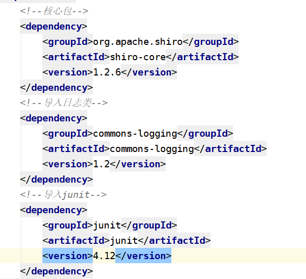

shiro
---------
1. 1.shiro的特点
    1. 1.1 上手简单，入门的门槛低
    2. 1.2 它不依赖spring，没有spring都可以在项目中使用shiro
    3. 1.3 一般要完成的权限控制方面的功能，shiro都可以实现
2. 2.springSecurity
    1. 2.1 上手有一定的难度，有入门门槛
    2. 2.2 他依赖于spring，要使用它必须在spring框架中使用
    3. 2.3 它的功能非常强大（shiro有的功能，它都有）
3. 3.shiro这个安全框架中,主要包含了哪些功能？
    1. 3.1 认证 -------------判断用户是否可以登录，以及判断用户是否已经登录
    2. 3.2 授权 -------------当登录用户要访问某一个资源，判断用户是否有访问权限
    3. 3.3 密码管理 --------- 对用户的密码用MD5加密，让密码更安全
    4. 3.4 会话管理 ---------用户登录以后，把用户的状态，保存在shiro的session中
    5. 3.5 缓存管理 ---------用户登录成功以后，把用户拥有的访问权限存放在换从中，避免每次一要进行权限判断时，到数据库中获取用户权限
4. 4.shiro中的一些概念：
    1. 4.1 认证 --------判断用户是否可以登录，以及判断用户是否已登录
    2. 4.2 授权 --------当登录用户要访问某一个资源，判断用户是否有访问权限
    3. 4.3 SecurityManager：安全管理器
        1. 4.3.1 在shiro中的认证与授权读需要通过安装管理器来执行
    4. 4.4 Subject:主体
        1. 4.4.1 主体用户封装信息，然后调用方法这些信息传递给securityManager进行认证、授权
    5. 4.5 cache：缓存
    6. 4.6 Realm领域对象
        1. 4.6.1 作用:它封装了两个方法,一个用户认证登录,一个用户授权(得到用户的访问权限)
    7. 4.7 shiro认证时的几种异常:
        1. 4.7.1 UnknowAccountException 用户不存在
        2. 4.7.2 IncorrectCredentialsException 密码错误
    8. 4.8
5. 5.示例1:在ini文件配置用户信息,通过shiro进行认证操作
    1. 5.1 这种方式，是将用户名、密码写在一个后缀名ini文件中，然后让shiro读取这个文件，获取用户信息。我们只是通过这种方式，练习shiro的用户，实际开发中，用户名、密码不会写在文件中，而是在数据库中
    2. 5.2 步骤
        1. 5.2.1 创建一个maven工程
        2. 5.2.2 在项目中导入如下依赖：
            1. 5.2.2.1 
        3. 5.2.3 在main/java/resource目录下,新建一个shiro.ini文件,用户保存用户信息
            1. 5.2.3.1 在ini中配置用户信息
        4. 5.2.4 编写一个测试类,进行认证操作（登录）
    3. 5.3 实际开发中,不可能将用户名密码写在文件中，因为不安全
6. 6.示例2:编写一个Realm类,通过realm类进行认证操作
    1. 6.1 通过realm类中的方法,连接数据库进行认证
    2. 6.2 步骤
        1. 6.2.1 创建一个领域对象AuthcRealm类 继承于AuthorizingRealm类
        2. 6.2.2 在认证的方法中,编写代码进行认证操作(doGetAuthenticationInfo)
    3. 6.3 在resources下,创建一个shiro2.ini文件,用户加载realm类
7. 7.shiro认证的过程
    1. 7.1 用户输入的用户名与密码将会封装成一个令牌 UsernamePasswordToken
    2. 7.2 主体(subject)会调用login方法进行认证,并且把令牌作为参数传递给securityManager
    3. 7.3 安全管理器(SecurityManager),它会首先判断用户名是否存在:
        1. 7.3.1 如果用户名不存在,将会抛出异常:UnknowAccountException 用户名不存在
        2. 7.3.2 如果用户名存在,shiro将取得该用户名正确密码,然后把正确的密码与用户输入的密码进行对比
            1. 7.3.2.1 如果密码不一致,将抛出异常:IncorrectCredentialsException
            2. 7.3.2.2 如果密码一致,将会把认证的主体subject,存放在shiro的session
        3. 7.3.3 shiro判断用户是否已经登录时,就是查询shiro的session中是否存在认证过的主体(subject)
    4. 7.4 如果已认证的用户,要退出认证,只需要通过主体subject调用logout()即可
        1. 7.4.1 subject.logout();//调用此方法,就会移除用户
8. 8.在开发中,将用户信息存放在数据库中,那样不安全？
    1. 8.1 因为有了用户与密码，就可以登录别人的账号
    2. 8.2 实际开发中，密码需要加密存放到数据库中
    3. 8.3 存放在数据库中的数据
        1. 8.3.1 用户名 ---------- 原始的用户名
        2. 8.3.2 密码   ---------- 加密后密码
    4. 8.4 常用的加密方式：MD5
        1. 8.4.1 原始密码:123 盐:accp 加密次数:3
9. 9.示例：授权
    1. 9.1 用户在访问某一个资源时,判断是否拥有访问权限
    2. 9.2 通过ini文件,进行授权
        1. 9.2.1 把用户信息,以及角色信息,每一种角色拥有的权限写在ini文件中
    3. 9.3
10. 10.
