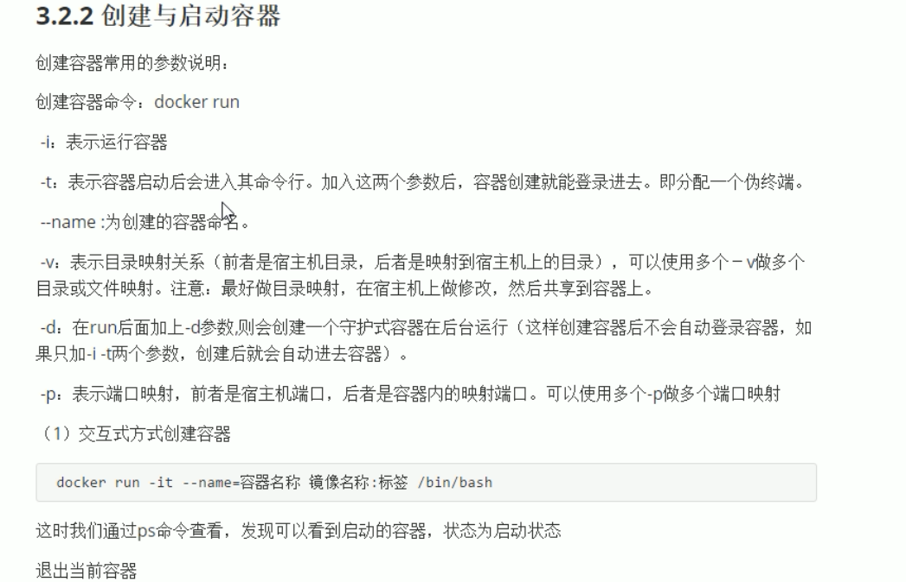
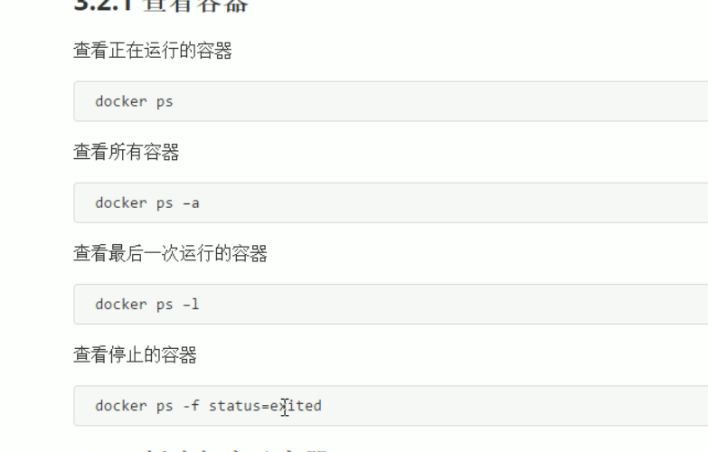

## docker常用命令

#### 查看镜像

> docker images

#### 搜索镜像

> docker search centos

#### 拉取镜像

> docker pull 镜像名:版本名

#### 删除镜像

> docker rmi 镜像ID
>
> docker rmo `docker images -q` 删除所有镜像

### 容器相关命令

#### 设置容器自启动

> docker update --restart=always 容器名

#### 查看当前运行的容器

> docker ps

#### 创建容器命令

> docker run 
>
> -i 运行容器
>
> -t 进行命令行
>
> --name:为容器命名





#### 容器停止和启动

> docker start 容器名
>
> docker stop 容器名

#### 文件拷贝

> docker cp 需要拷贝的文件 容器名:路径
>
> docker exec -it 名 /bin/bash 
>
> docker cp 容器名:文件名称 宿主文件名称

#### 目录挂载

> docker run -di -v /usr/local/myhtml:/usr/local/myhtml --name=mycentos3 centos:7

#### 查看容器IP地址

> docker inspect 容器名称(容器id)

#### 删除容器

> docker rm 容器名称
>
> 不能移除正在运行的容器

#### 创建mysql

> docker run -di --name=tensquare_mysql -p 33306:3306 -e MYSQL_ROOT_PASSWORD=996649855 容器名称

#### 创建tomcat

> 1. 拉取镜像
>
>    docker pull tomcat:7 -jre7
>
> 2. 创建镜像
>
>    docker run -di --name=mytomcat -p 9000:8080 -v /usr/local/webapps:/usr/local/tomcat/webapps 镜像名称
>
> 3. 

#### 安装nginx

> 1. 拉取nginx镜像
>
>    ```
>    docker pull nginx
>    ```
>
>    
>
> 2.  创建nginx容器
>
>    ```
>    docker run -di --name=nginx -p 80:80 nginx
>    ```
>
>    

#### 搭建redis

