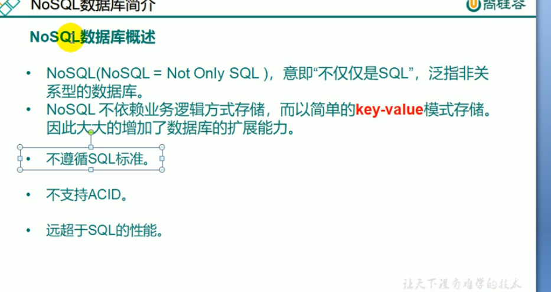
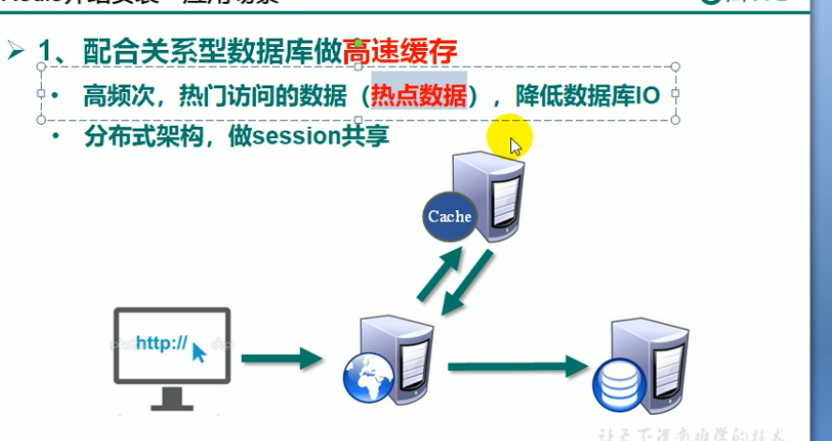

## Redis数据库

### 目录

1. NoSQL数据库简介
2. Redis简介与安装
3. Redis五大数据类型
4. Redis相关配置
5. Redis的java客户端Jedis
6. Redis事务
7. Redis持久化
8. Redis主从复制
9. Redis集群

### NoSQL数据库简介

#### 技术的分类

#### NoSQL数据库概述

#### 缓存数据库

#### 文档型数据库

#### 列式数据库

#### 数据库排名

#### Redis介绍安装

#### 步骤

1. 下载安装包
2. 上传
3. 解压
4. 
5. 
6. 然后make install
7. 查看默认安装目录

### Redis安装和关闭

#### 查看目录

#### 启动

#### 测试是否启动

#### Redis为什么这么快？

1. 基于内存
2. 单线程
3. 多路IO复用 NIO BIO AIO

#### BIO  阻塞式io  tomcat

#### NIO  非阻塞式

#### AIO  多路IO复用

