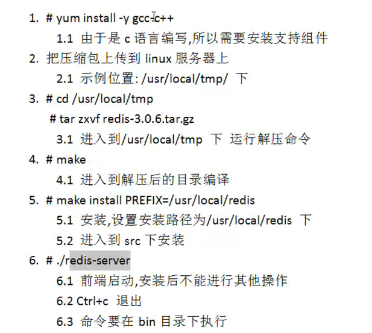
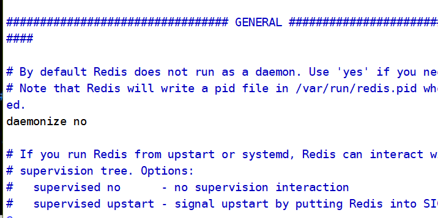
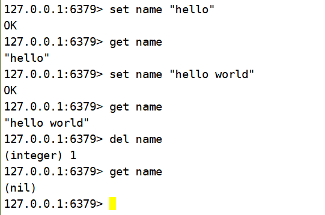

## Redis笔记

### 常用命令

Redis 支持单机版和集群,下面的步骤是单机版安装步骤

1. # yum install -y gcc-c++
1.1 由于是 c 语言编写,所以需要安装支持组件
2. 把压缩包上传到 linux 服务器上
2.1 示例位置: /usr/local/tmp/ 下
3. # cd /usr/local/tmp
# tar zxvf redis-3.0.6.tar.gz
3.1 进入到/usr/local/tmp 下 运行解压命令
4. # make
4.1 进入到解压后的目录编译
5. # make install PREFIX=/usr/local/redis
5.1 安装,设置安装路径为/usr/local/redis 下
5.2 进入到 src 下安装
6. # ./redis-server
6.1 前端启动,安装后不能进行其他操作
6.2 Ctrl+c 退出
6.3 命令要在 bin 目录下执行
7. # cp /usr/local/tmp/redis-3.0.0/redis.conf /usr/local/redis/bin
7.1 把解压目录下配置文件拷贝到安装目录的 bin 下
8.# vi redis.conf
8.1 修改 bin 下 redis.conf
8.2 把 daemonize 由 no 修改成 yes,守护进程启动
9.# ps aux|grep redis
9.1 查看 redis 启动情况
10../redis-server redis.conf
10.1 启动 redis 服务
11.# ./redis-cli shutdown
10.1 如果希望关闭,运行上面命令,不关闭不运行即可
12.# ./redis-cli
11.1 进入到自带客户端工具,测试 redis 是否可用
12 # set name ‘smallming’
12.1 添加一个 string ,key 为 name,value 为 smallming
13# get name
13.1 取出 name 中内容

#### 安装



#### 连接linux的redis



修改为yes表示后台运行

#### 命令

进入客户端

新增 set name "hello"

查询 get name

改   set name "hello1 "



setex name 时间  值

setnx 代表如果不在才做设置,存在就话不做处理

#### Redis几个常用概念

1. Redis 默认有 16384 solts(槽),每个槽可以存储多个 hash 值.
2. Redis默认是没有密码
   1. 如果要开启密码 只需要修改redis的conf文件 
   2. 修改password

#### Jedis

1. Jedis是Redis客户端工具jar

2. ```xml
   //导入依赖
   <dependency>
     <groupId>redis.clients</groupId>
     <artifactId>jedis</artifactId>
     <version>2.8.1</version>
   </dependency>
   ```

3. 新建测试类

   ```java
   Jedis jeds=new Jedis("192.168.189.172",6379);
   String result=jedis.set("address","北京");
   ```

4. 测试代码

   ```java
    public void insRedis(){
           Jedis jedis=new Jedis("192.168.189.172",6379);
           String set = jedis.set("name", "张三");
           System.out.println(set);
   
       }
   ```

   

5. 注意:连接时需要将bind 127.0.0.1注释然后将保护模式关闭

#### 搭建集群

