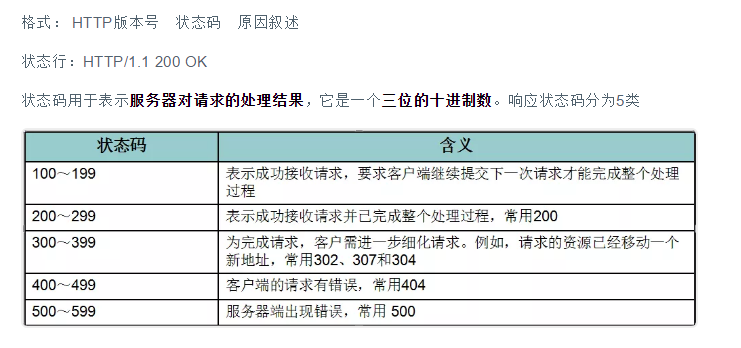

<r>Servlet【HTTP协议、Servlet生命周期】<r/>
----------------------------------------------------
## 关于请求和响应 ##
  

HTTP请求
------
**浏览器向服务器请求某个web资源时，称之为浏览器向服务器发送了一个http请求。**

- 关于请求方式：分为get和post方式
- 一般来说，当我们点击超链接，通过地址栏访问都是get请求方式。通过表单提交的数据一般是post方式。
- 可以简单理解GET方式用来查询数据,POST方式用来提交数据，get的提交速度比post快

**GET方式：在URL地址后附带的参数是有限制的，其数据容量通常不能超过1K。**

**POST方式：可以在请求的实体内容中向服务器发送数据，传送的数据量无限制。**

 
## HTTP响应 ##

**一个HTTP响应代表着服务器向浏览器回送数据(就是我们要做的事)**

## 状态行(了解) ##

什么是Serlvet
-----------

Servlet其实就是一个遵循Servlet开发的java类。Serlvet是由服务器调用的，运行在服务器端。
<r>Servlet生命周期可分为5个步骤<r/>
------------------

- 1.<r>**加载Servlet**。</r>当Tomcat第一次访问Servlet的时候，Tomcat会负责创建Servlet的实例<r>
- 2.<r> **初始化**。</r>当Servlet被实例化后，Tomcat会调用init()方法初始化这个对象
- 3. <r>**处理服务**。</r>当浏览器访问Servlet的时候，Servlet 会调用service()方法处理请求
- 4. <r>**销毁**。</r>当Tomcat关闭时或者检测到Servlet要从Tomcat删除的时候会自动调用destroy()方法，让该实例释放掉所占的资源。一个Servlet如果长时间不被使用的话，也会被Tomcat自动销毁
- 5. <r>**卸载**。</r>当Servlet调用完destroy()方法后，等待垃圾回收。如果有需要再次使用这个Servlet，会重新调用init()方法进行初始化操作。
- 6. <r>**简单总结**</r>：只要访问Servlet，service()就会被调用。init()只有第一次访问Servlet的时候才会被调用。 destroy()只有在Tomcat关闭的时候才会被调用。

