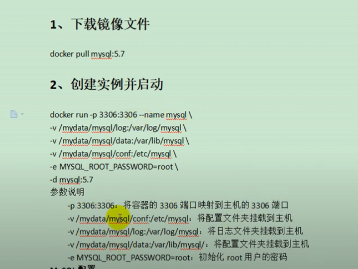
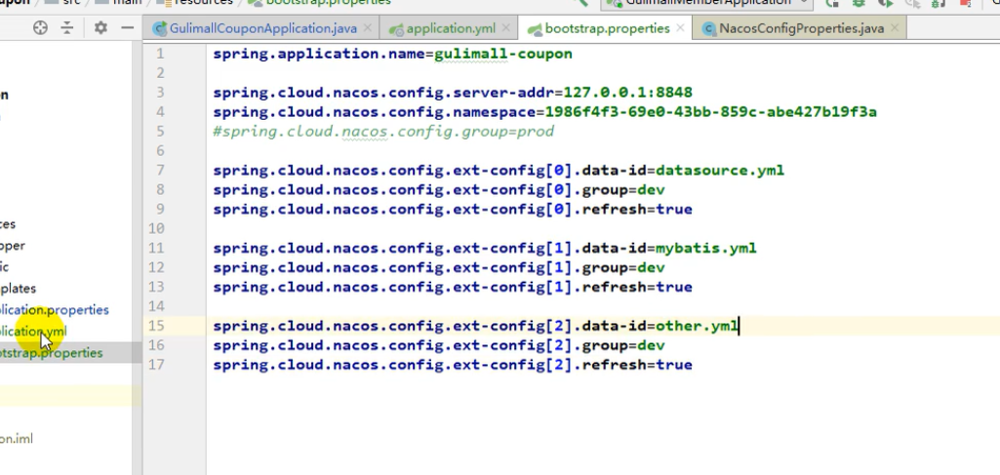
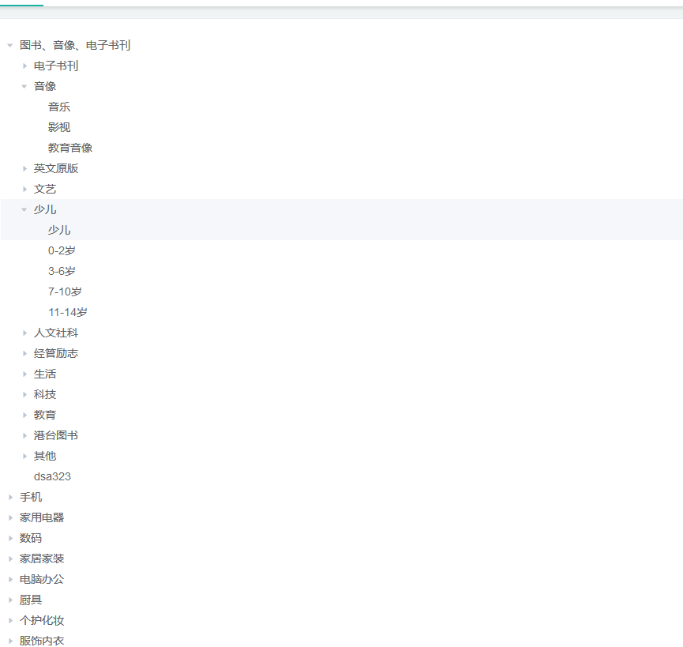
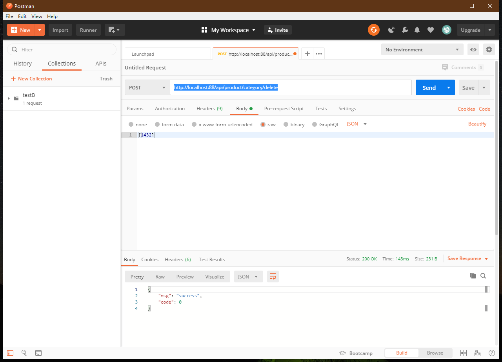

## 分布式笔记

### 第一天

#### 安装工具

virtualBox

vagrant 快速创建linux

> 初始化
>
> vagrant init centos/7

配置网络 

修改vargrantbox配置文件中的私有网络

```
//地址和windows下的ipconfig virtualBox的虚拟网卡
//config.vm.network "private_network",ip "192.168.56.10"
```


vagrant ssh进入linux

chkconfig docker on开启自启动

#### 安装docker和docker加速

> sudo mkdir -p /etc/docker sudo tee /etc/docker/daemon.json <<-'EOF' {  "registry-mirrors": ["https://yh0l4f9h.mirror.aliyuncs.com"] } EOF sudo systemctl daemon-reload sudo systemctl restart docker

配置阿里云镜像加速

下载mysql 从镜像仓库中安装

docker pull mysql:5.7

### docker的一些操作命令

> docker search 关键字 来搜索
>
> docker pull 关键字:版本号 //拉取
>
> docker images 所有镜像列表
>
> docker rmi 镜像id来删除

### docker容器操作常用命令

> 运行:docker run --name:容器名称 -d 后台运行 image-name:镜像模板
>
> 列表:docker ps
>
> 停止:docker stop container-name
>
> 启动:docker start
>
> 删除:docker rm 
>
> 端口映射:-p 6379:6379
>
> 容器日志:docker logs container-name
>
> service firewalld status:查看防火墙状态
>
> service firewalld stop：停止
>
> docker update --restart=always 容器名
>
> 更多命令:[更多命令](https://docs.docker.com/engine/reference/commandline/docker/)

#### 创建docker实例并启动mysql



```tex
docker run -p 3306:3306 --name mysql \
-v /mydata/mysql/log:/var/log/mysql \
-v /mydata/mysql/data:/var/lib/mysql \
-v /mydata/mysql/conf:/etc/mysql \
-e MYSQL_ROOT_PASSWORD=996649855 \
-d mysql:5.7
```

-p 3306:3306 就是将3306端口进行对应 -name 指的是启动的容器文件的名称

-v 就是映射容器内部的文件 进行挂载

##### 进入指定docker镜像

```
docker exec -it mysql/ bin/bash
```

这个mysql是一个完整的linux系统

#### mysql配置

配置mysql编码

```
[client]
default-character-set=utf8
[mysql]
default-character-set=utf8
[mysqld]
init_connect='set collation_connection=utf8_ unicode_ci'
init_connect='SET NAMES utf8'
character-set-server=utf8
collation-server=utf8_unicode_ci
skip-character-set-client-handshake
skip-name-resolve
```

#### 安装redis

下载 docker pull redis

#### 启动

```
#先执行创建好文件
mkdir -p /mydata/redis/conf
touch /mydata/redis/conf/redis.conf

docker run -p 6379:6379 --name redis \
-v /mydata/redis/data:/data \
-v /mydata/redis/conf/redis.conf:/etc/redis/redis.conf \
-d redis redis-server /etc/redis/redis.conf
```

进入redis docker exec -it redis redis-cli

```properties
#bind 127.0.0.1 //允许远程连接
protected-mode no
appendonly yes //持久化
requirepass password //密码
```


##### 持久化redis

appendonly yes

防止重启redis数据丢失

##### 可视化工具 redisDesktopManager

#### 配置统一jdk和maven 

##### vscode插件下载

- auto close tag
- auto rename tag
- chinese
- eslint
- html css support
- html snippets
- javascript es6
- live server

#### 环境配置git

git配置用户名和邮箱

```
git config --global user.name 'username'
git config --global user.email 'email'//注册时用的账号
配置ssh免密登录
ssh-keygen -t rsa -C "xxx@xxxx.com"
cat ~/.ssh/id_rsa.pub

```

#### 创建微服务

共同

1. web openfeign
2. 每一个服务,包名 **com.wb.gulimal**l.xxx(product/order/ware/coupon/member)
3. 模块名 gulimall-coupon名 

##### 忽略文件

```
target/
pom.xml.tag
pom.xml.releaseBackup
pom.xml.versionBackup
pom.xml.next
release.properties
dependency-reduced-pom.xml
buildNumber.properties
.mvn/timing.properties
.mvn/wrapper/maven-wrapper.jar

**/mvnw
**/mvnw.cmd

**/.mvn

**/target/
.idea

**/.gitignore
```

#### 自动启动docker 容器内容

docker ps -a 查看容器

docker update redis --restart=always

docker update mysql --restart=always

#### 从gitt上获取人人开源项目并导入进来

#### 将数据库文件生成好

##### 启动renrenfast项目测试localhost8080:renrefast

#### 安装node启动前端项目

设置node镜像

```
npm config set registry http://registry.npm.taobao.org/
```

运行 npm run dev

#### 下载代码生成器

设置对应的项目结果和数据库地址

#### 生成公共类

依赖

 ```xml

 ```

#### 整合mybatis-plus

1. 导入依赖

2. 配置

   1. 配置数据源

      1. 导入数据库的驱动

      2. 配置数据源

         ```yaml
         spring:
           datasource:
             username: root
             password: 996649855
             url: jdbc:mysql://192.168.56.10:3306/gulimall_pms
             driver-class-name: com.mysql.jdbc.Driver
         ```

         

   2. 配置mybatis-plus

      1. 使用注解扫描mapper

      2. 告诉mybatsiplus sql映射文件位置

         mybatis-plus:mapper-locations

      3. 配置主键自增id 

   3. 测试增删改查

   ```java
   @Autowired
       BrandService brandService;
   
       @Test
       void contextLoads() {
   //        BrandEntity brandEntity = new BrandEntity();
   //        brandEntity.setDescript("");
   //        brandEntity.setName("华为");
   //        brandService.save(brandEntity);
   //        System.out.println("保存成功");
           List<BrandEntity> list = brandService.list(new QueryWrapper<BrandEntity>().eq("brand_id",1));
           for (BrandEntity brandEntity : list) {
               System.out.println(brandEntity);
           }
   ```

   

##### 配置所有代码生成

1. 修改模块名
2. 数据库连接名
3. 生成即可

#### springCloud Alibaba


##### 导入依赖管理

```xml
<dependencyManagement>
    <dependencies>
        <dependency>
            <groupId>com.alibaba.cloud</groupId>
            <artifactId>spring-cloud-alibaba-dependencies</artifactId>
            <version>2.2.1.RELEASE</version>
            <type>pom</type>
            <scope>import</scope>
        </dependency>
    </dependencies>
</dependencyManagement>
<dependency>
            <groupId>com.alibaba.cloud</groupId>
            <artifactId>spring-cloud-starter-alibaba-nacos-config</artifactId>
        </dependency>
        <dependency>
            <groupId>com.alibaba.cloud</groupId>
            <artifactId>spring-cloud-starter-alibaba-nacos-discovery</artifactId>
        </dependency>
```

#### 引入springCloudAlibaba nacos

##### 配置注册中心

```yaml
spring:
    application:
        name: gulimall-coupon
      cloud:
        nacos:
          discovery:
            server-addr: 127.0.0.1:8848
```

#### 利用openfeign进行服务调用

1. controller

```java
 @RequestMapping("/member/list")
    public  R memberCoupons(){
        CouponEntity couponEntity=new CouponEntity();
        couponEntity.setCouponName("满100减10");
        return R.ok().put("coupons",Arrays.asList(couponEntity));
    }
//member的controller
@Autowired
    CouponFeign couponFeign;

    @RequestMapping("/coupons")
    public R test() {
        MemberEntity memberEntity = new MemberEntity();
        memberEntity.setNickname("张三");
        R r = couponFeign.memberCoupons();
        return R.ok().put("member",memberEntity).put("coupons",r.get("coupons"));
    }
```

2. 步骤
   1. 引入openfeign
   2. 编写一个接口,告诉springcloud这个接口需要调用远程服务
      1. 声明接口调用的方法名称
   3. 开启远程调用功
3. 调用结果


#### 配置中心,在nacos配置中心添加配置

##### 在springboot上添加refreshScope注解,然后在配置中心修改即可全局修改

步骤

1. 引入配置中心依赖

2. 创建一个bootstrap.properties文件
   1. 名字
   2. 配置中心地址
   
3. 需要给配置中心默认添加一个叫当前应用名.properties文件

4. 数据集(Data Id)

5. @refreshScope一定要加在controller层上

6. 选择分组和命名空间

   ```yaml
   spring:
     application:
       name: gulimall-member
     cloud:
       nacos:
         config:
           server-addr: 127.0.0.1:8848
           file-extension: yaml 
           namespace: 4c765002-8a6e-4964-97e5-437fd35c6b4e 指定命名空间
           group: dev 指定分组
   
   ```

   


### nacos配置中心加载多配置



1. 微服务任何配置信息,都可以放在配置中心中

2. 只需要在bootstrap.properties说明加载配置中心中哪些配置文件

3. @Value()@ConfigurationProperties都可以获取配置文件值

4. yml集合配置方式

   ```yml
   spring:
     application:
       name: gulimall-coupon
     cloud:
       nacos:
         config:
           server-addr: 127.0.0.1:8848
           namespace: d548ba13-bd46-46e1-b05d-ec8457d747a2
           ext-config:
             - data-id: datasource.yml
               group: dev
               refresh: true
             - data-id: mybatis.yml
               group: dev
               refresh: true
             - data-id: other.yml
               group: dev
               refresh: true
   ```

   

5. 命名空间一定要对！！！！！！！

#### SpringCloudGateWay

[springCloudGateWay](https://cloud.spring.io/spring-cloud-gateway/2.1.x/single/spring-cloud-gateway.html#_glossary)

```yaml
gateway:
      routes:
        - id: test_route
          uri: https://www.baidu.com
          predicates:
            - Query=url, baidu
        - id: test_route1
          uri: https://www.qq.com
          predicates:
            - Query=url, qq
        - id: admin_route
          uri: lb://renren-fast
          predicates:
            - Path=/api/**
          filters:
            - RewritePath=/api/(?<segment>.*),/renren-fast/$\{segment}
```

#### 配置菜单路由

```yaml
- id: product_route
          uri: lb://gulimall-product
          predicates:
            - Path: /api/product/**
          filters:
            - RewritePath=/api/(?<segment>.*),/$\{segment}
```

##### 配置好产品的注册

```yaml
 cloud:
    nacos:
      discovery:
        server-addr: 127.0.0.1:8848
        spring:
  application:
    name: gulimall-product
  cloud:
    nacos:
      config:
        server-addr: 127.0.0.1:8848
        namespace: 59fdcf12-ef67-4c1c-b7f8-315ed68fca60
```


#### 三级菜单前后端测试

```vue
<!--  -->
<template>
<el-tree :data="menus" :props="defaultProps" @node-click="handleNodeClick"></el-tree>
</template>

<script>
export default {
//import引入的组件需要注入到对象中才能使用
components: {},
props:{},
data() {
 return {
        menus: [],
        defaultProps: {
          children: 'children',
          label: 'name'//显示的名字
        }
      };
},
 methods: {
      handleNodeClick(data) {
        console.log(data);
      },
      getMenus(){
          //进行路由转发请求
          this.$http({
          url: this.$http.adornUrl('/product/category/list/tree'),
          method: 'get'
        }).then(({data}) => {//{}解构
            console.log("成功获取到菜单数据",data.data);
            this.menus=data.data;
        })
      }
    },
//监听属性 类似于data概念
computed: {},
//监控data中的数据变化
watch: {},
//方法集合
//生命周期 - 创建完成（可以访问当前this实例）
created() {
    this.getMenus();//初始化调用
},
//生命周期 - 挂载完成（可以访问DOM元素）
mounted() {

},
beforeCreate() {}, //生命周期 - 创建之前
beforeMount() {}, //生命周期 - 挂载之前
beforeUpdate() {}, //生命周期 - 更新之前
updated() {}, //生命周期 - 更新之后
beforeDestroy() {}, //生命周期 - 销毁之前
destroyed() {}, //生命周期 - 销毁完成
activated() {}, //如果页面有keep-alive缓存功能，这个函数会触发
}
</script>
<style scoped>

</style>
```



#### 操作节点

1. 加上elementui的内容

   ```vue
   <span class="custom-tree-node" slot-scope="{ node, data }">
         <span>{{ node.label }}</span>
         <span>
           <el-button type="text" v-if="node.level<=2" size="mini" @click="() => append(data)">Append</el-button>
           <el-button type="text" v-if="node.childNodes.length==0" size="mini" @click="() => remove(node, data)">Delete</el-button>
         </span>
       </span>	
    append(data) {
         console.log("append", data);
       },
       remove(node, data) {
         console.log(data);
       }
   ```

2. 在element-tree上加上标签

   1. showbox 显示多选框
   2. *expand-on-click-node* 点击箭头才展开
   3. node-key="catId" 给节点赋予唯一id属性

   

   

   

   

   

   


#### 操作节点发送删除操作

1. @requestBody 获取请求体,必须发送post请求
2. springMvc自动将请求体的数据(json)转为对应的对象
3. 删除地址http://localhost:88/api/product/category/delete



4. 自定义批量删除方法

   ```java
   //采用逻辑删除
   ```

   

5. 逻辑删除

   ```yaml
   mybatis-plus:
     global-config:
       db-config:
         logic-delete-field: flag  #全局逻辑删除字段值 3.3.0开始支持，详情看下面。
         logic-delete-value: 1 # 逻辑已删除值(默认为 1)
         logic-not-delete-value: 0 # 逻辑未删除值(默认为 0)
         //加上@TableLogic字段属性
   ```

   

6. 前端删除方法

   ```javascript
    remove(node, data) {
         //获取catId
         var ids=[data.catId];
          this.$http({
               url: this.$http.adornUrl('/product/category/delete'),
               method: 'post',
               data: this.$http.adornData(ids, false)
             }).then(({data}) => {
               console.log("删除成功");
             })
       }
   ```

   

7. 生成代码片段

   ```javascript
   "http-get请求":{
       "prefix":"httpget",
        "body":[
            "this.\\$http({",
            "url:this.\\$http.adomUrl(""),",
            "method:'get'",
            "params:this\\$http.adornParam({})",
            "}).then({data})=>{",
            "})"
        ],
          "descript":"httpGet请求"  
   }
   
   "http-post请求":{
       "prefix":"httppost",
        "body":[
            "this.\\$http({",
            "url:this.\\$http.adomUrl(""),",
            "method:'post'",
            "data:this\\$http.adornData(data,false)",
            "}).then({data})=>{",
            "})"
        ],
          "descript":"httpPost请求"  
   }
   ```

   

8. 添加提示框(elementui操作)

#### append

1. 