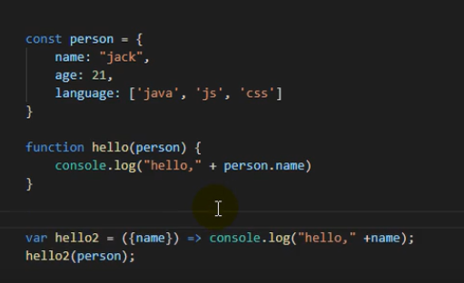
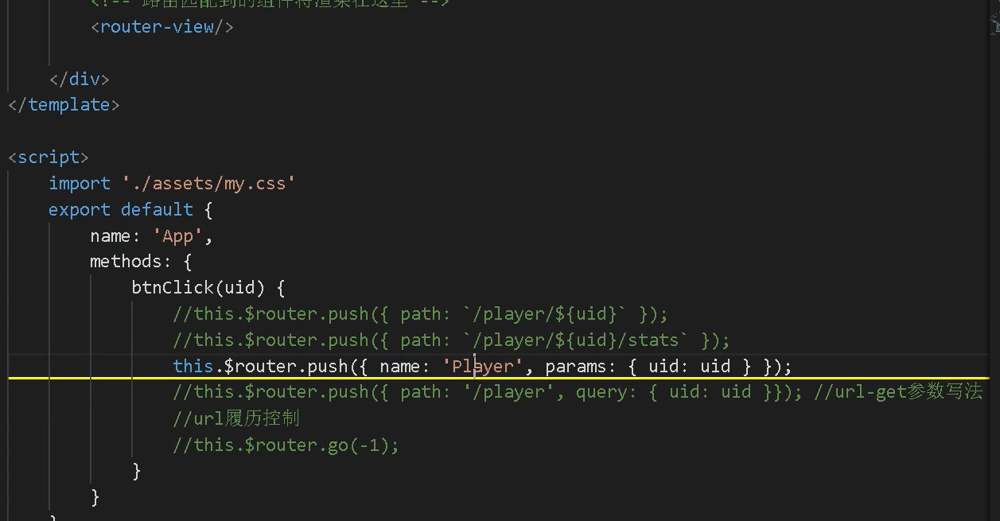

## 前端快速入门




#### 引入bootstrap

1. npm install bootstrap --save --save-exact
2. 导入 import 'bootstrap/dist/css/bootstrap.min.css'

#### 引入axios

1. npm install --save --save-exact axios vue-axios
2. 导入 import axios from 'axios'
3. import VueAxios from 'vue-axios'
4. Vue.use(VueAxios,axios)

#### 引入路由

1. npm install vue-router --save --save-exact

#### 动态路由

1. 动态路由的匹配设置

2. ```html
   <!--  -->
   <template>
   <div>
       <h1>hello world</h1>
       <p>{{detial}}</p>
   </div>
   </template>
   
   <script>
   export default {
   //import引入的组件需要注入到对象中才能使用
   components: {},
   props:{},
   data() {
   //这里存放数据
   return {
       detial:{}
   };
   },
   //监听属性 类似于data概念
   computed: {},
   //监控data中的数据变化
   watch: {},
   //方法集合
   methods: {
       getPlayer(uid){
           console.log(uid);
           switch (uid) {
               case '1':
                   return {uid:1,name:'库里',point:26};
                   break;
               case '2':
                   return {uid:2,name:'哈登',point:26};
                   break;
               default:
                   return {uid:-1};
                   break;
           }
       }
   },
   //生命周期 - 创建完成（可以访问当前this实例）
   created() {
   
   },
   //生命周期 - 挂载完成（可以访问DOM元素）
   mounted() {
       //接收url参数id
       this.detial=this.getPlayer(this.$route.params.uid);
   },
   beforeCreate() {}, //生命周期 - 创建之前
   beforeMount() {}, //生命周期 - 挂载之前
   beforeUpdate() {}, //生命周期 - 更新之前
   updated() {}, //生命周期 - 更新之后
   beforeDestroy() {}, //生命周期 - 销毁之前
   destroyed() {}, //生命周期 - 销毁完成
   activated() {}, //如果页面有keep-alive缓存功能，这个函数会触发
   }
   </script>
   <style scoped>
   
   </style>
   ```

#### 嵌套路由



 