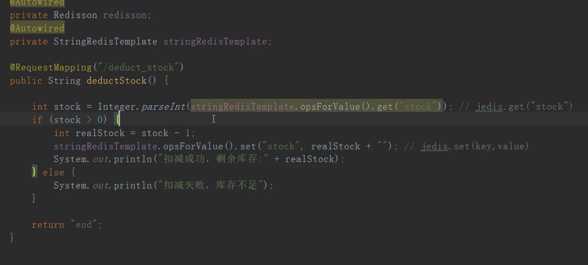
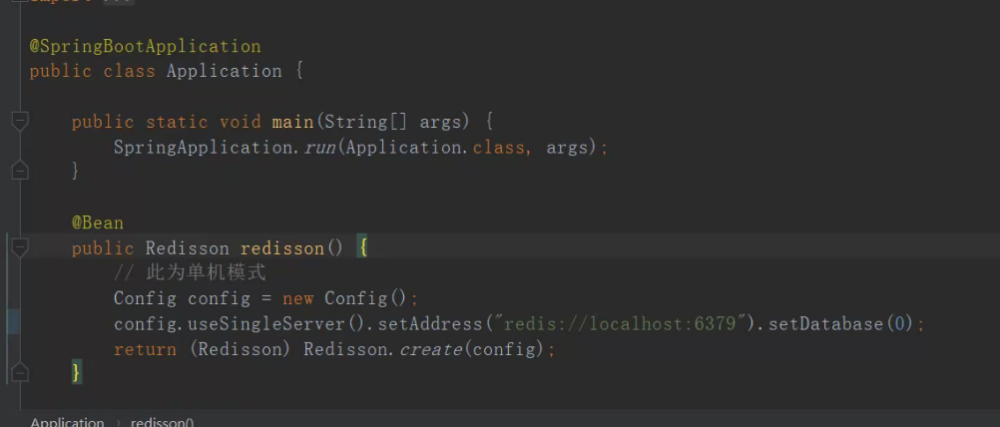
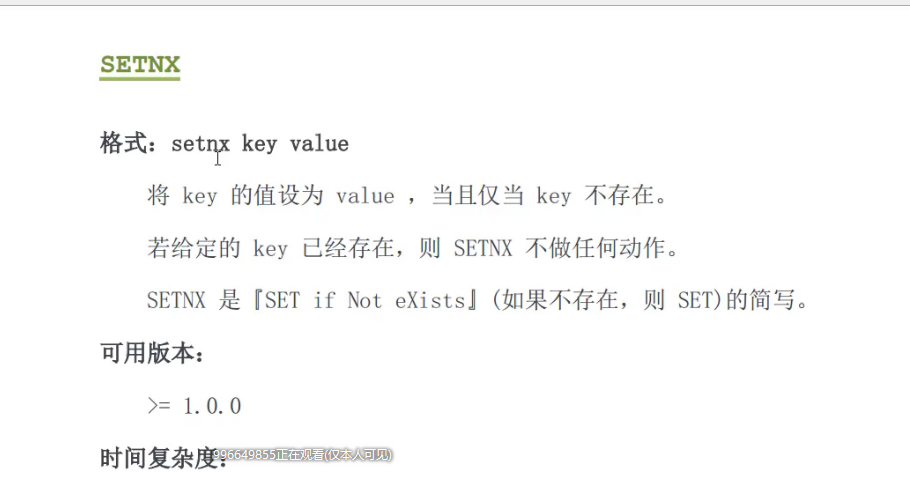
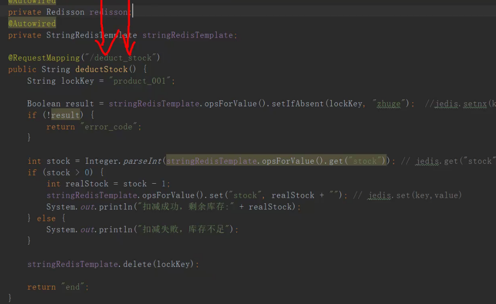
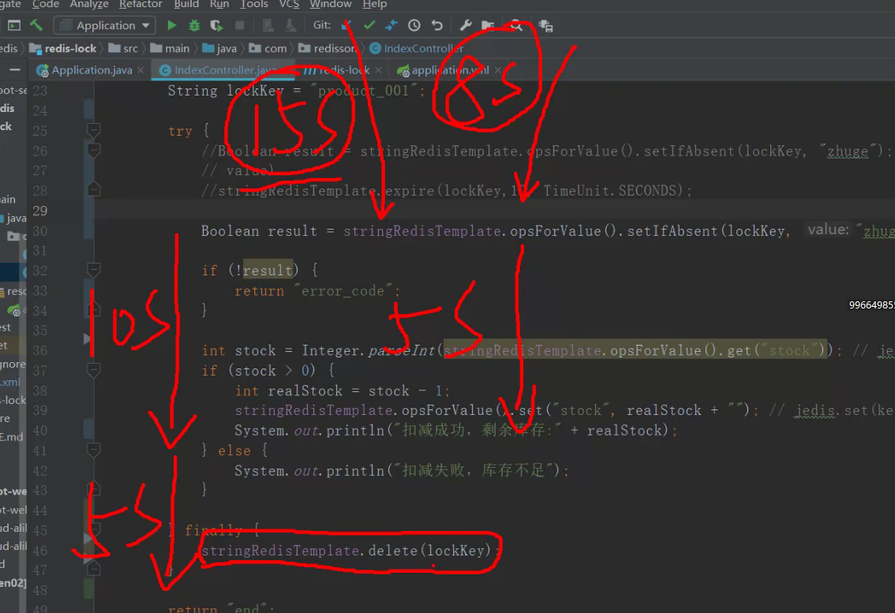
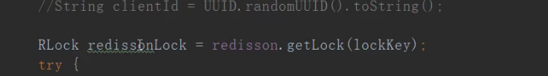
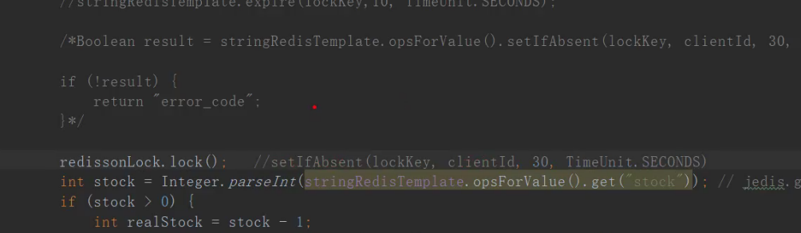
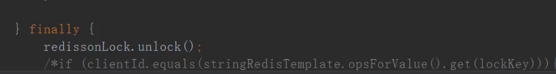
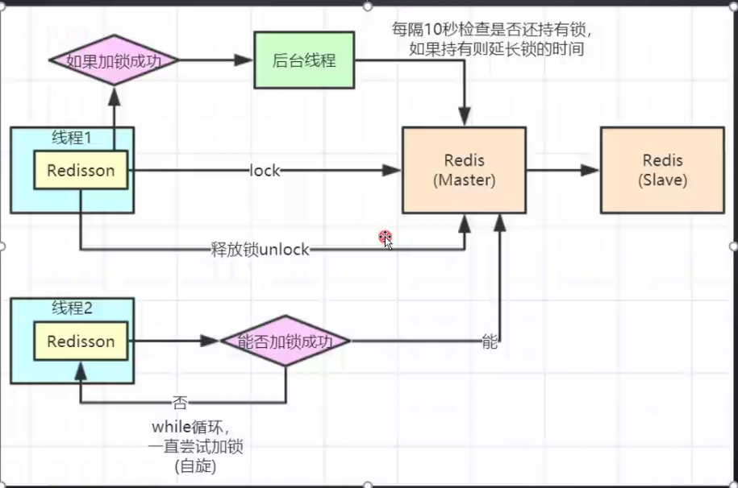

## Redis分布式高并发锁实战

### 简介

> 1. 分布式架构下如何实现redis分布式锁
> 2. 基于redisson框架实现分布式锁
> 3. redis主从架构锁失效问题redlock详解
> 4. 双十一大促如何将分布式锁性能提升100倍
> 5. zookeeper又是如何实现分布式锁的

### 锁

#### 场景

互联网秒杀

抢优惠劵

接口幂

##### demo





> 多线程的并发下会出现超卖的情况
>
> 只能进行单个tomcat的jvm进程进行控制锁
>
> 搭建Nginx就会出现超卖现象

#### 搭建分布式锁



##### set

set tl zhuge

set tl zhuge666 值会以后面为准

##### setnx

setnx tl zhuge

setnx tl zhuge666 值不会改变以前面为准

```java
Boolean result=stringRedisTemplate.opsForValue().setIfAbsent("lockKey","zhuge");//jedis.setnx("key","value");
//if true 执行成功 else 执行失败

```



*出现异常就会出现死锁现象*:使用try-finally来解决这个问题

*出现系统宕机或者kill -9了,还是会死锁*:可以设置redis的超时时间

```java
stringRedisTemplate.expire(lockKey,10,TimeUnit.SECONDS);
stringRedisTemplate.opsForValue().setifAbsent(String key,String value,long timeout,TimeUnit unit);//合并在一起原子执行
```

##### 业务没走完,锁已经失效了,自己加的锁被别人给释放掉了



##### 锁失效问题

1. 自己加的锁,自己来释放

   ```java
   String clientId=UUID.randomUUID().toString();
   if(clientId.equals(stringRedisTemplate.opsForValue().get(lockKey))){   stringRedisTemplate.delete(lockKey);
   }
   ```

2. 还是会出现锁失效的问题

   ```java
   //在业务代码里面建立一个分线程,进行判断我这个键是否还握有这个锁，如果存在那么重新定义他的超时时间，进行锁的续命即可
   ```

   

3. 实现redisson

   

   

   

#### redisson原理

