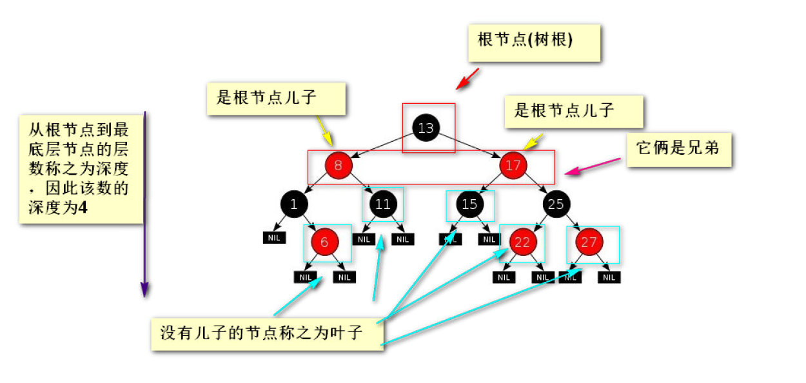

## 二叉树

1. 由根节点,子节点和叶子组成



2. 静态创建二叉树,首先定义根节点类TreeNode 包括根节点的值和左节点,右节点

3. 遍历二叉树

   1. 先序遍历 根>左>右
   2. 中序遍历 左>根>右
   3. 后序遍历 左>右>根

   ```java
   /*
    * 版权所有(C)，2020，所有权利保留。
    * 项目名： Binary-tree
    * 文件名： BinaryTreeTest.java
    * 模块说明：
    * 修改历史:
    * 2020-4-2 20:35:44 - WeiBin - 创建。
    */
   
   package com.wb.test;
   
   import com.wb.pojo.TreeNode;
   import org.junit.Test;
   
   /**
    * Create By WeiBin on 2020/4/2 20:35
    */
   public class BinaryTreeTest {
       @Test
       public void test1() {
           //先创建节点
           //根节点
           TreeNode treeNode1 = new TreeNode(1);
           //根节点的左节点
           TreeNode treeNode2 = new TreeNode(2);
           //根节点的右节点
           TreeNode treeNode3 = new TreeNode(3);
           //treeNode3的左节点
           TreeNode treeNode4 = new TreeNode(4);
           //treeNode3的右节点
           TreeNode treeNode5 = new TreeNode(5);
           //将节点连接起来
           treeNode1.setLeftNode(treeNode2);
           treeNode1.setRightNode(treeNode3);
           treeNode3.setLeftNode(treeNode4);
           treeNode3.setRightNode(treeNode5);
           //遍历 采用递归的思想
           //先序遍历
           getBinaryTreeNodePreorde(treeNode1);
   //        中序遍历
           System.out.println("===========================");
           getBinaryTreeNodeInOrder(treeNode1);
   //        后序遍历
           System.out.println("================");
           getBinaryTreeNodePostorder(treeNode1);
       }
   
       /**
        * 后序遍历
        * @param treeNode1
        */
       private void getBinaryTreeNodePostorder(TreeNode treeNode1) {
           //判断当传入的treeNode不等于空的时候进行遍历,当为空停止
           if (treeNode1 != null) {
               //获取左节点
               getBinaryTreeNodePreorde(treeNode1.getLeftNode());
               //获取右节点
               getBinaryTreeNodePreorde(treeNode1.getRightNode());
               //遍历根节点的值
               System.out.println(treeNode1.getValue());
           }
   
       }
   
       /**
        * 先序遍历  中序遍历
        *
        * @param treeNode1 根节点
        */
       private void getBinaryTreeNodePreorde(TreeNode treeNode1) {
           //判断当传入的treeNode不等于空的时候进行遍历,当为空停止
           if (treeNode1 != null) {
               //遍历根节点的值
               System.out.println(treeNode1.getValue());
               //获取左节点
               getBinaryTreeNodePreorde(treeNode1.getLeftNode());
               //获取右节点
               getBinaryTreeNodePreorde(treeNode1.getRightNode());
           }
       }
   
       /**
        * 根节点 中序遍历  左 中 右
        * @param treeNode
        */
       private void getBinaryTreeNodeInOrder(TreeNode treeNode) {
           //判断当传入的treeNode不等于空的时候进行遍历,当为空停止
           if (treeNode != null) {
               //访问左节点
               getBinaryTreeNodePreorde(treeNode.getLeftNode());
               //访问根节点的值
               System.out.println(treeNode.getValue());
               //访问右节点
               getBinaryTreeNodePreorde(treeNode.getRightNode());
           }
       }
   
   }
   ```

   

4. **通过中序和先序或者中序和后序我们就可以确定⼀颗⼆叉树**

5. 我们的代码实现也很简单，如果⽐当前根节点要⼩，那么放到当前根节点左边，如果⽐当前根节点要
   ⼤，那么放到当前根节点右边。
   因为是动态创建的，因此我们得⽤⼀个类来表示根节点

#### 动态创建

1. 创建根节点类

   ```java
   /**
        * 根据数组动态创建
        */
       public void createTree(RootNode rootNode, int value) {
           //如果进来的根节点为空,那么就将当前值作为根节点
           if (rootNode.getTreeNode() == null) {
               TreeNode treeNode = new TreeNode(value);
               rootNode.setTreeNode(treeNode);
           } else {
               //当前根
               TreeNode treeNode = rootNode.getTreeNode();
               while (treeNode != null) {
                   //当前值如果大于根节点的值,往右走
                   if (value > treeNode.getValue()) {
                       //如果右边米有树根那就直接插入
                       if (treeNode.getRightNode() == null) {
                           //插入值
                           treeNode.setRightNode(new TreeNode(value));
                           return;
                       } else {//如果右边有树根,那么就将当前这个值放到右边的树根去
                           treeNode = treeNode.getRightNode();
                       }
                   } else {//当前值小于往左走
                       //如果左边没有值,直接插入
                       if (treeNode.getLeftNode() == null) {
                           treeNode.setLeftNode(new TreeNode(value));
                           return;
                       } else {//放到左边去
                           treeNode = treeNode.getLeftNode();
                       }
                   }
   
               }
           }
       }
   ```

#### 获取树的深度

#### 获取树的最大值