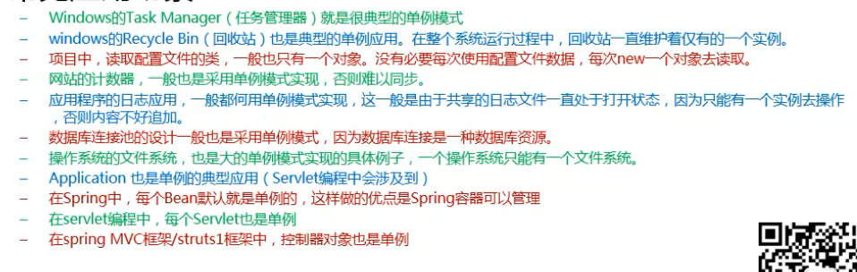
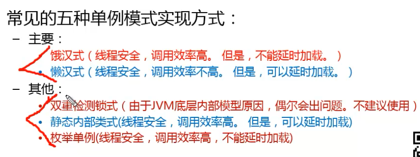

## 设计模式

### 创建型模式

- 单例模式
- 工厂模式
- 抽象工厂模式
- 建造者模式
- 原型模式

### 结构型模式

- 适配器模式
- 桥接模式
- 装饰模式
- 组和模式
- 外观模式
- 享元模式
- 代理模式

### 行为型模式

- 模板方法模式
- 命令模式
- 迭代器模式
- 观察者模式
- 中介者模式
- 备忘录模式
- 解释器模式
- 状态模式
- 策略模式
- 职责链模式
- 访问者模式

#### 单例模式

1. 核心作用

   保证一个类只有一个实例，并且提供一个访问该实例的全局访问点

2. 常见应用场景

   

3. 单例模式优点

   

4. 常见的五种单例模式实现方式

   

5. 饿汉式

   Hungry类

   ```java
   /*
    * 版权所有(C)，2020，所有权利保留。
    * 项目名： com-wb-design-patterns
    * 文件名： SingletonPattern.java
    * 模块说明：
    * 修改历史:
    * 2020-3-22 17:20:10 - WeiBin - 创建。
    */
   
   /*
    * 版权所有(C)，2020，所有权利保留。
    * 项目名： com-wb-design-patterns
    * 文件名： SingletonPattern.java
    * 模块说明：
    * 修改历史:
    * 2020-3-22 17:19:46 - WeiBin - 创建。
    */
   
   package com.wb.creationMode.singletonPattern;
   
   /**
    * Create By WeiBin on 2020/3/22 17:19
    */
   //单例模式  饿汉式
   public class Hungry {
       /**
        * 构造方法私有，提供一个变量，以及一个静态获取此对象的方法
        */
           private Hungry(){
   
           }
           private static Hungry hungry=new Hungry();  //类初始化时就加载了此对象
   		//方法没有同步，调用效率高
           public static Hungry getInstance(){
               return hungry;
           }
   
   }
   ```

   测试代码

   ```java
   @Test
       public void HungryTest(){
           Hungry instance = Hungry.getInstance();
           Hungry instance1=Hungry.getInstance();
           System.out.println(System.identityHashCode(instance)+"\t:"+System.identityHashCode(instance1));
           System.out.println("----------------------------");
           System.out.println(instance.equals(instance1));
           //是同一个对象
   
       }
   ```

6. 懒汉式

   Lazy

   ```java
   /*
    * 版权所有(C)，2020，所有权利保留。
    * 项目名： com-wb-design-patterns
    * 文件名： Lazy.java
    * 模块说明：
    * 修改历史:
    * 2020-3-22 17:26:43 - WeiBin - 创建。
    */
   
   package com.wb.creationMode.singletonPattern;
   
   /**
    * Create By WeiBin on 2020/3/22 17:26
    * 懒汉式
    */
   public class Lazy {
       /**
        * 私有化构造器
        */
       private Lazy(){
   
       }
       private static Lazy lazy;
       //需要加synchronized 不然在高并发的时候可能会产生多个对象
       //所以同步调用效率会慢一点
       public static synchronized Lazy getLazy(){
           if (lazy==null){
               lazy=new Lazy();
           }
           return lazy;
       }
   }
   
   ```

   测试代码

   ```java
    //测试懒汉
       @Test
       public void LazyTest(){
           Lazy lazy=Lazy.getLazy();
           Lazy lazy1=Lazy.getLazy();
           System.out.println(System.identityHashCode(lazy)+"\t:"+System.identityHashCode(lazy1));
           System.out.println("----------------------------");
           System.out.println(lazy.equals(lazy1));
       }
   ```

7. 双重检测锁式

   ```
   把同步块放在if后面
   ```

8. 静态内部类实现方式（烟台市一种懒加载）

   代码

   ```java
   public class StaticInnerClass {
   
       private static  class StaticInnerClassInstance{
           private static final StaticInnerClass STATIC_INNER_CLASS=new StaticInnerClass();
       }
   
       private StaticInnerClass(){
   
       }
   
       public static StaticInnerClass getInstance(){
           return StaticInnerClassInstance.STATIC_INNER_CLASS;
       }
   }
   ```

   测试

9. 枚举式

   代码

   

10. 

