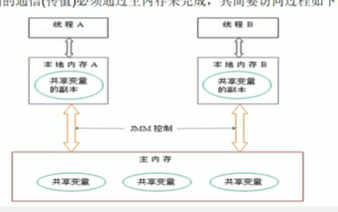

## 面试题-大厂2

### 谈谈你对volatile的理解

#### volatile是JAVA虚拟机提供的轻量级的同步机制（轻量级的synchornized）

1. 保证可见性

   > 

2. 不保证原子性

3. 禁止指令重排

#### JMM你谈谈

JVM(java虚拟机)

##### JMM(java内存模型)

> JAVA Memory Modle 是一种**抽象的概念,**并不真实存在,它描述的是一组规则或规范，通过这组规范定义了程序中各个变量的访问方式
>
> 1. 线程解锁前，必须把共享变量的值刷新会主内存
> 2. 线程加锁前，必须读取主内存的最新值到自己的工作内存
> 3. 加锁解锁是同一把锁
>
> 由于JVM运行程序的实体是线程，而每个线程创建时JVM都会为其创建一个工作内存（有些地方称为栈空间）工作内存是每个线程的私有数据区域，而JAVA内存模型中规定所有变量都存储在主内存，主内存是共享内存区域，所有线程都可以访问，**但线程对变量的操作（读取赋值等）必须在工作内存中进行，首先要将变量从主内存中拷贝到自己的工作内存空间，然后对变量进行操作，操作完成后在将变量写回主内存**，不能直接操作主内存中的变量，各个线程中的工作内存中存储着主内存的变量副本拷贝，因此不同的线程间无法访问对方的工作内存，线程间的通信必须通过主内存来完成
>
> 

#### 你在哪些地方用到过volatile