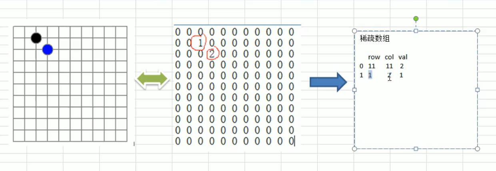
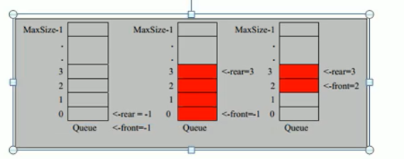

## 数据结构-1

### 线性结构和非线性结构

#### 线性结构

1. 特点：**数据元素之间存在一对一的线性关系**
2. 两种不同的存储结构,**顺序结构（数组）和链式结构（链表）**。顺序存储的线性表称为顺序表，顺序表中的存储元素是连续的
3. 链式存储的线性表称为链表,**链表中的存储元素不一定是连续的**,元素节点中存放数据元素以及相邻元素的地址信息
4. 线性结构常见的有:数组、队列、链表、栈

#### 非线性结构

> 非线性结构包括:二维数组，多维数组，广义表，树结构，图结构

## 数据结构和算法

### 稀疏数组和队列

> 需求:编写五子棋程序中，有存盘退出和续上盘的功能

- 二维数组可以存储（二维数组存储来了很多默认值）
- 稀疏数组

#### 稀疏数组

处理方法

- 记录数组一共有几行几列，有 多少个不同的值
- 把具有不通知的元素的行列及值记录在一个小规模的数组中，从而缩小程序的规模

|      | 行     | 列     | 值       |
| ---- | ------ | ------ | -------- |
| 0    | 多少行 | 多少列 | 多少个值 |
| 1    | (1)行  | (1)列  | (1)值    |
| 2    | 2      | 2      | 2        |

##### 应用实例

图解



- 思路
  1. 遍历原始的二维数组，得到要保存的有效数据个数sum
  2. 根据sum就可以创建稀疏数组sparseArr int[sum+1][3]
  3. 将二维数组的有效数据存入到稀疏数组中
- 稀疏数组转原始的二维数组思路
  1. 先读取到稀疏数组的第一行，根据第一行的数据创建原始的二维数组，比如上面的chessArr2=in[11][11]
  2. 在读取稀疏数组后几行的数据,并赋给原始的二维数组即可

**代码实现**

```java
//1.创建DataStructures项目
//2.创建包sparseArray
//3.创建类SparseArray
//4.创建原始的二维数组11*11
/*0:表示没有棋子,1表示黑子2表示蓝子*/
int chessArr1[][]=new int[11][11];
chessArr1[1][2]=1;
chessArr2[2][3]=2;
//输出原始的的二维数组
out("原始的二维数组")
for(int[] row:chessArr1){
    for(int data:row){
        out("%d\t",data);
    }
    out("/n");
}
//将二维数组转成稀疏数组
//1.遍历二维数组,得到非0数据的个数
int sum=0;
for(int i=0;i<chessArr1.length;i++){
    for(int j=0;j<11;j++){
        if(chessArr[i][j]!=0){
            sum++;
        }
    }
}
out(sum);
//2.创建对应的稀疏数组
int sparseArr[][]=new int[sum+1][3];
//3.给稀疏数组赋值
sparseArr[0][0]=11;
sparseArr[0][1]=11;
sparseArr[0][2]=sum;
// 遍历二维数组,将非0的值存放到稀疏数组中
int count=0;//用来记录是第几个非0数据
for(int i=0;i<chessArr1.length;i++){
    for(int j=0;j<11;j++){
        if(chessArr[i][j]!=0){
           	//非0数据
            count++;
            sparseArr[count][0]=i;
            sparseArr[count][1]=j;
            sparseArr[count][2]=chessArr1[i][j];
        }
    }
}
//输出稀疏数组的形式
out("得到的稀疏数组为~~~");
for(int i=0;i<sparseArr.length;i++){
    System.out.printf("%d\t%d\t%d\n",sparseArr[i][0],sparseArr[i][1],sparseArr[i][2]);
}

//将稀疏数组恢复成原始的二维数组
//1.读取第一行,创建原始的二维数组
int chessArr2[][]=new int[sparseArr[0][0]][sparseArr[0][1]];
//2.赋值即可
for(int i=1;i<sparseArr.length;i++){
    chessArr2[sparseArr[i][0]][sparseArr[i][1]]=sparseArr[i][2];
}
//3.输出
```

#### 队列

##### 简介

- 队列是一个有序列表,可以用数组或是链表来实现

- 遵循先入先出的原则。

- 示意图

  

##### 数组模拟队列

- 队列本身是有序列表，若使用数组的结构来存储队列的数据，则队列数组的声明如上图,其中maxSzie是该队列的最大容量
- 因为队列的输出和输入分别从前后端来处理,因此需要两个变量front及real分别记录队列前后端的下标,gront会随着数据输出而改变,而real会随着输出的输入而改变
- 当我们将数据存入队列时称为addQueue
  1. 将尾指针往后移,real+1，当front=real
  2. 若尾指针real小于队列的最大下标maxSize-1，则将数据存入rear所指的数组袁术中,否则无法存入数据.rear==maxSize-1

##### 代码实现

```java
//1.创建包queue
//2.创建ArrayQueueDemo
//使用数组模拟队列,编写一个ArrayQueue类
{
    private int maxSize;//数组的最大容量
    private int front;//数组的队列头
    private int real;//队列尾部
    private int[] arr;//该数组用户存放数据,模拟队列
    //创建队列的构造器
    public ArrayQueue(int arrMaxSize){
        maxSize=arrMaxSize;
        arr =new int[maxSize];
        front=-1;//指向队列头部,分析出front是指向头的前一个位置
        real=-1;//指向队列尾部,指向队的尾部
    }
    //判断队列是否满
    public boolean isFull(){
        return real==maxSize-1;
    }
    //判断队列是否为空
    public boolean isEmpty(){
        //当real与front相等的时候
        return real==front;
    }
    //添加数据到队列
    public void addQueue(int n){
        //判断队列是否满
        if(isFull()){     System.out.println("队列满,不能加数据");
            real++;//让real后移
            arr[real]=n;
        }
    }
    //获取队列的数据,出队列
    public int getQueue(){
        //判断队列是否为空
        if(isEmpty()){
      System.out.println("抛出异常");
            front++;
            return arr[front];//front后移
        }
    }
    //显示队列的所有数据
    public void showQueue(){
        //遍历arr
        if(isEmpty()){
            //队列为空
            return ;
        }
        for(int i=0;i<arr.length:i++){
            //输出
           
        }
    }
    //显示队列的头数据,注意不是取数据
    public int headQueue(){
       	//判断
        if(isEmpty()){
            //输出
            return ;
        }
        return arr[front];
    }
}
```

> 小结：1.队列是一个有序列表,数组和链表实现

##### 模拟成环形队列

