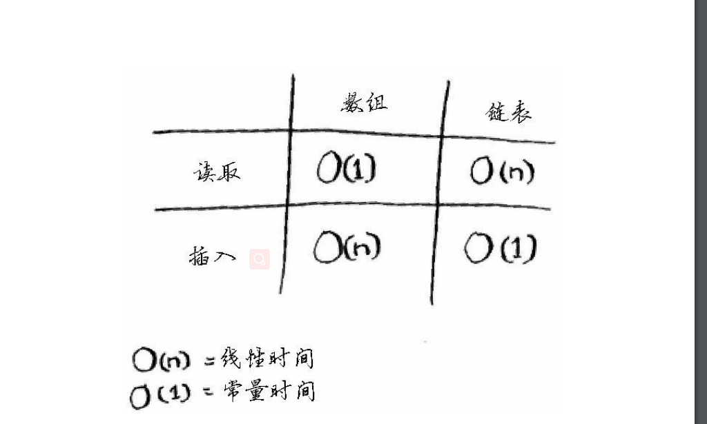

路线图
---
1.二分查找以及大O表示法来分析算法的速度
-----------------------
- 大O表示法,表示的是算法需要做的操作次数,例如画一个16个格子,每次画一个那么就是O(n),如果用二分那么就是O(log n)
- 1.二分查找的速度比简单查找快得多
- 2.O(log n)比O(n)快
- 3.算法运行时间并不以秒为单位
- 4.算法运行时间是从其增速的角度度量的
- 5.算法运行时间用大O来表示
2.学习数组和链表
-----------

```java
    数组和链表的储存方式
 数组储存是一串连续的空间,就好比你将你每天的待办事项储存在了数组中,本来只有三件事要做
但是中途你突然要新增一件事,但是你这3件事是储存在地址中的,而后面的内存地址是已经满了
那么做法是重新寻找一个联系的4个内存的空间,然后将前3个复制过来在添加第4个,以此内推,
那么每增加一个就要重新分配内存空间,那么势必添加速度就会很慢
而链表如下
```


数组和链表查询区别
---------


3.学习递归
--------
4.问题解决技巧
----------
5.散列表
-------
6.图算法
-----
7.K最近邻算法(KNN)
---------------
