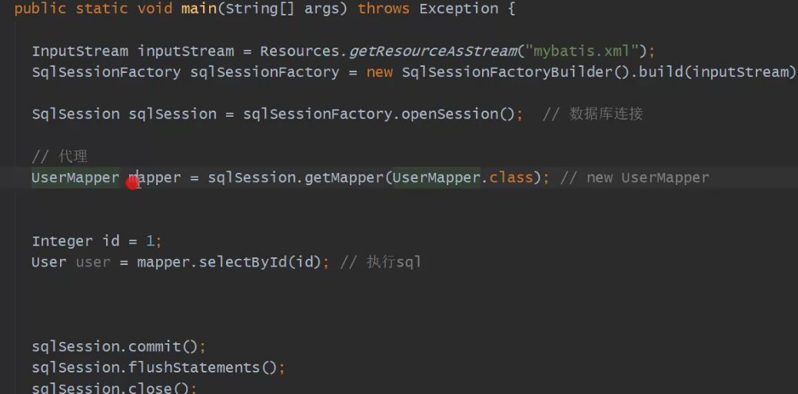
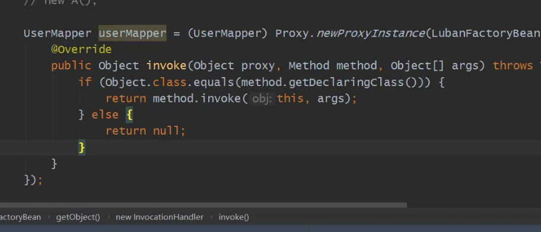

## Spring整合Mybatis底层原理

### 整合Mybatis

#### spring-mybatis   项目

##### 必须

1. Spring.jar
2. Mybatis.jar
3. mybatis-spring.jar

##### 配置bean SQLsessionFactory

##### 定义一个UserMapper接口

##### 通过MapperFactoryBean加入到spirng中

##### Component注解的 bean的类型是A

Bean的类型  class -----实例对象

bean可以实现依赖注入



##### 整合目的就是为了将Mybatis代理对象注入进spring

#### Mybatis对象是spring的一个bean

- BeanDefinition 表示bean的一个描述类
- 通过bean工厂的后置处理器获取BeanDefinition的描述信息

Mybatis代理对象------>BeanDefinition ---- >bean

```java
BeanDefinition bd=new BeanDefinition();
bd.setBeanClass(类型);
beanFactory.add(bd);
```

##### Mybatis代理对象类型

1. 代理接口
2. 具体实现类的类型  MyBatisProxy  动态代理  不存在

#### 利用spirng手动的去生成一个bean对象,new ----->

##### FactoryBean混合BeanFactory

//默认接口方法可以不用实现

FactoryBean拿到的是 getObject返回的对象  工厂bean

##### 利用FactoryBean生成UserMapper的代理对象

调用的是toString方法



##### 